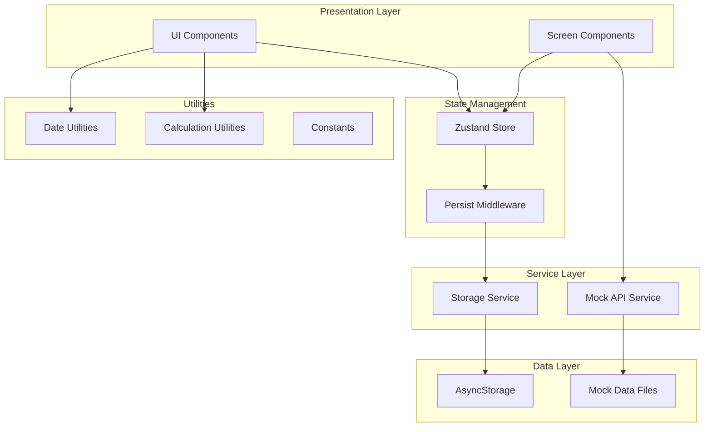
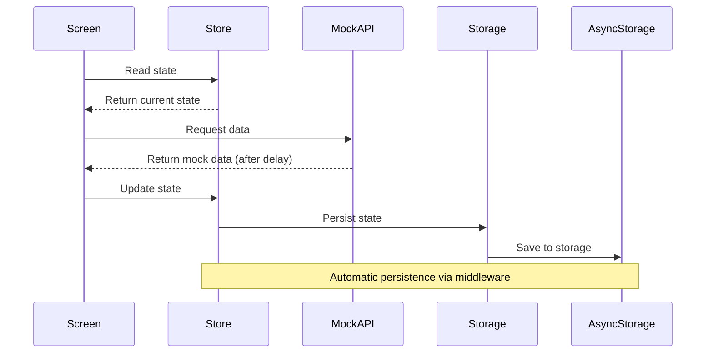

# Design Document: Setup Inicial

## Overview

Este documento describe el diseño técnico detallado para la Fase 1: Setup Inicial del sistema de gamificación. El objetivo es establecer la fundación técnica del proyecto, incluyendo:

- Estructura de carpetas organizada y escalable
- Sistema de estado global con Zustand y persistencia en AsyncStorage
- Servicio de API mock para desarrollo sin backend
- Servicios de almacenamiento y utilidades reutilizables
- Datos mock realistas para pruebas

Esta fase sienta las bases arquitectónicas que permitirán el desarrollo ágil de las funcionalidades de gamificación en fases posteriores.

### Objetivos del Diseño

1. **Escalabilidad**: Estructura que soporte crecimiento futuro del proyecto
2. **Mantenibilidad**: Código organizado con separación clara de responsabilidades
3. **Testabilidad**: Diseño que facilite pruebas unitarias y de integración
4. **Flexibilidad**: Fácil transición de mock API a backend real
5. **Persistencia**: Datos del usuario preservados entre sesiones

### Principios de Diseño

- **Separation of Concerns**: Cada módulo tiene una responsabilidad única
- **Single Source of Truth**: Zustand como única fuente de verdad para el estado
- **Service Layer Pattern**: Servicios encapsulan lógica de negocio y acceso a datos
- **Dependency Injection**: Facilita testing y cambio de implementaciones
- **Convention over Configuration**: Estructura predecible y consistente

## Architecture

### High-Level Architecture



### Component Interaction Flow



### Folder Structure

```
src/
├── components/           # Componentes reutilizables de UI
│   ├── common/          # Componentes comunes (Button, Card, etc.)
│   ├── streak/          # Componentes específicos de rachas
│   ├── level/           # Componentes de sistema de niveles
│   ├── achievement/     # Componentes de logros
│   └── index.js         # Barrel export
├── screens/             # Pantallas de la aplicación
│   ├── HomeScreen.js
│   ├── StreakScreen.js
│   ├── LevelScreen.js
│   └── index.js
├── hooks/               # Custom React hooks
│   ├── useStreak.js
│   ├── useLevel.js
│   └── index.js
├── stores/              # Zustand stores
│   ├── gameStore.js     # Estado principal del juego
│   └── index.js
├── services/            # Servicios de negocio
│   ├── mockAPI.js       # Mock API service
│   ├── storageService.js # Storage abstraction
│   └── index.js
├── modules/             # Módulos de lógica de negocio (futuro)
│   └── index.js
├── utils/               # Utilidades y helpers
│   ├── dateHelpers.js   # Funciones de fecha
│   ├── calculations.js  # Cálculos de experiencia/nivel
│   ├── constants.js     # Constantes del sistema
│   └── index.js
└── data/                # Datos mock
    ├── mockUsers.js     # Usuarios de ejemplo
    ├── mockAchievements.js # Logros predefinidos
    ├── mockRoutes.js    # Rutas de nivel
    └── index.js
```

## Components and Interfaces

### 1. Zustand Store (gameStore.js)

El store central que gestiona todo el estado de la aplicación.

#### State Shape

```javascript
{
  user: {
    id: string,
    name: string,
    level: number,
    experience: number,
    currentStreak: number,
    longestStreak: number,
    selectedRoute: 'beginner' | 'intermediate' | 'advanced' | 'expert',
    completedAchievements: string[],
    stats: {
      nutrition: number,
      sleep: number,
      movement: number
    }
  },
  streak: {
    id: string,
    userId: string,
    currentCount: number,
    lastCompletedDate: string,
    pillarHistory: Array<{
      date: string,
      pillar: 'nutrition' | 'sleep' | 'movement',
      completed: boolean,
      metrics: object
    }>
  },
  dailyPillar: {
    date: string,
    pillar: 'nutrition' | 'sleep' | 'movement',
    isManuallySet: boolean,
    target: {
      type: string,
      value: number,
      unit: string
    },
    progress: number,
    completed: boolean
  },
  achievements: Array<{
    id: string,
    title: string,
    description: string,
    icon: string,
    category: 'streak' | 'level' | 'pillar' | 'special',
    requirement: {
      type: string,
      value: number
    },
    unlockedAt: string | null
  }>
}
```

#### Actions

```javascript
// Actualizar racha cuando se completa el pilar del día
updateStreak: (completed: boolean) => void

// Rotar el pilar del día (automático o manual)
rotatePillar: (manual?: boolean, selectedPillar?: string) => void

// Añadir experiencia y calcular nivel
addExperience: (amount: number) => void

// Desbloquear un logro
unlockAchievement: (achievementId: string) => void

// Inicializar usuario (primera vez)
initializeUser: (userData: object) => void

// Resetear estado (para testing)
resetState: () => void
```

#### Implementation Pattern

```javascript
import create from 'zustand';
import { persist } from 'zustand/middleware';
import AsyncStorage from '@react-native-async-storage/async-storage';

export const useGameStore = create(
  persist(
    (set, get) => ({
      // Initial state
      user: null,
      streak: null,
      dailyPillar: null,
      achievements: [],
      
      // Actions
      updateStreak: (completed) => {
        const { streak, user } = get();
        // Lógica de actualización
        set({ 
          streak: { ...streak, /* updated */ },
          user: { ...user, /* updated */ }
        });
      },
      
      rotatePillar: (manual = false, selectedPillar) => {
        // Lógica de rotación
        set({ dailyPillar: { /* new pillar */ } });
      },
      
      addExperience: (amount) => {
        const { user } = get();
        const newExp = user.experience + amount;
        const newLevel = calculateLevel(newExp);
        set({ 
          user: { 
            ...user, 
            experience: newExp, 
            level: newLevel 
          } 
        });
      },
      
      unlockAchievement: (achievementId) => {
        const { achievements } = get();
        const updated = achievements.map(a => 
          a.id === achievementId 
            ? { ...a, unlockedAt: new Date().toISOString() }
            : a
        );
        set({ achievements: updated });
      },
      
      initializeUser: (userData) => {
        set({ user: userData });
      },
      
      resetState: () => {
        set({
          user: null,
          streak: null,
          dailyPillar: null,
          achievements: []
        });
      }
    }),
    {
      name: 'game-storage',
      getStorage: () => AsyncStorage
    }
  )
);
```

### 2. Mock API Service (mockAPI.js)

Servicio singleton que simula un backend con latencia de red.

#### Interface

```javascript
class MockAPIService {
  // Obtener datos del usuario
  getUserData(userId: string): Promise<User>
  
  // Actualizar racha
  updateStreak(userId: string, pillarData: object): Promise<Streak>
  
  // Obtener logros
  getAchievements(userId: string): Promise<Achievement[]>
  
  // Obtener rutas de nivel
  getLevelRoutes(): Promise<LevelRoute[]>
  
  // Simular delay de red
  _simulateDelay(): Promise<void>
}
```

#### Implementation Pattern

```javascript
import { mockUsers, mockAchievements, mockRoutes } from '../data';

class MockAPIService {
  constructor() {
    this.delay = 500; // ms
  }
  
  async getUserData(userId) {
    await this._simulateDelay();
    const user = mockUsers.find(u => u.id === userId);
    if (!user) {
      throw new Error(`User ${userId} not found`);
    }
    return { ...user }; // Return copy
  }
  
  async updateStreak(userId, pillarData) {
    await this._simulateDelay();
    // Simular actualización
    return {
      success: true,
      streak: {
        currentCount: pillarData.currentCount + 1,
        lastCompletedDate: new Date().toISOString()
      }
    };
  }
  
  async getAchievements(userId) {
    await this._simulateDelay();
    return [...mockAchievements]; // Return copy
  }
  
  async getLevelRoutes() {
    await this._simulateDelay();
    return [...mockRoutes]; // Return copy
  }
  
  _simulateDelay() {
    return new Promise(resolve => 
      setTimeout(resolve, this.delay)
    );
  }
}

// Singleton pattern
export default new MockAPIService();
```

### 3. Storage Service (storageService.js)

Abstracción sobre AsyncStorage para operaciones consistentes.

#### Interface

```javascript
class StorageService {
  // Guardar item
  setItem(key: string, value: any): Promise<void>
  
  // Obtener item
  getItem(key: string): Promise<any>
  
  // Eliminar item
  removeItem(key: string): Promise<void>
  
  // Limpiar todo
  clear(): Promise<void>
  
  // Obtener todas las claves
  getAllKeys(): Promise<string[]>
}
```

#### Implementation Pattern

```javascript
import AsyncStorage from '@react-native-async-storage/async-storage';

const KEY_PREFIX = '@gamification:';

class StorageService {
  _getFullKey(key) {
    return `${KEY_PREFIX}${key}`;
  }
  
  async setItem(key, value) {
    try {
      const fullKey = this._getFullKey(key);
      const jsonValue = JSON.stringify(value);
      await AsyncStorage.setItem(fullKey, jsonValue);
    } catch (error) {
      console.error(`Error saving ${key}:`, error);
      throw error;
    }
  }
  
  async getItem(key) {
    try {
      const fullKey = this._getFullKey(key);
      const jsonValue = await AsyncStorage.getItem(fullKey);
      return jsonValue != null ? JSON.parse(jsonValue) : null;
    } catch (error) {
      console.error(`Error reading ${key}:`, error);
      return null;
    }
  }
  
  async removeItem(key) {
    try {
      const fullKey = this._getFullKey(key);
      await AsyncStorage.removeItem(fullKey);
    } catch (error) {
      console.error(`Error removing ${key}:`, error);
      throw error;
    }
  }
  
  async clear() {
    try {
      const keys = await this.getAllKeys();
      await AsyncStorage.multiRemove(keys);
    } catch (error) {
      console.error('Error clearing storage:', error);
      throw error;
    }
  }
  
  async getAllKeys() {
    try {
      const allKeys = await AsyncStorage.getAllKeys();
      return allKeys.filter(key => key.startsWith(KEY_PREFIX));
    } catch (error) {
      console.error('Error getting keys:', error);
      return [];
    }
  }
}

export default new StorageService();
```

### 4. Utilities

#### Date Helpers (dateHelpers.js)

```javascript
/**
 * Obtiene la fecha actual en formato ISO
 * @returns {string} Fecha actual
 */
export const getCurrentDate = () => {
  return new Date().toISOString();
};

/**
 * Verifica si una fecha es hoy
 * @param {string} dateString - Fecha en formato ISO
 * @returns {boolean}
 */
export const isToday = (dateString) => {
  const date = new Date(dateString);
  const today = new Date();
  return date.toDateString() === today.toDateString();
};

/**
 * Verifica si dos fechas son el mismo día
 * @param {string} date1 - Primera fecha
 * @param {string} date2 - Segunda fecha
 * @returns {boolean}
 */
export const isSameDay = (date1, date2) => {
  const d1 = new Date(date1);
  const d2 = new Date(date2);
  return d1.toDateString() === d2.toDateString();
};

/**
 * Calcula la diferencia en días entre dos fechas
 * @param {string} date1 - Fecha inicial
 * @param {string} date2 - Fecha final
 * @returns {number} Diferencia en días
 */
export const getDaysDifference = (date1, date2) => {
  const d1 = new Date(date1);
  const d2 = new Date(date2);
  const diffTime = Math.abs(d2 - d1);
  const diffDays = Math.ceil(diffTime / (1000 * 60 * 60 * 24));
  return diffDays;
};
```

#### Calculations (calculations.js)

```javascript
/**
 * Calcula el nivel basado en la experiencia
 * @param {number} experience - Experiencia total
 * @returns {number} Nivel calculado
 */
export const calculateLevel = (experience) => {
  // Fórmula: nivel = floor(sqrt(experience / 100))
  return Math.floor(Math.sqrt(experience / 100)) + 1;
};

/**
 * Calcula la experiencia necesaria para el siguiente nivel
 * @param {number} currentLevel - Nivel actual
 * @returns {number} Experiencia necesaria
 */
export const calculateExperienceForNextLevel = (currentLevel) => {
  // Fórmula inversa: exp = (nivel^2) * 100
  return Math.pow(currentLevel, 2) * 100;
};

/**
 * Calcula el progreso hacia el siguiente nivel
 * @param {number} currentExp - Experiencia actual
 * @param {number} currentLevel - Nivel actual
 * @returns {number} Porcentaje de progreso (0-100)
 */
export const calculateProgress = (currentExp, currentLevel) => {
  const currentLevelExp = calculateExperienceForNextLevel(currentLevel - 1);
  const nextLevelExp = calculateExperienceForNextLevel(currentLevel);
  const expInLevel = currentExp - currentLevelExp;
  const expNeeded = nextLevelExp - currentLevelExp;
  return Math.min(100, Math.max(0, (expInLevel / expNeeded) * 100));
};
```

#### Constants (constants.js)

```javascript
/**
 * Constantes del sistema de gamificación
 */

// Pilares del sistema
export const PILLARS = {
  NUTRITION: 'nutrition',
  SLEEP: 'sleep',
  MOVEMENT: 'movement'
};

// Categorías de logros
export const ACHIEVEMENT_CATEGORIES = {
  STREAK: 'streak',
  LEVEL: 'level',
  PILLAR: 'pillar',
  SPECIAL: 'special'
};

// Rutas de nivel
export const LEVEL_ROUTES = {
  BEGINNER: 'beginner',
  INTERMEDIATE: 'intermediate',
  ADVANCED: 'advanced',
  EXPERT: 'expert'
};

// Experiencia por actividad
export const EXPERIENCE_REWARDS = {
  PILLAR_COMPLETED: 50,
  STREAK_MILESTONE: 100,
  ACHIEVEMENT_UNLOCKED: 75
};

// Configuración de API
export const API_CONFIG = {
  USE_MOCK: true,
  MOCK_DELAY: 500,
  BASE_URL: __DEV__ 
    ? 'http://localhost:3000/api' 
    : 'https://api.production.com'
};

// Claves de almacenamiento
export const STORAGE_KEYS = {
  GAME_STATE: 'game-storage',
  USER_PREFERENCES: 'user-preferences',
  ONBOARDING_COMPLETED: 'onboarding-completed'
};
```

## Data Models

### Mock Users (mockUsers.js)

```javascript
export const mockUsers = [
  {
    id: 'user-001',
    name: 'Ana García',
    level: 5,
    experience: 2500,
    currentStreak: 7,
    longestStreak: 15,
    selectedRoute: 'intermediate',
    completedAchievements: ['first_week', 'level_5', 'nutrition_master'],
    stats: {
      nutrition: 75,
      sleep: 60,
      movement: 80
    }
  },
  {
    id: 'user-002',
    name: 'Carlos Rodríguez',
    level: 12,
    experience: 14400,
    currentStreak: 30,
    longestStreak: 45,
    selectedRoute: 'advanced',
    completedAchievements: [
      'first_week', 
      'first_month', 
      'level_10', 
      'level_12',
      'sleep_champion',
      'movement_expert'
    ],
    stats: {
      nutrition: 85,
      sleep: 90,
      movement: 95
    }
  }
];
```

### Mock Achievements (mockAchievements.js)

```javascript
export const mockAchievements = [
  // Streak achievements
  {
    id: 'first_week',
    title: '¡Primera Semana!',
    description: 'Completa una racha de 7 días',
    icon: '🔥',
    category: 'streak',
    requirement: {
      type: 'streak_count',
      value: 7
    },
    unlockedAt: null
  },
  {
    id: 'first_month',
    title: 'Mes Completo',
    description: 'Mantén una racha de 30 días',
    icon: '🏆',
    category: 'streak',
    requirement: {
      type: 'streak_count',
      value: 30
    },
    unlockedAt: null
  },
  {
    id: 'unstoppable',
    title: 'Imparable',
    description: 'Alcanza una racha de 100 días',
    icon: '⚡',
    category: 'streak',
    requirement: {
      type: 'streak_count',
      value: 100
    },
    unlockedAt: null
  },
  
  // Level achievements
  {
    id: 'level_5',
    title: 'Nivel 5 Alcanzado',
    description: 'Llega al nivel 5',
    icon: '⭐',
    category: 'level',
    requirement: {
      type: 'level',
      value: 5
    },
    unlockedAt: null
  },
  {
    id: 'level_10',
    title: 'Nivel 10 Maestro',
    description: 'Alcanza el nivel 10',
    icon: '🌟',
    category: 'level',
    requirement: {
      type: 'level',
      value: 10
    },
    unlockedAt: null
  },
  {
    id: 'level_25',
    title: 'Experto Nivel 25',
    description: 'Llega al nivel 25',
    icon: '💫',
    category: 'level',
    requirement: {
      type: 'level',
      value: 25
    },
    unlockedAt: null
  },
  
  // Pillar achievements
  {
    id: 'nutrition_master',
    title: 'Maestro de Nutrición',
    description: 'Completa 20 días de nutrición',
    icon: '🥗',
    category: 'pillar',
    requirement: {
      type: 'pillar_count',
      pillar: 'nutrition',
      value: 20
    },
    unlockedAt: null
  },
  {
    id: 'sleep_champion',
    title: 'Campeón del Sueño',
    description: 'Completa 20 días de sueño',
    icon: '😴',
    category: 'pillar',
    requirement: {
      type: 'pillar_count',
      pillar: 'sleep',
      value: 20
    },
    unlockedAt: null
  },
  {
    id: 'movement_expert',
    title: 'Experto en Movimiento',
    description: 'Completa 20 días de movimiento',
    icon: '🏃',
    category: 'pillar',
    requirement: {
      type: 'pillar_count',
      pillar: 'movement',
      value: 20
    },
    unlockedAt: null
  },
  
  // Special achievements
  {
    id: 'perfect_balance',
    title: 'Balance Perfecto',
    description: 'Completa los 3 pilares en una semana',
    icon: '⚖️',
    category: 'special',
    requirement: {
      type: 'all_pillars_week',
      value: 1
    },
    unlockedAt: null
  }
];
```

### Mock Routes (mockRoutes.js)

```javascript
export const mockRoutes = [
  {
    id: 'beginner',
    name: 'Principiante',
    description: 'Para quienes comienzan su viaje de bienestar',
    levels: [
      { level: 1, experienceRequired: 0, title: 'Novato', unlockedFeatures: ['basic_tracking'] },
      { level: 2, experienceRequired: 100, title: 'Aprendiz', unlockedFeatures: ['daily_tips'] },
      { level: 3, experienceRequired: 400, title: 'Estudiante', unlockedFeatures: ['weekly_summary'] },
      { level: 4, experienceRequired: 900, title: 'Practicante', unlockedFeatures: ['custom_goals'] },
      { level: 5, experienceRequired: 1600, title: 'Dedicado', unlockedFeatures: ['achievement_badges'] },
      { level: 6, experienceRequired: 2500, title: 'Comprometido', unlockedFeatures: ['streak_recovery'] },
      { level: 7, experienceRequired: 3600, title: 'Persistente', unlockedFeatures: ['advanced_stats'] },
      { level: 8, experienceRequired: 4900, title: 'Determinado', unlockedFeatures: ['monthly_challenges'] },
      { level: 9, experienceRequired: 6400, title: 'Enfocado', unlockedFeatures: ['social_sharing'] },
      { level: 10, experienceRequired: 8100, title: 'Graduado', unlockedFeatures: ['route_upgrade'] }
    ]
  },
  {
    id: 'intermediate',
    name: 'Intermedio',
    description: 'Para quienes tienen experiencia en hábitos saludables',
    levels: [
      { level: 11, experienceRequired: 10000, title: 'Intermedio I', unlockedFeatures: ['advanced_tracking'] },
      { level: 12, experienceRequired: 12100, title: 'Intermedio II', unlockedFeatures: ['custom_pillars'] },
      { level: 13, experienceRequired: 14400, title: 'Intermedio III', unlockedFeatures: ['pillar_rotation'] },
      { level: 14, experienceRequired: 16900, title: 'Intermedio IV', unlockedFeatures: ['insights'] },
      { level: 15, experienceRequired: 19600, title: 'Intermedio V', unlockedFeatures: ['predictions'] },
      { level: 16, experienceRequired: 22500, title: 'Avanzando I', unlockedFeatures: ['coaching_tips'] },
      { level: 17, experienceRequired: 25600, title: 'Avanzando II', unlockedFeatures: ['habit_stacking'] },
      { level: 18, experienceRequired: 28900, title: 'Avanzando III', unlockedFeatures: ['community_access'] },
      { level: 19, experienceRequired: 32400, title: 'Avanzando IV', unlockedFeatures: ['mentor_program'] },
      { level: 20, experienceRequired: 36100, title: 'Avanzando V', unlockedFeatures: ['route_upgrade'] }
    ]
  },
  {
    id: 'advanced',
    name: 'Avanzado',
    description: 'Para expertos en optimización de bienestar',
    levels: [
      { level: 21, experienceRequired: 40000, title: 'Avanzado I', unlockedFeatures: ['biometric_integration'] },
      { level: 22, experienceRequired: 44100, title: 'Avanzado II', unlockedFeatures: ['ai_recommendations'] },
      { level: 23, experienceRequired: 48400, title: 'Avanzado III', unlockedFeatures: ['performance_analytics'] },
      { level: 24, experienceRequired: 52900, title: 'Avanzado IV', unlockedFeatures: ['custom_algorithms'] },
      { level: 25, experienceRequired: 57600, title: 'Avanzado V', unlockedFeatures: ['expert_consultation'] }
    ]
  },
  {
    id: 'expert',
    name: 'Experto',
    description: 'Para maestros del bienestar integral',
    levels: [
      { level: 26, experienceRequired: 62500, title: 'Experto I', unlockedFeatures: ['research_access'] },
      { level: 27, experienceRequired: 67600, title: 'Experto II', unlockedFeatures: ['beta_features'] },
      { level: 28, experienceRequired: 72900, title: 'Experto III', unlockedFeatures: ['api_access'] },
      { level: 29, experienceRequired: 78400, title: 'Experto IV', unlockedFeatures: ['white_label'] },
      { level: 30, experienceRequired: 84100, title: 'Maestro', unlockedFeatures: ['lifetime_access'] }
    ]
  }
];
```


## Correctness Properties

*A property is a characteristic or behavior that should hold true across all valid executions of a system-essentially, a formal statement about what the system should do. Properties serve as the bridge between human-readable specifications and machine-verifiable correctness guarantees.*

### Property Reflection

Después de analizar todos los criterios de aceptación, identifiqué las siguientes áreas de redundancia:

1. **Serialización/Deserialización**: Los criterios 4.2 y 4.3 pueden combinarse en una propiedad de round-trip
2. **Persistencia del Store**: Los criterios 7.1 y 7.2 pueden combinarse en una propiedad de round-trip
3. **Estructura de carpetas**: Los criterios 1.4 y 1.5 pueden combinarse en una propiedad sobre accesibilidad
4. **Manejo de errores**: Los criterios 4.4 y 4.5 se solapan y pueden unificarse

Las propiedades finales eliminan redundancia y se enfocan en validaciones únicas y valiosas.

### Property 1: Storage Service Round-Trip

*For any* objeto JavaScript válido, serializar y luego deserializar usando Storage Service debe producir un objeto equivalente al original.

**Validates: Requirements 4.2, 4.3**

**Rationale**: Esta propiedad de round-trip valida que la serialización/deserialización es correcta y no pierde información. Es fundamental para la persistencia de datos.

### Property 2: Zustand Store Persistence Round-Trip

*For any* estado válido del store, cuando se persiste al cerrar la app y se restaura al abrirla, el estado recuperado debe ser equivalente al estado original.

**Validates: Requirements 7.1, 7.2, 2.3**

**Rationale**: Garantiza que los datos del usuario no se pierden entre sesiones. Es crítico para la experiencia del usuario.

### Property 3: Mock API Delay Consistency

*For any* método del Mock API Service, el tiempo de respuesta debe estar dentro del rango configurado (delay ± margen de tolerancia).

**Validates: Requirements 3.1, 3.3**

**Rationale**: Asegura que la simulación de latencia es consistente, lo que permite testing realista del comportamiento de la UI.

### Property 4: Mock API Singleton Guarantee

*For any* número de intentos de instanciación del Mock API Service, todas las referencias deben apuntar a la misma instancia.

**Validates: Requirements 3.5**

**Rationale**: El patrón Singleton previene inconsistencias de estado y garantiza un único punto de acceso a los datos mock.

### Property 5: Mock API Promise Resolution

*For all* métodos async del Mock API Service, deben retornar Promises que resuelven exitosamente con datos que cumplen el schema esperado.

**Validates: Requirements 3.6**

**Rationale**: Garantiza que todos los métodos async son confiables y retornan datos válidos, evitando errores en runtime.

### Property 6: Storage Service Error Handling

*For any* operación de Storage Service que falla, el servicio debe capturar el error, registrarlo, y retornar null sin lanzar excepciones.

**Validates: Requirements 4.4, 4.5**

**Rationale**: El manejo robusto de errores previene crashes de la aplicación y permite recuperación graceful.

### Property 7: Storage Key Prefix Consistency

*For all* claves generadas por Storage Service, deben comenzar con el prefijo configurado '@gamification:'.

**Validates: Requirements 4.6**

**Rationale**: Previene colisiones de claves con otras partes de la aplicación o librerías de terceros.

### Property 8: Mock Users Data Completeness

*For all* usuarios en mockUsers, cada usuario debe contener todas las propiedades requeridas: id, name, level, experience, currentStreak, longestStreak, selectedRoute, completedAchievements, y stats.

**Validates: Requirements 5.4**

**Rationale**: Garantiza que los datos mock son completos y pueden usarse para testing sin errores de propiedades faltantes.

### Property 9: Mock Achievements Data Completeness

*For all* logros en mockAchievements, cada logro debe contener todas las propiedades requeridas: id, title, description, icon, category, requirement, y unlockedAt.

**Validates: Requirements 5.5**

**Rationale**: Asegura que todos los logros tienen la estructura completa necesaria para renderizado y lógica de desbloqueo.

### Property 10: Folder Accessibility

*For all* carpetas definidas en la estructura del proyecto, deben ser navegables y accesibles desde la raíz, y cada subdirectorio debe contener un archivo index.js.

**Validates: Requirements 1.4, 1.5**

**Rationale**: Garantiza que la estructura de carpetas es consistente y facilita imports limpios en toda la aplicación.

### Property 11: State Restoration Validation

*For any* estado restaurado desde AsyncStorage, el Zustand Store debe validar la estructura de datos antes de aplicarla al estado actual.

**Validates: Requirements 7.5**

**Rationale**: Previene corrupción de estado por datos inválidos o incompatibles de versiones anteriores.

### Property 12: Utility Functions Documentation

*For all* funciones utilitarias en utils/, cada función debe incluir documentación JSDoc completa con descripción, parámetros y tipo de retorno.

**Validates: Requirements 9.4**

**Rationale**: La documentación consistente mejora la mantenibilidad y facilita el uso correcto de las utilidades.

### Property 13: Utility Exports Accessibility

*For all* utilidades definidas en archivos dentro de utils/, deben ser exportables desde el archivo index.js del directorio.

**Validates: Requirements 9.5**

**Rationale**: Facilita imports limpios y consistentes: `import { helper } from 'utils'` en lugar de rutas profundas.

## Error Handling

### Error Handling Strategy

El sistema implementa una estrategia de error handling en capas:

1. **Service Layer**: Captura errores de I/O y operaciones async
2. **Store Layer**: Valida datos antes de actualizar estado
3. **Component Layer**: Muestra mensajes de error al usuario

### Storage Service Error Handling

```javascript
async getItem(key) {
  try {
    const fullKey = this._getFullKey(key);
    const jsonValue = await AsyncStorage.getItem(fullKey);
    return jsonValue != null ? JSON.parse(jsonValue) : null;
  } catch (error) {
    console.error(`Error reading ${key}:`, error);
    // Log to analytics service in production
    if (!__DEV__) {
      AnalyticsService.logError('storage_read_error', { key, error });
    }
    return null; // Fail gracefully
  }
}
```

### Mock API Error Simulation

```javascript
async getUserData(userId) {
  await this._simulateDelay();
  
  const user = mockUsers.find(u => u.id === userId);
  if (!user) {
    // Simulate 404 error
    throw new Error(`User ${userId} not found`);
  }
  
  return { ...user };
}
```

### Store State Validation

```javascript
// En el middleware de persist
{
  name: 'game-storage',
  getStorage: () => AsyncStorage,
  onRehydrateStorage: () => (state, error) => {
    if (error) {
      console.error('Error rehydrating state:', error);
      // Reset to initial state on error
      return initialState;
    }
    
    // Validate state structure
    if (!isValidState(state)) {
      console.warn('Invalid state structure, resetting');
      return initialState;
    }
    
    return state;
  }
}
```

### Error Types and Handling

| Error Type | Source | Handling Strategy | User Impact |
|------------|--------|-------------------|-------------|
| Storage Read Error | AsyncStorage | Log + return null | Use default values |
| Storage Write Error | AsyncStorage | Log + retry once | Show warning toast |
| JSON Parse Error | Storage Service | Log + return null | Reset to defaults |
| User Not Found | Mock API | Throw error | Show error screen |
| Network Timeout | Mock API (future) | Retry with backoff | Show loading state |
| Invalid State | Store rehydration | Reset to initial | Silent recovery |

### Error Recovery Mechanisms

1. **Graceful Degradation**: App funciona con datos por defecto si falla la persistencia
2. **Retry Logic**: Operaciones críticas se reintentan una vez
3. **State Reset**: Opción para resetear estado corrupto
4. **Error Logging**: Todos los errores se registran para debugging

## Testing Strategy

### Dual Testing Approach

El proyecto implementa una estrategia de testing dual que combina:

1. **Unit Tests**: Para casos específicos, ejemplos concretos y edge cases
2. **Property-Based Tests**: Para propiedades universales que deben cumplirse con cualquier input

Ambos tipos de tests son complementarios y necesarios:
- Los unit tests validan comportamientos específicos y casos conocidos
- Los property tests validan reglas generales con inputs generados aleatoriamente

### Testing Framework Selection

- **Unit Testing**: Jest (incluido con React Native)
- **Property-Based Testing**: fast-check (librería de PBT para JavaScript)
- **Component Testing**: React Native Testing Library

### Property-Based Testing Configuration

Cada property test debe:
- Ejecutar mínimo 100 iteraciones (debido a la naturaleza aleatoria)
- Incluir un comentario con el tag: `Feature: setup-inicial, Property {N}: {descripción}`
- Referenciar la propiedad del documento de diseño

Ejemplo de configuración:

```javascript
import fc from 'fast-check';

describe('Storage Service Properties', () => {
  // Feature: setup-inicial, Property 1: Storage Service Round-Trip
  it('should preserve data through serialize/deserialize cycle', () => {
    fc.assert(
      fc.property(
        fc.object(), // Generate random objects
        (obj) => {
          const serialized = JSON.stringify(obj);
          const deserialized = JSON.parse(serialized);
          expect(deserialized).toEqual(obj);
        }
      ),
      { numRuns: 100 } // Minimum 100 iterations
    );
  });
});
```

### Unit Testing Strategy

Los unit tests se enfocan en:

1. **Ejemplos Específicos**: Casos concretos mencionados en requirements
   - Verificar que existen carpetas específicas (components/, screens/, etc.)
   - Verificar que el store tiene propiedades específicas (user, streak, etc.)
   - Verificar que Mock API tiene métodos específicos (getUserData, etc.)

2. **Edge Cases**: Casos límite y situaciones especiales
   - Estado inicial cuando no hay datos persistidos
   - Comportamiento con datos corruptos
   - Manejo de usuarios no encontrados

3. **Integration Points**: Interacción entre componentes
   - Store + AsyncStorage
   - Mock API + Mock Data
   - Utilities + Store actions

### Test Organization

```
__tests__/
├── unit/
│   ├── stores/
│   │   └── gameStore.test.js
│   ├── services/
│   │   ├── mockAPI.test.js
│   │   └── storageService.test.js
│   ├── utils/
│   │   ├── dateHelpers.test.js
│   │   └── calculations.test.js
│   └── data/
│       ├── mockUsers.test.js
│       └── mockAchievements.test.js
├── properties/
│   ├── storageService.properties.test.js
│   ├── gameStore.properties.test.js
│   └── mockAPI.properties.test.js
└── integration/
    └── setupValidation.test.js
```

### Example Unit Tests

```javascript
// __tests__/unit/stores/gameStore.test.js
describe('Game Store', () => {
  // Requirement 2.1: Store has required properties
  it('should have user, streak, dailyPillar, and achievements properties', () => {
    const state = useGameStore.getState();
    expect(state).toHaveProperty('user');
    expect(state).toHaveProperty('streak');
    expect(state).toHaveProperty('dailyPillar');
    expect(state).toHaveProperty('achievements');
  });
  
  // Requirement 2.4: Store has required actions
  it('should have updateStreak, rotatePillar, addExperience, and unlockAchievement actions', () => {
    const state = useGameStore.getState();
    expect(typeof state.updateStreak).toBe('function');
    expect(typeof state.rotatePillar).toBe('function');
    expect(typeof state.addExperience).toBe('function');
    expect(typeof state.unlockAchievement).toBe('function');
  });
  
  // Edge case: Initial state when no persisted data
  it('should initialize with null user when no persisted data exists', () => {
    // Clear storage
    AsyncStorage.clear();
    const state = useGameStore.getState();
    expect(state.user).toBeNull();
  });
});
```

### Example Property Tests

```javascript
// __tests__/properties/storageService.properties.test.js
import fc from 'fast-check';
import storageService from '../../src/services/storageService';

describe('Storage Service Properties', () => {
  // Feature: setup-inicial, Property 1: Storage Service Round-Trip
  it('should preserve any valid object through save/load cycle', async () => {
    await fc.assert(
      fc.asyncProperty(
        fc.string(), // Random key
        fc.object(), // Random object
        async (key, obj) => {
          await storageService.setItem(key, obj);
          const retrieved = await storageService.getItem(key);
          expect(retrieved).toEqual(obj);
        }
      ),
      { numRuns: 100 }
    );
  });
  
  // Feature: setup-inicial, Property 7: Storage Key Prefix Consistency
  it('should prefix all keys with @gamification:', async () => {
    await fc.assert(
      fc.asyncProperty(
        fc.string(), // Random key
        fc.anything(), // Random value
        async (key) => {
          await storageService.setItem(key, 'test');
          const allKeys = await storageService.getAllKeys();
          allKeys.forEach(k => {
            expect(k).toMatch(/^@gamification:/);
          });
        }
      ),
      { numRuns: 100 }
    );
  });
});
```

### Integration Tests

```javascript
// __tests__/integration/setupValidation.test.js
describe('Setup Validation', () => {
  // Requirement 10.1: Can import and use Zustand Store
  it('should import and use Zustand Store without errors', () => {
    expect(() => {
      const { useGameStore } = require('../../src/stores');
      const state = useGameStore.getState();
    }).not.toThrow();
  });
  
  // Requirement 10.2: Can invoke Mock API methods
  it('should invoke Mock API methods and receive mock data', async () => {
    const mockAPI = require('../../src/services/mockAPI').default;
    const userData = await mockAPI.getUserData('user-001');
    expect(userData).toBeDefined();
    expect(userData.id).toBe('user-001');
  });
  
  // Requirement 10.3: Can persist and retrieve data
  it('should persist and retrieve data using Storage Service', async () => {
    const storageService = require('../../src/services/storageService').default;
    const testData = { test: 'data', value: 123 };
    
    await storageService.setItem('test-key', testData);
    const retrieved = await storageService.getItem('test-key');
    
    expect(retrieved).toEqual(testData);
  });
});
```

### Test Coverage Goals

- **Unit Tests**: 80% code coverage mínimo
- **Property Tests**: Todas las propiedades del diseño implementadas
- **Integration Tests**: Todos los flujos críticos cubiertos

### Continuous Testing

```json
// package.json scripts
{
  "scripts": {
    "test": "jest",
    "test:watch": "jest --watch",
    "test:coverage": "jest --coverage",
    "test:properties": "jest --testPathPattern=properties",
    "test:unit": "jest --testPathPattern=unit",
    "test:integration": "jest --testPathPattern=integration"
  }
}
```

### Testing Best Practices

1. **Isolation**: Cada test debe ser independiente
2. **Cleanup**: Limpiar AsyncStorage entre tests
3. **Mocking**: Mockear dependencias externas cuando sea necesario
4. **Descriptive Names**: Nombres de tests claros y descriptivos
5. **Arrange-Act-Assert**: Seguir patrón AAA en unit tests
6. **Fast Execution**: Tests deben ejecutarse rápidamente

---

**Documento de Diseño Técnico - Setup Inicial**  
*Versión 1.0 - Febrero 2026*
