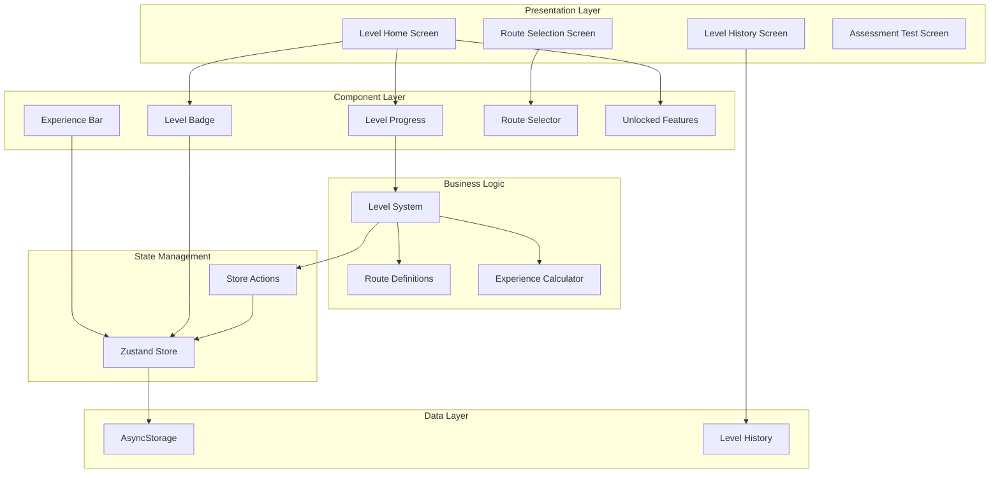
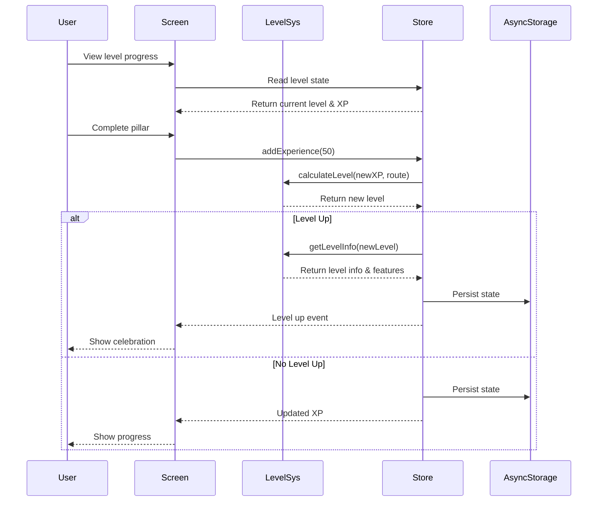

# Design Document: Sistema de Niveles

## Overview

Este documento describe el diseño técnico detallado para la Fase 3: Sistema de Niveles del sistema de gamificación. El objetivo es implementar un sistema de progresión tipo RPG con rutas personalizadas, incluyendo:

- LevelSystem: Módulo que encapsula lógica de niveles, experiencia y progresión
- Componentes de UI: LevelProgress, ExperienceBar, LevelBadge, RouteSelector, UnlockedFeatures
- Pantallas: LevelHomeScreen, LevelHistoryScreen, RouteSelectionScreen, AssessmentTestScreen
- Sistema de rutas: 4 rutas diferenciadas (beginner, intermediate, advanced, expert)
- Integración con Zustand Store y sistema de rachas existente
- Celebraciones de level up y notificaciones de cambio de ruta

Esta fase construye sobre la infraestructura de Phase 1 (setup-inicial) y Phase 2 (sistema-rachas).

### Objetivos del Diseño

1. **Progresión Clara**: Sistema que muestre progreso de forma visual e intuitiva
2. **Personalización**: Rutas adaptadas a diferentes niveles de experiencia
3. **Motivación**: Celebraciones y feedback que incentiven el progreso
4. **Integración**: Conexión fluida con sistema de rachas existente
5. **Escalabilidad**: Arquitectura que soporte futuras rutas y niveles

### Principios de Diseño

- **Single Responsibility**: LevelSystem maneja solo lógica de niveles
- **Composition over Inheritance**: Componentes pequeños y componibles
- **Immutability**: Estado inmutable en Zustand Store
- **Declarative UI**: Componentes React declarativos
- **Testability**: Lógica separada de UI para facilitar testing


## Architecture

### High-Level Architecture



### Component Interaction Flow




### Module Structure

```
src/
├── modules/
│   └── levelSystem/
│       ├── index.js              # Main LevelSystem class
│       ├── routes.js             # Route definitions
│       ├── experienceCalculator.js  # XP calculations
│       └── validators.js         # Validation functions
├── components/
│   └── level/
│       ├── LevelProgress.js      # Progress display
│       ├── ExperienceBar.js      # XP bar
│       ├── LevelBadge.js         # Level badge
│       ├── RouteSelector.js      # Route selection
│       ├── UnlockedFeatures.js   # Features list
│       └── index.js              # Barrel export
├── screens/
│   ├── LevelHomeScreen.js        # Main level screen
│   ├── LevelHistoryScreen.js     # History view
│   ├── RouteSelectionScreen.js   # Route selection
│   ├── AssessmentTestScreen.js   # Initial test
│   └── index.js
└── hooks/
    ├── useLevel.js               # Level state hook
    ├── useExperience.js          # Experience hook
    └── index.js
```

## Components and Interfaces

### 1. LevelSystem Module

El módulo central que encapsula toda la lógica de niveles.

#### Interface

```javascript
class LevelSystem {
  // Calculate current level from experience and route
  calculateLevel(experience: number, route: string): number
  
  // Get level information
  getLevelInfo(level: number, route: string): object
  
  // Get experience needed for next level
  getExperienceForNextLevel(currentLevel: number, route: string): number
  
  // Calculate progress to next level
  calculateProgress(currentExp: number, currentLevel: number, route: string): object
  
  // Get all unlocked features up to current level
  getUnlockedFeatures(level: number, route: string): string[]
  
  // Check if user can change route
  canChangeRoute(currentLevel: number, currentRoute: string, targetRoute: string): boolean
  
  // Assess user level from test results
  assessUserLevel(testResults: object): string
}
```


#### Implementation Pattern

```javascript
// src/modules/levelSystem/index.js
import { LEVEL_ROUTES } from '../../utils/constants';
import { calculateLevel, calculateExperienceForNextLevel } from '../../utils/calculations';

class LevelSystem {
  constructor() {
    this.routes = LEVEL_ROUTES;
  }
  
  calculateLevel(experience, route = 'beginner') {
    const routeData = this.routes[route];
    if (!routeData) return 1;
    
    // Find highest level reached
    for (let i = routeData.levels.length - 1; i >= 0; i--) {
      if (experience >= routeData.levels[i].experienceRequired) {
        return routeData.levels[i].level;
      }
    }
    return 1;
  }
  
  getLevelInfo(level, route = 'beginner') {
    const routeData = this.routes[route];
    if (!routeData) return null;
    
    return routeData.levels.find(l => l.level === level);
  }
  
  getExperienceForNextLevel(currentLevel, route = 'beginner') {
    const routeData = this.routes[route];
    if (!routeData) return 0;
    
    const nextLevel = routeData.levels.find(l => l.level === currentLevel + 1);
    return nextLevel ? nextLevel.experienceRequired : 0;
  }
  
  calculateProgress(currentExp, currentLevel, route = 'beginner') {
    const currentLevelInfo = this.getLevelInfo(currentLevel, route);
    const nextLevelInfo = this.getLevelInfo(currentLevel + 1, route);
    
    if (!currentLevelInfo || !nextLevelInfo) {
      return { percent: 100, current: 0, needed: 0 };
    }
    
    const expInLevel = currentExp - currentLevelInfo.experienceRequired;
    const expNeeded = nextLevelInfo.experienceRequired - currentLevelInfo.experienceRequired;
    const percent = Math.min(100, Math.max(0, (expInLevel / expNeeded) * 100));
    
    return { percent, current: expInLevel, needed: expNeeded };
  }
  
  getUnlockedFeatures(level, route = 'beginner') {
    const routeData = this.routes[route];
    if (!routeData) return [];
    
    const features = [];
    for (const levelData of routeData.levels) {
      if (levelData.level <= level) {
        features.push(...levelData.unlockedFeatures);
      }
    }
    return features;
  }
  
  canChangeRoute(currentLevel, currentRoute, targetRoute) {
    const routeOrder = ['beginner', 'intermediate', 'advanced', 'expert'];
    const currentIndex = routeOrder.indexOf(currentRoute);
    const targetIndex = routeOrder.indexOf(targetRoute);
    
    if (targetIndex !== currentIndex + 1) return false;
    
    const completionLevels = { beginner: 10, intermediate: 20, advanced: 25 };
    return currentLevel >= completionLevels[currentRoute];
  }
  
  assessUserLevel(testResults) {
    const score = testResults.score || 0;
    
    if (score < 30) return 'beginner';
    if (score < 60) return 'intermediate';
    if (score < 85) return 'advanced';
    return 'expert';
  }
}

export default new LevelSystem();
```


### 2. Route Definitions

Definición de las 4 rutas con sus niveles y features.

#### Implementation Pattern

```javascript
// src/modules/levelSystem/routes.js
export const LEVEL_ROUTES = {
  beginner: {
    id: 'beginner',
    name: 'Principiante',
    description: 'Para quienes comienzan su viaje de bienestar',
    color: '#4CAF50',
    levels: [
      { level: 1, experienceRequired: 0, title: 'Novato', unlockedFeatures: ['basic_tracking'] },
      { level: 2, experienceRequired: 100, title: 'Aprendiz', unlockedFeatures: ['daily_tips'] },
      { level: 3, experienceRequired: 400, title: 'Estudiante', unlockedFeatures: ['weekly_summary'] },
      { level: 4, experienceRequired: 900, title: 'Practicante', unlockedFeatures: ['custom_goals'] },
      { level: 5, experienceRequired: 1600, title: 'Dedicado', unlockedFeatures: ['achievement_badges'] },
      { level: 6, experienceRequired: 2500, title: 'Comprometido', unlockedFeatures: ['streak_recovery'] },
      { level: 7, experienceRequired: 3600, title: 'Persistente', unlockedFeatures: ['advanced_stats'] },
      { level: 8, experienceRequired: 4900, title: 'Determinado', unlockedFeatures: ['monthly_challenges'] },
      { level: 9, experienceRequired: 6400, title: 'Enfocado', unlockedFeatures: ['social_sharing'] },
      { level: 10, experienceRequired: 8100, title: 'Graduado', unlockedFeatures: ['route_upgrade'] }
    ]
  },
  intermediate: {
    id: 'intermediate',
    name: 'Intermedio',
    description: 'Para quienes tienen experiencia en hábitos saludables',
    color: '#2196F3',
    levels: [
      { level: 11, experienceRequired: 10000, title: 'Intermedio I', unlockedFeatures: ['advanced_tracking'] },
      { level: 12, experienceRequired: 12100, title: 'Intermedio II', unlockedFeatures: ['custom_pillars'] },
      { level: 13, experienceRequired: 14400, title: 'Intermedio III', unlockedFeatures: ['pillar_rotation'] },
      { level: 14, experienceRequired: 16900, title: 'Intermedio IV', unlockedFeatures: ['insights'] },
      { level: 15, experienceRequired: 19600, title: 'Intermedio V', unlockedFeatures: ['predictions'] },
      { level: 16, experienceRequired: 22500, title: 'Avanzando I', unlockedFeatures: ['coaching_tips'] },
      { level: 17, experienceRequired: 25600, title: 'Avanzando II', unlockedFeatures: ['habit_stacking'] },
      { level: 18, experienceRequired: 28900, title: 'Avanzando III', unlockedFeatures: ['community_access'] },
      { level: 19, experienceRequired: 32400, title: 'Avanzando IV', unlockedFeatures: ['mentor_program'] },
      { level: 20, experienceRequired: 36100, title: 'Avanzando V', unlockedFeatures: ['route_upgrade'] }
    ]
  },
  advanced: {
    id: 'advanced',
    name: 'Avanzado',
    description: 'Para expertos en optimización de bienestar',
    color: '#9C27B0',
    levels: [
      { level: 21, experienceRequired: 40000, title: 'Avanzado I', unlockedFeatures: ['biometric_integration'] },
      { level: 22, experienceRequired: 44100, title: 'Avanzado II', unlockedFeatures: ['ai_recommendations'] },
      { level: 23, experienceRequired: 48400, title: 'Avanzado III', unlockedFeatures: ['performance_analytics'] },
      { level: 24, experienceRequired: 52900, title: 'Avanzado IV', unlockedFeatures: ['custom_algorithms'] },
      { level: 25, experienceRequired: 57600, title: 'Avanzado V', unlockedFeatures: ['route_upgrade'] }
    ]
  },
  expert: {
    id: 'expert',
    name: 'Experto',
    description: 'Para maestros del bienestar integral',
    color: '#FF9800',
    levels: [
      { level: 26, experienceRequired: 62500, title: 'Experto I', unlockedFeatures: ['research_access'] },
      { level: 27, experienceRequired: 67600, title: 'Experto II', unlockedFeatures: ['beta_features'] },
      { level: 28, experienceRequired: 72900, title: 'Experto III', unlockedFeatures: ['api_access'] },
      { level: 29, experienceRequired: 78400, title: 'Experto IV', unlockedFeatures: ['white_label'] },
      { level: 30, experienceRequired: 84100, title: 'Maestro', unlockedFeatures: ['lifetime_access'] }
    ]
  }
};
```


### 3. Actualizar gameStore

Agregar estado y acciones de nivel al store existente.

#### State Extension

```javascript
// Agregar a src/stores/gameStore.js

const initialState = {
  // ... estado existente
  levelProgress: {
    currentRoute: 'beginner',
    unlockedFeatures: [],
    levelHistory: [],
    routeChangeAvailable: false
  }
};
```

#### New Actions

```javascript
// Agregar a src/stores/gameStore.js

/**
 * Añade experiencia y actualiza nivel
 * Ahora con soporte para rutas y level up
 */
addExperience: (amount) => {
  const { user, levelProgress } = get();
  
  if (!user) return;
  
  const newExp = user.experience + amount;
  const newLevel = levelSystem.calculateLevel(newExp, levelProgress.currentRoute);
  const oldLevel = user.level;
  
  const leveledUp = newLevel > oldLevel;
  
  if (leveledUp) {
    const levelInfo = levelSystem.getLevelInfo(newLevel, levelProgress.currentRoute);
    const newFeatures = levelInfo?.unlockedFeatures || [];
    
    const levelHistory = [
      ...levelProgress.levelHistory,
      {
        level: newLevel,
        route: levelProgress.currentRoute,
        unlockedAt: new Date().toISOString(),
        features: newFeatures
      }
    ];
    
    const routeChangeAvailable = levelSystem.canChangeRoute(
      newLevel, 
      levelProgress.currentRoute, 
      getNextRoute(levelProgress.currentRoute)
    );
    
    set({
      user: { ...user, experience: newExp, level: newLevel },
      levelProgress: {
        ...levelProgress,
        unlockedFeatures: levelSystem.getUnlockedFeatures(newLevel, levelProgress.currentRoute),
        levelHistory,
        routeChangeAvailable
      }
    });
    
    return { leveledUp: true, newLevel, newFeatures };
  } else {
    set({
      user: { ...user, experience: newExp, level: newLevel }
    });
    
    return { leveledUp: false };
  }
},

/**
 * Cambia la ruta del usuario
 */
changeRoute: (newRoute) => {
  const { user, levelProgress } = get();
  
  if (!levelSystem.canChangeRoute(user.level, levelProgress.currentRoute, newRoute)) {
    console.warn('Cannot change to route:', newRoute);
    return false;
  }
  
  set({
    levelProgress: {
      ...levelProgress,
      currentRoute: newRoute,
      unlockedFeatures: levelSystem.getUnlockedFeatures(user.level, newRoute),
      routeChangeAvailable: false
    },
    user: { ...user, selectedRoute: newRoute }
  });
  
  return true;
},

/**
 * Establece ruta inicial (solo primera vez)
 */
setInitialRoute: (route) => {
  const { user, levelProgress } = get();
  
  set({
    levelProgress: {
      ...levelProgress,
      currentRoute: route,
      unlockedFeatures: levelSystem.getUnlockedFeatures(user.level, route)
    },
    user: { ...user, selectedRoute: route }
  });
}
```


### 4. Custom Hooks

#### useLevel Hook

```javascript
// src/hooks/useLevel.js
import { useGameStore } from '../stores';
import levelSystem from '../modules/levelSystem';

export const useLevel = () => {
  const user = useGameStore(state => state.user);
  const levelProgress = useGameStore(state => state.levelProgress);
  const addExperience = useGameStore(state => state.addExperience);
  const changeRoute = useGameStore(state => state.changeRoute);
  const setInitialRoute = useGameStore(state => state.setInitialRoute);
  
  const currentLevel = user?.level || 1;
  const currentExp = user?.experience || 0;
  const currentRoute = levelProgress?.currentRoute || 'beginner';
  
  const progress = levelSystem.calculateProgress(currentExp, currentLevel, currentRoute);
  const levelInfo = levelSystem.getLevelInfo(currentLevel, currentRoute);
  const expForNext = levelSystem.getExperienceForNextLevel(currentLevel, currentRoute);
  const unlockedFeatures = levelProgress?.unlockedFeatures || [];
  
  const canUpgradeRoute = (targetRoute) => {
    return levelSystem.canChangeRoute(currentLevel, currentRoute, targetRoute);
  };
  
  return {
    currentLevel,
    currentExp,
    currentRoute,
    progress,
    levelInfo,
    expForNext,
    unlockedFeatures,
    levelHistory: levelProgress?.levelHistory || [],
    routeChangeAvailable: levelProgress?.routeChangeAvailable || false,
    addExperience,
    changeRoute,
    setInitialRoute,
    canUpgradeRoute
  };
};
```

#### useExperience Hook

```javascript
// src/hooks/useExperience.js
import { useGameStore } from '../stores';

export const useExperience = () => {
  const user = useGameStore(state => state.user);
  const addExperience = useGameStore(state => state.addExperience);
  
  const currentExp = user?.experience || 0;
  
  const grantExperience = (amount, source = 'unknown') => {
    console.log(`Granting ${amount} XP from ${source}`);
    return addExperience(amount);
  };
  
  return {
    currentExp,
    grantExperience,
    addExperience
  };
};
```


### 5. Level Components

#### LevelProgress Component

```javascript
// src/components/level/LevelProgress.js
import React from 'react';
import { View, Text, StyleSheet } from 'react-native';
import { useLevel } from '../../hooks';

export const LevelProgress = ({ style }) => {
  const { currentLevel, progress, levelInfo, expForNext } = useLevel();
  
  return (
    <View style={[styles.container, style]}>
      <View style={styles.header}>
        <Text style={styles.levelText}>Nivel {currentLevel}</Text>
        <Text style={styles.titleText}>{levelInfo?.title || 'Novato'}</Text>
      </View>
      
      <View style={styles.progressContainer}>
        <View style={styles.progressBar}>
          <View 
            style={[styles.progressFill, { width: `${progress.percent}%` }]} 
          />
        </View>
        <Text style={styles.progressText}>
          {Math.round(progress.current)} / {Math.round(progress.needed)} XP
        </Text>
      </View>
      
      <Text style={styles.nextLevelText}>
        {Math.round(progress.needed - progress.current)} XP para nivel {currentLevel + 1}
      </Text>
    </View>
  );
};

const styles = StyleSheet.create({
  container: {
    backgroundColor: '#FFFFFF',
    borderRadius: 12,
    padding: 16,
    shadowColor: '#000',
    shadowOffset: { width: 0, height: 2 },
    shadowOpacity: 0.1,
    shadowRadius: 4,
    elevation: 3
  },
  header: {
    flexDirection: 'row',
    justifyContent: 'space-between',
    alignItems: 'center',
    marginBottom: 12
  },
  levelText: {
    fontSize: 24,
    fontWeight: 'bold',
    color: '#FF6B35'
  },
  titleText: {
    fontSize: 16,
    color: '#666',
    fontStyle: 'italic'
  },
  progressContainer: {
    marginBottom: 8
  },
  progressBar: {
    height: 12,
    backgroundColor: '#E0E0E0',
    borderRadius: 6,
    overflow: 'hidden',
    marginBottom: 4
  },
  progressFill: {
    height: '100%',
    backgroundColor: '#4CAF50',
    borderRadius: 6
  },
  progressText: {
    fontSize: 12,
    color: '#999',
    textAlign: 'right'
  },
  nextLevelText: {
    fontSize: 14,
    color: '#666',
    textAlign: 'center'
  }
});
```
