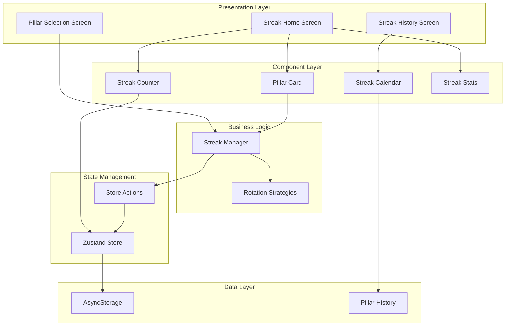
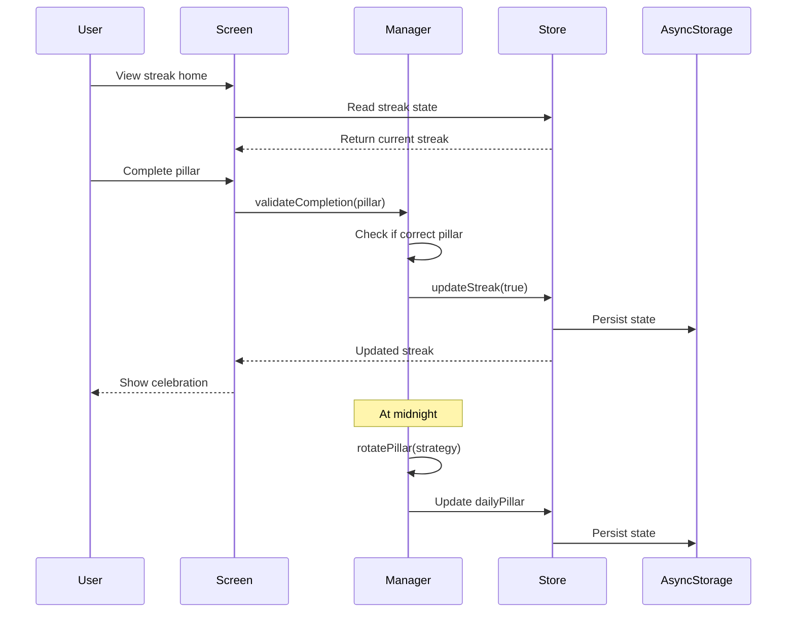

# Design Document: Sistema de Rachas

## Overview

Este documento describe el diseño técnico detallado para la Fase 2: Sistema de Rachas del sistema de gamificación. El objetivo es implementar el núcleo del sistema de motivación basado en rachas, incluyendo:

- StreakManager: Módulo que encapsula lógica de cálculo y validación de rachas
- Componentes de UI: StreakCounter, StreakCalendar, PillarCard, StreakStats
- Pantallas: StreakHomeScreen, StreakHistoryScreen, PillarSelectionScreen
- Rotación de pilares: Automática (medianoche) y manual (usuario)
- Estrategias de rotación: round-robin, stats-based, weighted-random
- Integración con Zustand Store y persistencia en AsyncStorage

Esta fase construye sobre la infraestructura establecida en Phase 1 (setup-inicial) y es fundamental para mantener el engagement del usuario.

### Objetivos del Diseño

1. **Motivación**: Sistema que incentive la consistencia diaria
2. **Flexibilidad**: Permitir rotación automática y selección manual
3. **Visualización**: Componentes claros que muestren progreso y estado
4. **Persistencia**: Historial completo de rachas y rotaciones
5. **Extensibilidad**: Arquitectura que soporte futuras estrategias de rotación

### Principios de Diseño

- **Single Responsibility**: StreakManager maneja solo lógica de rachas
- **Composition over Inheritance**: Componentes pequeños y componibles
- **Immutability**: Estado inmutable en Zustand Store
- **Declarative UI**: Componentes React declarativos
- **Testability**: Lógica separada de UI para facilitar testing

## Architecture

### High-Level Architecture



### Component Interaction Flow



### Module Structure

```
src/
├── modules/
│   └── streakManager/
│       ├── index.js              # Main StreakManager class
│       ├── strategies.js         # Rotation strategies
│       └── validators.js         # Validation functions
├── components/
│   └── streak/
│       ├── StreakCounter.js      # Streak count display
│       ├── StreakCalendar.js     # Calendar visualization
│       ├── PillarCard.js         # Daily pillar card
│       ├── StreakStats.js        # Statistics display
│       └── index.js              # Barrel export
├── screens/
│   ├── StreakHomeScreen.js       # Main streak screen
│   ├── StreakHistoryScreen.js    # History view
│   ├── PillarSelectionScreen.js  # Manual selection
│   └── index.js
└── hooks/
    ├── useStreak.js              # Streak state hook
    ├── usePillarRotation.js      # Rotation logic hook
    └── index.js
```

## Components and Interfaces

### 1. StreakManager Module

El módulo central que encapsula toda la lógica de rachas.

#### Interface

```javascript
class StreakManager {
  // Calculate current streak from history
  calculateCurrentStreak(pillarHistory: Array): number
  
  // Check if streak is active (within 24h)
  isStreakActive(lastCompletedDate: string): boolean
  
  // Get pillar for today based on strategy
  getPillarForToday(strategy: string, userStats: object): string
  
  // Validate pillar completion
  validateCompletion(pillar: string, dailyPillar: object): boolean
  
  // Rotate pillar (automatic or manual)
  rotatePillar(manual: boolean, selectedPillar?: string, strategy?: string): object
  
  // Get rotation strategy
  getRotationStrategy(strategyName: string): Function
}
```

#### Implementation Pattern

```javascript
// src/modules/streakManager/index.js
import { getCurrentDate, isSameDay, getDaysDifference } from '../../utils/dateHelpers';
import { roundRobinStrategy, statsBasedStrategy, weightedRandomStrategy } from './strategies';

class StreakManager {
  constructor() {
    this.strategies = {
      'round-robin': roundRobinStrategy,
      'stats-based': statsBasedStrategy,
      'weighted-random': weightedRandomStrategy
    };
  }
  
  calculateCurrentStreak(pillarHistory) {
    if (!pillarHistory || pillarHistory.length === 0) {
      return 0;
    }
    
    // Sort by date descending
    const sorted = [...pillarHistory].sort((a, b) => 
      new Date(b.date) - new Date(a.date)
    );
    
    let streak = 0;
    let currentDate = new Date();
    
    for (const entry of sorted) {
      const entryDate = new Date(entry.date);
      const daysDiff = getDaysDifference(entryDate, currentDate);
      
      // If gap is more than 1 day, streak is broken
      if (daysDiff > 1) {
        break;
      }
      
      if (entry.completed) {
        streak++;
        currentDate = entryDate;
      } else {
        break;
      }
    }
    
    return streak;
  }
  
  isStreakActive(lastCompletedDate) {
    if (!lastCompletedDate) {
      return false;
    }
    
    const now = new Date();
    const lastCompleted = new Date(lastCompletedDate);
    const hoursDiff = (now - lastCompleted) / (1000 * 60 * 60);
    
    return hoursDiff <= 24;
  }
  
  getPillarForToday(strategy = 'round-robin', userStats = {}, pillarHistory = []) {
    const strategyFn = this.strategies[strategy] || this.strategies['round-robin'];
    return strategyFn(userStats, pillarHistory);
  }
  
  validateCompletion(pillar, dailyPillar) {
    if (!dailyPillar) {
      return false;
    }
    
    return pillar === dailyPillar.pillar;
  }
  
  rotatePillar(manual = false, selectedPillar = null, strategy = 'round-robin', userStats = {}, pillarHistory = []) {
    const pillar = manual && selectedPillar 
      ? selectedPillar 
      : this.getPillarForToday(strategy, userStats, pillarHistory);
    
    return {
      date: getCurrentDate(),
      pillar,
      isManuallySet: manual,
      target: this._getTargetForPillar(pillar),
      progress: 0,
      completed: false
    };
  }
  
  _getTargetForPillar(pillar) {
    const targets = {
      nutrition: { type: 'meals', value: 3, unit: 'comidas saludables' },
      sleep: { type: 'hours', value: 8, unit: 'horas' },
      movement: { type: 'minutes', value: 30, unit: 'minutos' }
    };
    
    return targets[pillar] || targets.nutrition;
  }
  
  getRotationStrategy(strategyName) {
    return this.strategies[strategyName] || this.strategies['round-robin'];
  }
}

export default new StreakManager();
```


### 2. Rotation Strategies

Estrategias intercambiables para rotación de pilares.

#### Implementation Pattern

```javascript
// src/modules/streakManager/strategies.js
import { PILLARS } from '../../utils/constants';

/**
 * Round-robin strategy: Rotate pillars in sequence
 * @param {object} userStats - User statistics (unused)
 * @param {Array} pillarHistory - History of pillar completions
 * @returns {string} Next pillar
 */
export const roundRobinStrategy = (userStats, pillarHistory) => {
  const sequence = [PILLARS.NUTRITION, PILLARS.SLEEP, PILLARS.MOVEMENT];
  
  if (!pillarHistory || pillarHistory.length === 0) {
    return sequence[0];
  }
  
  // Get last pillar
  const lastEntry = pillarHistory[pillarHistory.length - 1];
  const lastPillar = lastEntry.pillar;
  
  // Find next in sequence
  const currentIndex = sequence.indexOf(lastPillar);
  const nextIndex = (currentIndex + 1) % sequence.length;
  
  return sequence[nextIndex];
};

/**
 * Stats-based strategy: Prioritize pillar with lowest progress
 * @param {object} userStats - User statistics by pillar
 * @param {Array} pillarHistory - History of pillar completions
 * @returns {string} Pillar with lowest stats
 */
export const statsBasedStrategy = (userStats, pillarHistory) => {
  if (!userStats || Object.keys(userStats).length === 0) {
    return roundRobinStrategy(userStats, pillarHistory);
  }
  
  // Find pillar with lowest stat
  const pillars = [PILLARS.NUTRITION, PILLARS.SLEEP, PILLARS.MOVEMENT];
  let lowestPillar = pillars[0];
  let lowestValue = userStats[lowestPillar] || 0;
  
  for (const pillar of pillars) {
    const value = userStats[pillar] || 0;
    if (value < lowestValue) {
      lowestValue = value;
      lowestPillar = pillar;
    }
  }
  
  return lowestPillar;
};

/**
 * Weighted random strategy: Random selection weighted by inverse stats
 * @param {object} userStats - User statistics by pillar
 * @param {Array} pillarHistory - History of pillar completions
 * @returns {string} Randomly selected pillar
 */
export const weightedRandomStrategy = (userStats, pillarHistory) => {
  if (!userStats || Object.keys(userStats).length === 0) {
    return roundRobinStrategy(userStats, pillarHistory);
  }
  
  const pillars = [PILLARS.NUTRITION, PILLARS.SLEEP, PILLARS.MOVEMENT];
  
  // Calculate weights (inverse of stats, so lower stats = higher weight)
  const maxStat = 100;
  const weights = pillars.map(pillar => {
    const stat = userStats[pillar] || 0;
    return maxStat - stat + 1; // +1 to avoid zero weight
  });
  
  // Calculate total weight
  const totalWeight = weights.reduce((sum, w) => sum + w, 0);
  
  // Random selection
  let random = Math.random() * totalWeight;
  
  for (let i = 0; i < pillars.length; i++) {
    random -= weights[i];
    if (random <= 0) {
      return pillars[i];
    }
  }
  
  return pillars[pillars.length - 1];
};
```

### 3. Streak Components

#### StreakCounter Component

```javascript
// src/components/streak/StreakCounter.js
import React from 'react';
import { View, Text, StyleSheet } from 'react-native';
import { useGameStore } from '../../stores';

/**
 * Displays current streak count with fire emoji
 */
export const StreakCounter = ({ size = 'medium', style }) => {
  const currentStreak = useGameStore(state => state.user?.currentStreak || 0);
  
  const sizeStyles = {
    small: { fontSize: 16, iconSize: 20 },
    medium: { fontSize: 24, iconSize: 32 },
    large: { fontSize: 36, iconSize: 48 }
  };
  
  const { fontSize, iconSize } = sizeStyles[size] || sizeStyles.medium;
  
  return (
    <View style={[styles.container, style]}>
      <Text style={[styles.count, { fontSize }]}>
        {currentStreak}
      </Text>
      <Text style={[styles.icon, { fontSize: iconSize }]}>
        🔥
      </Text>
    </View>
  );
};

const styles = StyleSheet.create({
  container: {
    flexDirection: 'row',
    alignItems: 'center',
    justifyContent: 'center',
    gap: 8
  },
  count: {
    fontWeight: 'bold',
    color: '#FF6B35'
  },
  icon: {
    lineHeight: 1
  }
});
```

#### PillarCard Component

```javascript
// src/components/streak/PillarCard.js
import React from 'react';
import { View, Text, TouchableOpacity, StyleSheet } from 'react-native';
import { useGameStore } from '../../stores';
import streakManager from '../../modules/streakManager';

const PILLAR_CONFIG = {
  nutrition: {
    name: 'Nutrición',
    icon: '🥗',
    color: '#4CAF50'
  },
  sleep: {
    name: 'Sueño',
    icon: '😴',
    color: '#2196F3'
  },
  movement: {
    name: 'Movimiento',
    icon: '🏃',
    color: '#FF9800'
  }
};

/**
 * Displays daily pillar with progress and completion button
 */
export const PillarCard = ({ onComplete, style }) => {
  const dailyPillar = useGameStore(state => state.dailyPillar);
  const updateStreak = useGameStore(state => state.updateStreak);
  
  if (!dailyPillar) {
    return null;
  }
  
  const config = PILLAR_CONFIG[dailyPillar.pillar];
  const { target, progress, completed } = dailyPillar;
  const progressPercent = Math.min(100, (progress / target.value) * 100);
  
  const handleComplete = () => {
    if (!completed && progressPercent >= 100) {
      updateStreak(true);
      onComplete?.();
    }
  };
  
  return (
    <View style={[styles.card, { borderColor: config.color }, style]}>
      <View style={styles.header}>
        <Text style={styles.icon}>{config.icon}</Text>
        <Text style={styles.name}>{config.name}</Text>
      </View>
      
      <View style={styles.target}>
        <Text style={styles.targetText}>
          Objetivo: {target.value} {target.unit}
        </Text>
      </View>
      
      <View style={styles.progressBar}>
        <View 
          style={[
            styles.progressFill, 
            { width: `${progressPercent}%`, backgroundColor: config.color }
          ]} 
        />
      </View>
      
      <Text style={styles.progressText}>
        {progress} / {target.value} {target.unit}
      </Text>
      
      {completed ? (
        <View style={[styles.completedBadge, { backgroundColor: config.color }]}>
          <Text style={styles.completedText}>✓ Completado</Text>
        </View>
      ) : (
        <TouchableOpacity
          style={[
            styles.completeButton,
            { backgroundColor: config.color },
            progressPercent < 100 && styles.disabledButton
          ]}
          onPress={handleComplete}
          disabled={progressPercent < 100}
        >
          <Text style={styles.buttonText}>Marcar como Completado</Text>
        </TouchableOpacity>
      )}
    </View>
  );
};

const styles = StyleSheet.create({
  card: {
    backgroundColor: '#FFFFFF',
    borderRadius: 12,
    borderWidth: 2,
    padding: 16,
    shadowColor: '#000',
    shadowOffset: { width: 0, height: 2 },
    shadowOpacity: 0.1,
    shadowRadius: 4,
    elevation: 3
  },
  header: {
    flexDirection: 'row',
    alignItems: 'center',
    marginBottom: 12
  },
  icon: {
    fontSize: 32,
    marginRight: 12
  },
  name: {
    fontSize: 20,
    fontWeight: 'bold',
    color: '#333'
  },
  target: {
    marginBottom: 8
  },
  targetText: {
    fontSize: 14,
    color: '#666'
  },
  progressBar: {
    height: 8,
    backgroundColor: '#E0E0E0',
    borderRadius: 4,
    overflow: 'hidden',
    marginBottom: 8
  },
  progressFill: {
    height: '100%',
    borderRadius: 4
  },
  progressText: {
    fontSize: 12,
    color: '#999',
    marginBottom: 12
  },
  completeButton: {
    padding: 12,
    borderRadius: 8,
    alignItems: 'center'
  },
  disabledButton: {
    opacity: 0.5
  },
  buttonText: {
    color: '#FFFFFF',
    fontWeight: 'bold',
    fontSize: 16
  },
  completedBadge: {
    padding: 12,
    borderRadius: 8,
    alignItems: 'center'
  },
  completedText: {
    color: '#FFFFFF',
    fontWeight: 'bold',
    fontSize: 16
  }
});
```


#### StreakCalendar Component

```javascript
// src/components/streak/StreakCalendar.js
import React, { useState } from 'react';
import { View, Text, TouchableOpacity, StyleSheet, Modal } from 'react-native';
import { useGameStore } from '../../stores';
import { isSameDay } from '../../utils/dateHelpers';

const PILLAR_ICONS = {
  nutrition: '🥗',
  sleep: '😴',
  movement: '🏃'
};

/**
 * Displays calendar view of streak history
 */
export const StreakCalendar = ({ daysToShow = 30, style }) => {
  const pillarHistory = useGameStore(state => state.streak?.pillarHistory || []);
  const [selectedDay, setSelectedDay] = useState(null);
  
  // Generate last N days
  const days = [];
  const today = new Date();
  
  for (let i = daysToShow - 1; i >= 0; i--) {
    const date = new Date(today);
    date.setDate(date.getDate() - i);
    days.push(date);
  }
  
  const getDayData = (date) => {
    return pillarHistory.find(entry => 
      isSameDay(entry.date, date.toISOString())
    );
  };
  
  const renderDay = (date, index) => {
    const dayData = getDayData(date);
    const isCompleted = dayData?.completed;
    const pillar = dayData?.pillar;
    
    return (
      <TouchableOpacity
        key={index}
        style={[
          styles.day,
          isCompleted && styles.completedDay,
          !isCompleted && dayData && styles.incompletedDay
        ]}
        onPress={() => setSelectedDay(dayData)}
      >
        <Text style={styles.dayNumber}>{date.getDate()}</Text>
        {isCompleted && pillar && (
          <Text style={styles.pillarIcon}>{PILLAR_ICONS[pillar]}</Text>
        )}
      </TouchableOpacity>
    );
  };
  
  return (
    <View style={[styles.container, style]}>
      <View style={styles.grid}>
        {days.map((date, index) => renderDay(date, index))}
      </View>
      
      {selectedDay && (
        <Modal
          visible={!!selectedDay}
          transparent
          animationType="fade"
          onRequestClose={() => setSelectedDay(null)}
        >
          <TouchableOpacity 
            style={styles.modalOverlay}
            activeOpacity={1}
            onPress={() => setSelectedDay(null)}
          >
            <View style={styles.modalContent}>
              <Text style={styles.modalTitle}>
                {new Date(selectedDay.date).toLocaleDateString()}
              </Text>
              <Text style={styles.modalPillar}>
                {PILLAR_ICONS[selectedDay.pillar]} {selectedDay.pillar}
              </Text>
              <Text style={styles.modalStatus}>
                {selectedDay.completed ? '✓ Completado' : '✗ No completado'}
              </Text>
              {selectedDay.metrics && (
                <Text style={styles.modalMetrics}>
                  {JSON.stringify(selectedDay.metrics, null, 2)}
                </Text>
              )}
            </View>
          </TouchableOpacity>
        </Modal>
      )}
    </View>
  );
};

const styles = StyleSheet.create({
  container: {
    padding: 8
  },
  grid: {
    flexDirection: 'row',
    flexWrap: 'wrap',
    gap: 8
  },
  day: {
    width: 40,
    height: 40,
    borderRadius: 8,
    backgroundColor: '#F5F5F5',
    alignItems: 'center',
    justifyContent: 'center',
    borderWidth: 1,
    borderColor: '#E0E0E0'
  },
  completedDay: {
    backgroundColor: '#C8E6C9',
    borderColor: '#4CAF50'
  },
  incompletedDay: {
    backgroundColor: '#FFCDD2',
    borderColor: '#F44336'
  },
  dayNumber: {
    fontSize: 12,
    fontWeight: 'bold',
    color: '#333'
  },
  pillarIcon: {
    fontSize: 10,
    marginTop: 2
  },
  modalOverlay: {
    flex: 1,
    backgroundColor: 'rgba(0, 0, 0, 0.5)',
    justifyContent: 'center',
    alignItems: 'center'
  },
  modalContent: {
    backgroundColor: '#FFFFFF',
    borderRadius: 12,
    padding: 20,
    minWidth: 250,
    shadowColor: '#000',
    shadowOffset: { width: 0, height: 2 },
    shadowOpacity: 0.25,
    shadowRadius: 4,
    elevation: 5
  },
  modalTitle: {
    fontSize: 18,
    fontWeight: 'bold',
    marginBottom: 12,
    color: '#333'
  },
  modalPillar: {
    fontSize: 16,
    marginBottom: 8,
    color: '#666'
  },
  modalStatus: {
    fontSize: 14,
    marginBottom: 8,
    color: '#666'
  },
  modalMetrics: {
    fontSize: 12,
    color: '#999',
    fontFamily: 'monospace'
  }
});
```

#### StreakStats Component

```javascript
// src/components/streak/StreakStats.js
import React from 'react';
import { View, Text, StyleSheet } from 'react-native';
import { useGameStore } from '../../stores';

/**
 * Displays streak statistics
 */
export const StreakStats = ({ style }) => {
  const user = useGameStore(state => state.user);
  const pillarHistory = useGameStore(state => state.streak?.pillarHistory || []);
  
  const currentStreak = user?.currentStreak || 0;
  const longestStreak = user?.longestStreak || 0;
  
  // Calculate completion rate
  const totalDays = pillarHistory.length;
  const completedDays = pillarHistory.filter(entry => entry.completed).length;
  const completionRate = totalDays > 0 
    ? Math.round((completedDays / totalDays) * 100) 
    : 0;
  
  // Count completions by pillar
  const pillarCounts = pillarHistory.reduce((acc, entry) => {
    if (entry.completed) {
      acc[entry.pillar] = (acc[entry.pillar] || 0) + 1;
    }
    return acc;
  }, {});
  
  const renderStat = (label, value, icon) => (
    <View style={styles.stat}>
      <Text style={styles.statIcon}>{icon}</Text>
      <Text style={styles.statValue}>{value}</Text>
      <Text style={styles.statLabel}>{label}</Text>
    </View>
  );
  
  return (
    <View style={[styles.container, style]}>
      <Text style={styles.title}>Estadísticas</Text>
      
      <View style={styles.statsGrid}>
        {renderStat('Racha Actual', currentStreak, '🔥')}
        {renderStat('Racha Más Larga', longestStreak, '🏆')}
        {renderStat('Tasa de Completación', `${completionRate}%`, '📊')}
      </View>
      
      <View style={styles.pillarStats}>
        <Text style={styles.subtitle}>Por Pilar</Text>
        <View style={styles.pillarRow}>
          <Text style={styles.pillarStat}>🥗 {pillarCounts.nutrition || 0}</Text>
          <Text style={styles.pillarStat}>😴 {pillarCounts.sleep || 0}</Text>
          <Text style={styles.pillarStat}>🏃 {pillarCounts.movement || 0}</Text>
        </View>
      </View>
    </View>
  );
};

const styles = StyleSheet.create({
  container: {
    backgroundColor: '#FFFFFF',
    borderRadius: 12,
    padding: 16,
    shadowColor: '#000',
    shadowOffset: { width: 0, height: 2 },
    shadowOpacity: 0.1,
    shadowRadius: 4,
    elevation: 3
  },
  title: {
    fontSize: 18,
    fontWeight: 'bold',
    marginBottom: 16,
    color: '#333'
  },
  statsGrid: {
    flexDirection: 'row',
    justifyContent: 'space-around',
    marginBottom: 16
  },
  stat: {
    alignItems: 'center'
  },
  statIcon: {
    fontSize: 24,
    marginBottom: 4
  },
  statValue: {
    fontSize: 20,
    fontWeight: 'bold',
    color: '#333',
    marginBottom: 2
  },
  statLabel: {
    fontSize: 12,
    color: '#666',
    textAlign: 'center'
  },
  pillarStats: {
    borderTopWidth: 1,
    borderTopColor: '#E0E0E0',
    paddingTop: 12
  },
  subtitle: {
    fontSize: 14,
    fontWeight: 'bold',
    marginBottom: 8,
    color: '#666'
  },
  pillarRow: {
    flexDirection: 'row',
    justifyContent: 'space-around'
  },
  pillarStat: {
    fontSize: 16,
    color: '#333'
  }
});
```

### 4. Custom Hooks

#### useStreak Hook

```javascript
// src/hooks/useStreak.js
import { useGameStore } from '../stores';
import streakManager from '../modules/streakManager';

/**
 * Custom hook for streak operations
 */
export const useStreak = () => {
  const user = useGameStore(state => state.user);
  const streak = useGameStore(state => state.streak);
  const dailyPillar = useGameStore(state => state.dailyPillar);
  const updateStreak = useGameStore(state => state.updateStreak);
  const rotatePillar = useGameStore(state => state.rotatePillar);
  
  const currentStreak = user?.currentStreak || 0;
  const longestStreak = user?.longestStreak || 0;
  const isActive = streakManager.isStreakActive(streak?.lastCompletedDate);
  
  const completePillar = (pillar) => {
    const isValid = streakManager.validateCompletion(pillar, dailyPillar);
    if (isValid) {
      updateStreak(true);
      return true;
    }
    return false;
  };
  
  const selectPillar = (pillar) => {
    rotatePillar(true, pillar);
  };
  
  return {
    currentStreak,
    longestStreak,
    isActive,
    dailyPillar,
    pillarHistory: streak?.pillarHistory || [],
    completePillar,
    selectPillar
  };
};
```

#### usePillarRotation Hook

```javascript
// src/hooks/usePillarRotation.js
import { useEffect } from 'react';
import { useGameStore } from '../stores';
import { isToday } from '../utils/dateHelpers';

/**
 * Custom hook for automatic pillar rotation
 */
export const usePillarRotation = () => {
  const dailyPillar = useGameStore(state => state.dailyPillar);
  const rotatePillar = useGameStore(state => state.rotatePillar);
  
  useEffect(() => {
    // Check if we need to rotate (new day)
    const checkRotation = () => {
      if (!dailyPillar || !isToday(dailyPillar.date)) {
        // Rotate to new pillar
        rotatePillar(false);
      }
    };
    
    // Check on mount
    checkRotation();
    
    // Check every minute
    const interval = setInterval(checkRotation, 60000);
    
    return () => clearInterval(interval);
  }, [dailyPillar, rotatePillar]);
  
  return {
    dailyPillar,
    needsRotation: dailyPillar && !isToday(dailyPillar.date)
  };
};
```


## Screens

### 1. StreakHomeScreen

```javascript
// src/screens/StreakHomeScreen.js
import React, { useState } from 'react';
import { View, Text, ScrollView, TouchableOpacity, StyleSheet, Animated } from 'react-native';
import { StreakCounter, PillarCard, StreakStats } from '../components/streak';
import { useStreak, usePillarRotation } from '../hooks';

export const StreakHomeScreen = ({ navigation }) => {
  usePillarRotation(); // Auto-rotate pillar
  const { currentStreak, completePillar } = useStreak();
  const [celebrationAnim] = useState(new Animated.Value(0));
  
  const handleComplete = () => {
    // Show celebration animation
    Animated.sequence([
      Animated.timing(celebrationAnim, {
        toValue: 1,
        duration: 300,
        useNativeDriver: true
      }),
      Animated.timing(celebrationAnim, {
        toValue: 0,
        duration: 300,
        delay: 1000,
        useNativeDriver: true
      })
    ]).start();
  };
  
  const celebrationScale = celebrationAnim.interpolate({
    inputRange: [0, 1],
    outputRange: [0, 1]
  });
  
  return (
    <ScrollView style={styles.container}>
      <View style={styles.header}>
        <Text style={styles.title}>Mi Racha</Text>
        <StreakCounter size="large" />
      </View>
      
      <PillarCard 
        style={styles.pillarCard}
        onComplete={handleComplete}
      />
      
      <StreakStats style={styles.stats} />
      
      <View style={styles.actions}>
        <TouchableOpacity
          style={styles.button}
          onPress={() => navigation.navigate('StreakHistory')}
        >
          <Text style={styles.buttonText}>Ver Historial</Text>
        </TouchableOpacity>
        
        <TouchableOpacity
          style={[styles.button, styles.secondaryButton]}
          onPress={() => navigation.navigate('PillarSelection')}
        >
          <Text style={[styles.buttonText, styles.secondaryButtonText]}>
            Cambiar Pilar
          </Text>
        </TouchableOpacity>
      </View>
      
      {/* Celebration overlay */}
      <Animated.View 
        style={[
          styles.celebration,
          {
            opacity: celebrationAnim,
            transform: [{ scale: celebrationScale }]
          }
        ]}
        pointerEvents="none"
      >
        <Text style={styles.celebrationText}>🎉</Text>
        <Text style={styles.celebrationMessage}>¡Pilar Completado!</Text>
      </Animated.View>
    </ScrollView>
  );
};

const styles = StyleSheet.create({
  container: {
    flex: 1,
    backgroundColor: '#F5F5F5'
  },
  header: {
    padding: 20,
    alignItems: 'center',
    backgroundColor: '#FFFFFF',
    borderBottomWidth: 1,
    borderBottomColor: '#E0E0E0'
  },
  title: {
    fontSize: 24,
    fontWeight: 'bold',
    marginBottom: 12,
    color: '#333'
  },
  pillarCard: {
    margin: 16
  },
  stats: {
    margin: 16
  },
  actions: {
    padding: 16,
    gap: 12
  },
  button: {
    backgroundColor: '#FF6B35',
    padding: 16,
    borderRadius: 8,
    alignItems: 'center'
  },
  secondaryButton: {
    backgroundColor: '#FFFFFF',
    borderWidth: 2,
    borderColor: '#FF6B35'
  },
  buttonText: {
    color: '#FFFFFF',
    fontSize: 16,
    fontWeight: 'bold'
  },
  secondaryButtonText: {
    color: '#FF6B35'
  },
  celebration: {
    position: 'absolute',
    top: '40%',
    left: 0,
    right: 0,
    alignItems: 'center',
    justifyContent: 'center'
  },
  celebrationText: {
    fontSize: 80
  },
  celebrationMessage: {
    fontSize: 24,
    fontWeight: 'bold',
    color: '#4CAF50',
    marginTop: 8
  }
});
```

### 2. StreakHistoryScreen

```javascript
// src/screens/StreakHistoryScreen.js
import React from 'react';
import { View, Text, ScrollView, StyleSheet } from 'react-native';
import { StreakCalendar, StreakStats } from '../components/streak';
import { useStreak } from '../hooks';

export const StreakHistoryScreen = ({ navigation }) => {
  const { pillarHistory } = useStreak();
  
  return (
    <ScrollView style={styles.container}>
      <View style={styles.header}>
        <Text style={styles.title}>Historial de Rachas</Text>
      </View>
      
      <View style={styles.section}>
        <Text style={styles.sectionTitle}>Últimos 30 Días</Text>
        <StreakCalendar daysToShow={30} />
      </View>
      
      <View style={styles.section}>
        <StreakStats />
      </View>
      
      <View style={styles.section}>
        <Text style={styles.sectionTitle}>Resumen</Text>
        <Text style={styles.summaryText}>
          Total de días registrados: {pillarHistory.length}
        </Text>
        <Text style={styles.summaryText}>
          Días completados: {pillarHistory.filter(e => e.completed).length}
        </Text>
      </View>
    </ScrollView>
  );
};

const styles = StyleSheet.create({
  container: {
    flex: 1,
    backgroundColor: '#F5F5F5'
  },
  header: {
    padding: 20,
    backgroundColor: '#FFFFFF',
    borderBottomWidth: 1,
    borderBottomColor: '#E0E0E0'
  },
  title: {
    fontSize: 24,
    fontWeight: 'bold',
    color: '#333'
  },
  section: {
    margin: 16,
    padding: 16,
    backgroundColor: '#FFFFFF',
    borderRadius: 12,
    shadowColor: '#000',
    shadowOffset: { width: 0, height: 2 },
    shadowOpacity: 0.1,
    shadowRadius: 4,
    elevation: 3
  },
  sectionTitle: {
    fontSize: 18,
    fontWeight: 'bold',
    marginBottom: 12,
    color: '#333'
  },
  summaryText: {
    fontSize: 14,
    color: '#666',
    marginBottom: 8
  }
});
```

### 3. PillarSelectionScreen

```javascript
// src/screens/PillarSelectionScreen.js
import React from 'react';
import { View, Text, TouchableOpacity, StyleSheet, Alert } from 'react-native';
import { useStreak } from '../hooks';

const PILLARS = [
  {
    id: 'nutrition',
    name: 'Nutrición',
    icon: '🥗',
    description: 'Enfócate en comer saludable hoy',
    color: '#4CAF50'
  },
  {
    id: 'sleep',
    name: 'Sueño',
    icon: '😴',
    description: 'Prioriza tu descanso hoy',
    color: '#2196F3'
  },
  {
    id: 'movement',
    name: 'Movimiento',
    icon: '🏃',
    description: 'Mantente activo hoy',
    color: '#FF9800'
  }
];

export const PillarSelectionScreen = ({ navigation }) => {
  const { dailyPillar, selectPillar } = useStreak();
  
  const handleSelect = (pillarId) => {
    if (dailyPillar?.completed) {
      Alert.alert(
        'Pilar Completado',
        'Ya completaste el pilar de hoy. No puedes cambiarlo.',
        [{ text: 'OK' }]
      );
      return;
    }
    
    selectPillar(pillarId);
    Alert.alert(
      'Pilar Actualizado',
      `Tu pilar del día ahora es: ${PILLARS.find(p => p.id === pillarId)?.name}`,
      [
        {
          text: 'OK',
          onPress: () => navigation.goBack()
        }
      ]
    );
  };
  
  return (
    <View style={styles.container}>
      <View style={styles.header}>
        <Text style={styles.title}>Selecciona tu Pilar</Text>
        <Text style={styles.subtitle}>
          Elige en qué quieres enfocarte hoy
        </Text>
      </View>
      
      <View style={styles.pillars}>
        {PILLARS.map(pillar => (
          <TouchableOpacity
            key={pillar.id}
            style={[
              styles.pillarOption,
              { borderColor: pillar.color },
              dailyPillar?.pillar === pillar.id && styles.selectedPillar
            ]}
            onPress={() => handleSelect(pillar.id)}
            disabled={dailyPillar?.completed}
          >
            <Text style={styles.pillarIcon}>{pillar.icon}</Text>
            <Text style={styles.pillarName}>{pillar.name}</Text>
            <Text style={styles.pillarDescription}>{pillar.description}</Text>
            
            {dailyPillar?.pillar === pillar.id && (
              <View style={[styles.badge, { backgroundColor: pillar.color }]}>
                <Text style={styles.badgeText}>Actual</Text>
              </View>
            )}
          </TouchableOpacity>
        ))}
      </View>
      
      {dailyPillar?.completed && (
        <View style={styles.notice}>
          <Text style={styles.noticeText}>
            ⚠️ Ya completaste el pilar de hoy. Vuelve mañana para seleccionar uno nuevo.
          </Text>
        </View>
      )}
    </View>
  );
};

const styles = StyleSheet.create({
  container: {
    flex: 1,
    backgroundColor: '#F5F5F5'
  },
  header: {
    padding: 20,
    backgroundColor: '#FFFFFF',
    borderBottomWidth: 1,
    borderBottomColor: '#E0E0E0'
  },
  title: {
    fontSize: 24,
    fontWeight: 'bold',
    marginBottom: 8,
    color: '#333'
  },
  subtitle: {
    fontSize: 14,
    color: '#666'
  },
  pillars: {
    padding: 16,
    gap: 16
  },
  pillarOption: {
    backgroundColor: '#FFFFFF',
    borderRadius: 12,
    borderWidth: 2,
    padding: 20,
    alignItems: 'center',
    shadowColor: '#000',
    shadowOffset: { width: 0, height: 2 },
    shadowOpacity: 0.1,
    shadowRadius: 4,
    elevation: 3
  },
  selectedPillar: {
    borderWidth: 3
  },
  pillarIcon: {
    fontSize: 48,
    marginBottom: 12
  },
  pillarName: {
    fontSize: 20,
    fontWeight: 'bold',
    marginBottom: 8,
    color: '#333'
  },
  pillarDescription: {
    fontSize: 14,
    color: '#666',
    textAlign: 'center'
  },
  badge: {
    marginTop: 12,
    paddingHorizontal: 12,
    paddingVertical: 6,
    borderRadius: 12
  },
  badgeText: {
    color: '#FFFFFF',
    fontSize: 12,
    fontWeight: 'bold'
  },
  notice: {
    margin: 16,
    padding: 16,
    backgroundColor: '#FFF3CD',
    borderRadius: 8,
    borderWidth: 1,
    borderColor: '#FFC107'
  },
  noticeText: {
    fontSize: 14,
    color: '#856404',
    textAlign: 'center'
  }
});
```

## Data Models

### Streak Data Structure

```javascript
const Streak = {
  id: 'streak-001',
  userId: 'user-001',
  currentCount: 7,
  lastCompletedDate: '2024-02-15T22:30:00.000Z',
  pillarHistory: [
    {
      date: '2024-02-15T00:00:00.000Z',
      pillar: 'nutrition',
      completed: true,
      metrics: {
        meals: 3,
        quality: 'high'
      }
    },
    {
      date: '2024-02-14T00:00:00.000Z',
      pillar: 'sleep',
      completed: true,
      metrics: {
        hours: 8,
        quality: 'good'
      }
    }
    // ... more history
  ]
};
```

### DailyPillar Data Structure

```javascript
const DailyPillar = {
  date: '2024-02-16T00:00:00.000Z',
  pillar: 'movement',
  isManuallySet: false,
  target: {
    type: 'minutes',
    value: 30,
    unit: 'minutos'
  },
  progress: 15,
  completed: false
};
```


## Correctness Properties

*A property is a characteristic or behavior that should hold true across all valid executions of a system-essentially, a formal statement about what the system should do. Properties serve as the bridge between human-readable specifications and machine-verifiable correctness guarantees.*

### Property Reflection

Después de analizar todos los criterios de aceptación, identifiqué las siguientes áreas clave para property-based testing:

1. **Cálculo de Rachas**: La lógica de calcular rachas consecutivas es compleja y debe funcionar con cualquier historial válido
2. **Rotación de Pilares**: Las estrategias de rotación deben cumplir invariantes (ej: cada pilar aparece al menos una vez cada 7 días)
3. **Validación de Completación**: La validación debe ser consistente y predecible
4. **Estado de Racha Activa**: La verificación de 24 horas debe ser precisa
5. **Persistencia de Historial**: El historial debe preservarse correctamente

Las propiedades finales se enfocan en invariantes universales que deben cumplirse independientemente de los datos de entrada.

### Property 1: Streak Calculation Monotonicity

*For any* historial de pilares válido, si se añade un día completado consecutivo, la racha calculada debe incrementar en exactamente 1.

**Validates: Requirements 1.1, 1.2**

**Rationale**: Esta propiedad garantiza que el cálculo de rachas es consistente y predecible. Es fundamental para la confianza del usuario en el sistema.

### Property 2: Streak Reset on Gap

*For any* historial de pilares con un gap (día sin completar), la racha calculada debe resetear a 0 o comenzar a contar desde después del gap.

**Validates: Requirements 1.3**

**Rationale**: Asegura que las rachas se rompen correctamente cuando hay días sin completar, manteniendo la integridad del sistema de motivación.

### Property 3: Streak Active Within 24 Hours

*For any* fecha de última completación, si la diferencia con la fecha actual es menor o igual a 24 horas, la racha debe considerarse activa.

**Validates: Requirements 2.1, 2.2**

**Rationale**: La verificación de racha activa es crítica para determinar si el usuario mantiene su consistencia.

### Property 4: Round-Robin Rotation Sequence

*For any* secuencia de rotaciones usando round-robin, los pilares deben aparecer en orden: nutrition → sleep → movement → nutrition, sin saltos.

**Validates: Requirements 3.5, 5.1**

**Rationale**: La estrategia round-robin debe ser predecible y justa, garantizando que cada pilar aparece en su turno.

### Property 5: Pillar Distribution Fairness

*For any* estrategia de rotación, en un período de 21 días (3 semanas), cada pilar debe aparecer al menos 3 veces.

**Validates: Requirements 5.5**

**Rationale**: Garantiza que ningún pilar es ignorado por períodos prolongados, manteniendo el balance del sistema.

### Property 6: Manual Selection Override

*For any* pilar seleccionado manualmente, el Daily_Pillar debe actualizarse inmediatamente y marcar isManuallySet como true.

**Validates: Requirements 4.2, 4.5**

**Rationale**: La selección manual debe tener prioridad sobre la rotación automática y ser inmediata.

### Property 7: Completion Validation Consistency

*For any* intento de completación, si el pilar completado coincide con el Daily_Pillar asignado, la validación debe retornar true; de lo contrario, false.

**Validates: Requirements 6.1, 6.3**

**Rationale**: La validación debe ser determinística y consistente para evitar confusión del usuario.

### Property 8: Pillar History Immutability

*For any* entrada en Pillar_History, una vez registrada, no debe modificarse (solo se pueden añadir nuevas entradas).

**Validates: Requirements 6.4, 17.2**

**Rationale**: El historial debe ser inmutable para mantener la integridad de los datos y permitir auditoría.

### Property 9: Longest Streak Update

*For any* racha actual que supera la racha más larga registrada, la racha más larga debe actualizarse al valor de la racha actual.

**Validates: Requirements 1.5**

**Rationale**: El registro de la racha más larga debe mantenerse actualizado para motivación del usuario.

### Property 10: Stats-Based Strategy Prioritization

*For any* conjunto de estadísticas de usuario, la estrategia stats-based debe seleccionar el pilar con el valor más bajo.

**Validates: Requirements 5.2**

**Rationale**: La estrategia basada en estadísticas debe priorizar consistentemente las áreas que necesitan más atención.

### Property 11: Weighted Random Distribution

*For any* conjunto de estadísticas de usuario, después de 1000 rotaciones con weighted-random, los pilares con menor stat deben aparecer más frecuentemente.

**Validates: Requirements 5.3**

**Rationale**: La estrategia weighted-random debe reflejar las estadísticas en la distribución de selecciones a largo plazo.

### Property 12: Completion Triggers Experience Gain

*For any* completación válida de pilar, el usuario debe recibir experiencia usando addExperience del store.

**Validates: Requirements 15.5**

**Rationale**: Completar pilares debe recompensar al usuario con experiencia de forma consistente.

### Property 13: Calendar Day Uniqueness

*For any* día en el Streak_Calendar, debe aparecer exactamente una vez en la visualización de 30 días.

**Validates: Requirements 8.1**

**Rationale**: El calendario debe mostrar cada día una sola vez para evitar confusión.

### Property 14: Pillar History Retention

*For any* entrada en Pillar_History, debe mantenerse por al menos 90 días desde su fecha de creación.

**Validates: Requirements 17.4**

**Rationale**: El historial debe preservarse suficiente tiempo para análisis y visualización de tendencias.

## Error Handling

### Error Handling Strategy

El sistema de rachas implementa manejo de errores en múltiples capas:

1. **Validation Layer**: Validar inputs antes de procesamiento
2. **Business Logic Layer**: Manejar casos edge en StreakManager
3. **UI Layer**: Mostrar mensajes claros al usuario
4. **Persistence Layer**: Recuperación graceful de errores de storage

### StreakManager Error Handling

```javascript
calculateCurrentStreak(pillarHistory) {
  try {
    if (!pillarHistory || pillarHistory.length === 0) {
      return 0; // Safe default
    }
    
    // Validate history entries
    const validEntries = pillarHistory.filter(entry => 
      entry.date && 
      entry.pillar && 
      typeof entry.completed === 'boolean'
    );
    
    if (validEntries.length === 0) {
      console.warn('No valid entries in pillar history');
      return 0;
    }
    
    // Calculate streak logic...
    
  } catch (error) {
    console.error('Error calculating streak:', error);
    return 0; // Fail gracefully
  }
}
```

### Rotation Strategy Error Handling

```javascript
getPillarForToday(strategy, userStats, pillarHistory) {
  try {
    const strategyFn = this.strategies[strategy];
    
    if (!strategyFn) {
      console.warn(`Unknown strategy: ${strategy}, falling back to round-robin`);
      return this.strategies['round-robin'](userStats, pillarHistory);
    }
    
    const pillar = strategyFn(userStats, pillarHistory);
    
    // Validate result
    const validPillars = [PILLARS.NUTRITION, PILLARS.SLEEP, PILLARS.MOVEMENT];
    if (!validPillars.includes(pillar)) {
      console.error(`Invalid pillar returned: ${pillar}`);
      return PILLARS.NUTRITION; // Safe default
    }
    
    return pillar;
    
  } catch (error) {
    console.error('Error in rotation strategy:', error);
    return PILLARS.NUTRITION; // Fail gracefully
  }
}
```

### UI Error Handling

```javascript
// In PillarCard component
const handleComplete = () => {
  try {
    if (!dailyPillar) {
      Alert.alert('Error', 'No hay pilar asignado para hoy');
      return;
    }
    
    if (completed) {
      Alert.alert('Ya Completado', 'Ya completaste el pilar de hoy');
      return;
    }
    
    if (progressPercent < 100) {
      Alert.alert(
        'Progreso Incompleto',
        'Completa el objetivo antes de marcar como completado'
      );
      return;
    }
    
    const success = completePillar(dailyPillar.pillar);
    
    if (success) {
      onComplete?.();
    } else {
      Alert.alert('Error', 'No se pudo completar el pilar');
    }
    
  } catch (error) {
    console.error('Error completing pillar:', error);
    Alert.alert('Error', 'Ocurrió un error al completar el pilar');
  }
};
```

### Error Types and Handling

| Error Type | Source | Handling Strategy | User Impact |
|------------|--------|-------------------|-------------|
| Invalid History Data | StreakManager | Filter invalid entries | Use valid data only |
| Unknown Strategy | Rotation | Fallback to round-robin | Seamless experience |
| Invalid Pillar | Validation | Reject with message | Clear error message |
| Storage Error | AsyncStorage | Log + use cached data | Minimal disruption |
| Completion Error | UI | Show alert | User retries |
| Date Parsing Error | Date utilities | Use current date | Safe default |

### Error Recovery Mechanisms

1. **Graceful Degradation**: Sistema funciona con datos parciales si hay errores
2. **Safe Defaults**: Valores por defecto seguros (ej: racha = 0, estrategia = round-robin)
3. **User Feedback**: Mensajes claros cuando algo falla
4. **Logging**: Todos los errores se registran para debugging
5. **Retry Logic**: Operaciones críticas se reintentan una vez

## Testing Strategy

### Dual Testing Approach

El proyecto implementa una estrategia de testing dual:

1. **Unit Tests**: Para casos específicos, ejemplos concretos y edge cases
2. **Property-Based Tests**: Para propiedades universales que deben cumplirse con cualquier input

### Testing Framework Selection

- **Unit Testing**: Jest (incluido con React Native)
- **Property-Based Testing**: fast-check (librería de PBT para JavaScript)
- **Component Testing**: React Native Testing Library

### Property-Based Testing Configuration

Cada property test debe:
- Ejecutar mínimo 100 iteraciones
- Incluir un comentario con el tag: `Feature: sistema-rachas, Property {N}: {descripción}`
- Referenciar la propiedad del documento de diseño

Ejemplo:

```javascript
import fc from 'fast-check';
import streakManager from '../../src/modules/streakManager';

describe('StreakManager Properties', () => {
  // Feature: sistema-rachas, Property 1: Streak Calculation Monotonicity
  it('should increment streak by 1 when adding consecutive completed day', () => {
    fc.assert(
      fc.property(
        fc.array(fc.record({
          date: fc.date(),
          pillar: fc.constantFrom('nutrition', 'sleep', 'movement'),
          completed: fc.boolean()
        })),
        (history) => {
          const initialStreak = streakManager.calculateCurrentStreak(history);
          
          // Add consecutive completed day
          const lastDate = history.length > 0 
            ? new Date(history[history.length - 1].date)
            : new Date();
          const nextDate = new Date(lastDate);
          nextDate.setDate(nextDate.getDate() + 1);
          
          const newHistory = [...history, {
            date: nextDate.toISOString(),
            pillar: 'nutrition',
            completed: true
          }];
          
          const newStreak = streakManager.calculateCurrentStreak(newHistory);
          
          expect(newStreak).toBe(initialStreak + 1);
        }
      ),
      { numRuns: 100 }
    );
  });
});
```

### Test Organization

```
__tests__/
├── unit/
│   ├── modules/
│   │   ├── streakManager.test.js
│   │   └── strategies.test.js
│   ├── components/
│   │   ├── StreakCounter.test.js
│   │   ├── PillarCard.test.js
│   │   ├── StreakCalendar.test.js
│   │   └── StreakStats.test.js
│   ├── screens/
│   │   ├── StreakHomeScreen.test.js
│   │   ├── StreakHistoryScreen.test.js
│   │   └── PillarSelectionScreen.test.js
│   └── hooks/
│       ├── useStreak.test.js
│       └── usePillarRotation.test.js
├── properties/
│   ├── streakCalculation.properties.test.js
│   ├── rotationStrategies.properties.test.js
│   └── validation.properties.test.js
└── integration/
    └── streakFlow.test.js
```

### Example Unit Tests

```javascript
// __tests__/unit/modules/streakManager.test.js
describe('StreakManager', () => {
  // Requirement 1.1: Calculate current streak
  it('should calculate streak from consecutive completed days', () => {
    const history = [
      { date: '2024-02-13', pillar: 'nutrition', completed: true },
      { date: '2024-02-14', pillar: 'sleep', completed: true },
      { date: '2024-02-15', pillar: 'movement', completed: true }
    ];
    
    const streak = streakManager.calculateCurrentStreak(history);
    expect(streak).toBe(3);
  });
  
  // Requirement 1.3: Reset streak on gap
  it('should reset streak when day is skipped', () => {
    const history = [
      { date: '2024-02-13', pillar: 'nutrition', completed: true },
      { date: '2024-02-14', pillar: 'sleep', completed: false },
      { date: '2024-02-15', pillar: 'movement', completed: true }
    ];
    
    const streak = streakManager.calculateCurrentStreak(history);
    expect(streak).toBe(1); // Only counts last completed day
  });
  
  // Edge case: Empty history
  it('should return 0 for empty history', () => {
    const streak = streakManager.calculateCurrentStreak([]);
    expect(streak).toBe(0);
  });
});
```

### Test Coverage Goals

- **Unit Tests**: 80% code coverage mínimo
- **Property Tests**: Todas las propiedades del diseño implementadas
- **Integration Tests**: Flujos críticos cubiertos (completar pilar, rotar pilar, ver historial)

---

**Documento de Diseño Técnico - Sistema de Rachas**  
*Versión 1.0 - Febrero 2026*
