# Design Document: Zeal AI - Fase 4: Sistema de Gamificación Integral

## Overview

Este documento detalla el diseño técnico del sistema de gamificación integral para Zeal AI, que implementa rachas multi-factor, niveles de maestría tipo RPG, sistema de logros y rotación inteligente de pilares. El diseño se basa en los 20 requisitos funcionales definidos en requirements.md y proporciona especificaciones técnicas completas para la implementación.

### Objetivos del Diseño

1. **Modularidad**: Arquitectura basada en módulos independientes que pueden evolucionar sin afectar otros componentes
2. **Testabilidad**: Diseño que facilita testing unitario y property-based testing
3. **Escalabilidad**: Preparado para migración a backend real sin refactorización mayor
4. **Performance**: Optimizado para dispositivos móviles con animaciones fluidas a 60 FPS
5. **Mantenibilidad**: Código autodocumentado con patrones de diseño claros

### Principios Arquitectónicos

- **Separation of Concerns**: Lógica de negocio separada de UI y persistencia
- **Dependency Inversion**: Módulos dependen de abstracciones, no de implementaciones concretas
- **Single Responsibility**: Cada módulo tiene una responsabilidad única y bien definida
- **Open/Closed**: Abierto para extensión (nuevos pilares, logros) pero cerrado para modificación
- **Fail-Safe**: El sistema nunca pierde datos del usuario, incluso ante errores

## Architecture

### Diagrama de Arquitectura del Sistema

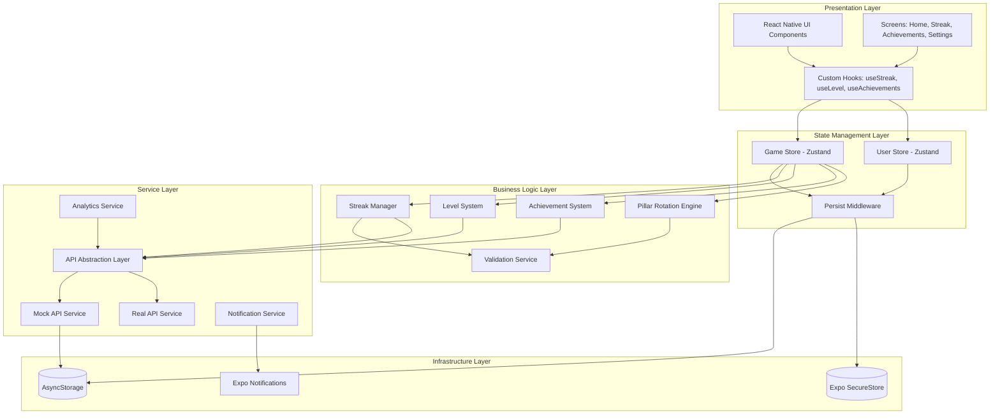

### Arquitectura de Capas

#### 1. Presentation Layer (UI)
- **Responsabilidad**: Renderizar interfaz y capturar interacciones del usuario
- **Tecnologías**: React Native, React Navigation, React Native Reanimated
- **Componentes Principales**:
  - `HomeScreen`: Pantalla principal con contador de racha y pilar del día
  - `StreakScreen`: Historial de rachas y calendario de completitud
  - `AchievementsScreen`: Galería de logros desbloqueados y bloqueados
  - `SettingsScreen`: Configuración de notificaciones y preferencias
  - `OnboardingFlow`: Flujo de bienvenida y evaluación inicial

#### 2. State Management Layer
- **Responsabilidad**: Gestionar estado global de la aplicación
- **Tecnología**: Zustand con middleware persist
- **Stores**:
  - `gameStore`: Estado de gamificación (racha, nivel, logros, pilar del día)
  - `userStore`: Datos del usuario (perfil, configuración, historial)
- **Justificación de Zustand**: 
  - Menos boilerplate que Redux (no requiere actions, reducers separados)
  - Mejor performance que Context API (re-renders selectivos)
  - API simple e intuitiva
  - Middleware persist integrado para AsyncStorage

#### 3. Business Logic Layer
- **Responsabilidad**: Implementar reglas de negocio del sistema de gamificación
- **Módulos Core**:
  - `Streak_Manager`: Cálculo y validación de rachas
  - `Level_System`: Progresión de niveles y experiencia
  - `Achievement_System`: Desbloqueo y tracking de logros
  - `Pillar_Rotation_Engine`: Selección inteligente del pilar del día
  - `Validation_Service`: Validación de completitud de pilares

#### 4. Service Layer
- **Responsabilidad**: Abstraer servicios externos y APIs
- **Servicios**:
  - `API_Abstraction_Layer`: Interfaz unificada para Mock y Real API
  - `Notification_Service`: Gestión de notificaciones push
  - `Analytics_Service`: Tracking de eventos y métricas
- **Patrón Strategy**: Permite cambiar entre Mock y Real API mediante configuración

#### 5. Infrastructure Layer
- **Responsabilidad**: Persistencia y servicios de plataforma
- **Componentes**:
  - `AsyncStorage`: Almacenamiento de datos no sensibles
  - `Expo SecureStore`: Almacenamiento encriptado para tokens
  - `Expo Notifications`: API de notificaciones nativas

### Flujo de Datos

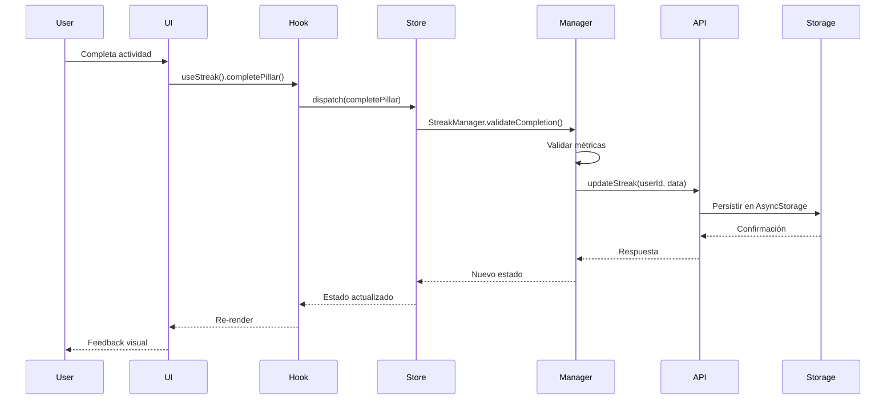

## Components and Interfaces

### Diagrama de Clases del Dominio

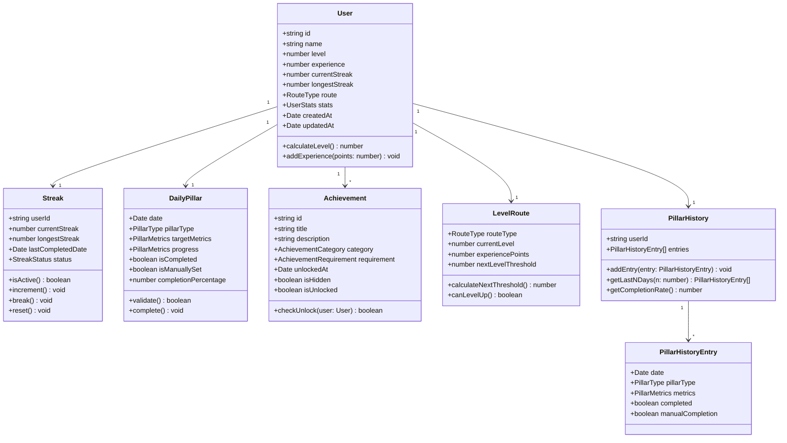

### Interfaces Principales

#### IStreakManager

```typescript
interface IStreakManager {
  /**
   * Calcula la racha actual basándose en el historial
   * @param userId - ID del usuario
   * @returns Objeto Streak con estado actual
   */
  calculateCurrentStreak(userId: string): Promise<Streak>;
  
  /**
   * Valida si un pilar está completado según métricas
   * @param pillar - Pilar a validar
   * @returns true si cumple criterios de completitud
   */
  validatePillarCompletion(pillar: DailyPillar): boolean;
  
  /**
   * Incrementa la racha del usuario
   * @param userId - ID del usuario
   * @returns Streak actualizado
   */
  incrementStreak(userId: string): Promise<Streak>;
  
  /**
   * Marca la racha como rota
   * @param userId - ID del usuario
   * @returns Streak actualizado
   */
  breakStreak(userId: string): Promise<Streak>;
  
  /**
   * Verifica si la racha está en riesgo (>20h desde última completitud)
   * @param streak - Racha a verificar
   * @returns true si está en riesgo
   */
  isStreakAtRisk(streak: Streak): boolean;
}
```

#### ILevelSystem

```typescript
interface ILevelSystem {
  /**
   * Calcula el nivel basándose en puntos de experiencia
   * @param experiencePoints - Puntos acumulados
   * @returns Nivel calculado
   */
  calculateLevel(experiencePoints: number): number;
  
  /**
   * Calcula puntos necesarios para siguiente nivel
   * @param currentLevel - Nivel actual
   * @returns Puntos requeridos
   */
  calculateNextLevelThreshold(currentLevel: number): number;
  
  /**
   * Otorga experiencia al usuario
   * @param userId - ID del usuario
   * @param points - Puntos a otorgar
   * @returns Usuario actualizado con nuevo nivel
   */
  addExperience(userId: string, points: number): Promise<User>;
  
  /**
   * Asigna ruta de maestría basándose en evaluación
   * @param testScore - Puntaje del test (0-100)
   * @returns Ruta asignada
   */
  assignRoute(testScore: number): RouteType;
  
  /**
   * Permite cambiar de ruta (solo cada 30 días)
   * @param userId - ID del usuario
   * @param newRoute - Nueva ruta deseada
   * @returns true si el cambio fue exitoso
   */
  changeRoute(userId: string, newRoute: RouteType): Promise<boolean>;
}
```

#### IPillarRotationEngine

```typescript
interface IPillarRotationEngine {
  /**
   * Selecciona el pilar del día usando estrategia configurada
   * @param userId - ID del usuario
   * @param strategy - Estrategia de rotación
   * @returns Pilar seleccionado
   */
  selectDailyPillar(
    userId: string, 
    strategy: RotationStrategy
  ): Promise<DailyPillar>;
  
  /**
   * Rotación round-robin balanceada
   * @param history - Historial de pilares
   * @returns Tipo de pilar seleccionado
   */
  roundRobinRotation(history: PillarHistory): PillarType;
  
  /**
   * Rotación basada en estadísticas más bajas
   * @param user - Usuario con stats
   * @returns Tipo de pilar seleccionado
   */
  statsBasedRotation(user: User): PillarType;
  
  /**
   * Rotación aleatoria ponderada
   * @param history - Historial para calcular pesos
   * @returns Tipo de pilar seleccionado
   */
  weightedRandomRotation(history: PillarHistory): PillarType;
  
  /**
   * Permite al usuario cambiar pilar manualmente
   * @param userId - ID del usuario
   * @param pillarType - Nuevo pilar
   * @returns true si el cambio fue exitoso
   */
  manuallySetPillar(userId: string, pillarType: PillarType): Promise<boolean>;
}
```

#### IAchievementSystem

```typescript
interface IAchievementSystem {
  /**
   * Verifica y desbloquea logros aplicables
   * @param userId - ID del usuario
   * @returns Array de logros desbloqueados
   */
  checkAndUnlockAchievements(userId: string): Promise<Achievement[]>;
  
  /**
   * Obtiene todos los logros del usuario
   * @param userId - ID del usuario
   * @param includeHidden - Si incluir logros ocultos bloqueados
   * @returns Array de logros
   */
  getUserAchievements(
    userId: string, 
    includeHidden: boolean
  ): Promise<Achievement[]>;
  
  /**
   * Calcula progreso hacia un logro específico
   * @param userId - ID del usuario
   * @param achievementId - ID del logro
   * @returns Porcentaje de progreso (0-100)
   */
  calculateAchievementProgress(
    userId: string, 
    achievementId: string
  ): Promise<number>;
  
  /**
   * Desbloquea un logro específico
   * @param userId - ID del usuario
   * @param achievementId - ID del logro
   * @returns Logro desbloqueado
   */
  unlockAchievement(
    userId: string, 
    achievementId: string
  ): Promise<Achievement>;
}
```

#### INotificationService

```typescript
interface INotificationService {
  /**
   * Solicita permisos de notificaciones
   * @returns true si se otorgaron permisos
   */
  requestPermissions(): Promise<boolean>;
  
  /**
   * Programa notificación diaria recurrente
   * @param time - Hora de la notificación (formato HH:mm)
   * @param pillarType - Tipo de pilar del día
   */
  scheduleDailyReminder(time: string, pillarType: PillarType): Promise<void>;
  
  /**
   * Envía notificación de advertencia de racha
   * @param streak - Racha actual
   */
  sendStreakWarning(streak: Streak): Promise<void>;
  
  /**
   * Envía notificación de logro desbloqueado
   * @param achievement - Logro desbloqueado
   */
  sendAchievementUnlocked(achievement: Achievement): Promise<void>;
  
  /**
   * Envía notificación de subida de nivel
   * @param newLevel - Nuevo nivel alcanzado
   */
  sendLevelUp(newLevel: number): Promise<void>;
  
  /**
   * Cancela todas las notificaciones programadas
   */
  cancelAllNotifications(): Promise<void>;
}
```

### Tipos y Enums

```typescript
// Tipos de pilares
enum PillarType {
  NUTRITION = 'nutrition',
  SLEEP = 'sleep',
  MOVEMENT = 'movement'
}

// Rutas de maestría
enum RouteType {
  BEGINNER = 'beginner',
  INTERMEDIATE = 'intermediate',
  ADVANCED = 'advanced',
  EXPERT = 'expert'
}

// Estados de racha
enum StreakStatus {
  ACTIVE = 'active',
  AT_RISK = 'at_risk',
  BROKEN = 'broken'
}

// Categorías de logros
enum AchievementCategory {
  STREAK = 'streak',
  LEVEL = 'level',
  PILLAR = 'pillar',
  SPECIAL = 'special'
}

// Estrategias de rotación
enum RotationStrategy {
  ROUND_ROBIN = 'round_robin',
  STATS_BASED = 'stats_based',
  WEIGHTED_RANDOM = 'weighted_random',
  MANUAL = 'manual'
}

// Métricas de pilares
interface PillarMetrics {
  // Nutrición
  caloriesTarget?: number;
  caloriesActual?: number;
  proteinTarget?: number;
  proteinActual?: number;
  carbsTarget?: number;
  carbsActual?: number;
  fatsTarget?: number;
  fatsActual?: number;
  
  // Sueño
  sleepHoursTarget?: number;
  sleepHoursActual?: number;
  sleepQuality?: number; // 0-100
  
  // Movimiento
  caloriesBurnedTarget?: number;
  caloriesBurnedActual?: number;
  stepsTarget?: number;
  stepsActual?: number;
  activeMinutesTarget?: number;
  activeMinutesActual?: number;
}

// Estadísticas del usuario
interface UserStats {
  nutritionScore: number; // 0-100
  sleepScore: number; // 0-100
  movementScore: number; // 0-100
  overallScore: number; // Promedio de los tres
}

// Requisito de logro
interface AchievementRequirement {
  type: 'streak' | 'level' | 'pillar_count' | 'custom';
  value: number;
  pillarType?: PillarType;
  customCheck?: (user: User) => boolean;
}
```

## Data Models

### Esquemas de Datos

#### User Schema

```typescript
interface User {
  id: string; // UUID
  name: string;
  email?: string;
  level: number;
  experience: number;
  currentStreak: number;
  longestStreak: number;
  route: RouteType;
  stats: UserStats;
  preferences: UserPreferences;
  createdAt: Date;
  updatedAt: Date;
  syncedAt?: Date; // Para sincronización con backend
}

interface UserPreferences {
  notificationTime: string; // HH:mm format
  notificationTypes: {
    dailyReminder: boolean;
    streakWarning: boolean;
    achievements: boolean;
    levelUp: boolean;
  };
  rotationStrategy: RotationStrategy;
  pillarThresholds: {
    nutrition: number; // Porcentaje de macros (default: 90)
    sleep: number; // Horas mínimas (default: 7)
    movement: number; // Porcentaje de calorías (default: 100)
  };
  theme: 'light' | 'dark' | 'auto';
  language: 'es' | 'en';
  soundEnabled: boolean;
  hapticEnabled: boolean;
}
```

#### Streak Schema

```typescript
interface Streak {
  userId: string;
  currentStreak: number;
  longestStreak: number;
  lastCompletedDate: Date;
  status: StreakStatus;
  history: StreakHistoryEntry[];
  createdAt: Date;
  updatedAt: Date;
}

interface StreakHistoryEntry {
  date: Date;
  streakCount: number;
  event: 'started' | 'continued' | 'broken';
}
```

#### DailyPillar Schema

```typescript
interface DailyPillar {
  id: string;
  userId: string;
  date: Date; // Fecha del pilar (sin hora)
  pillarType: PillarType;
  targetMetrics: PillarMetrics;
  progress: PillarMetrics;
  isCompleted: boolean;
  isManuallySet: boolean;
  manualCompletion: boolean;
  completedAt?: Date;
  completionPercentage: number;
  createdAt: Date;
  updatedAt: Date;
}
```

#### Achievement Schema

```typescript
interface Achievement {
  id: string;
  title: string;
  description: string;
  category: AchievementCategory;
  requirement: AchievementRequirement;
  icon: string; // Nombre del icono o URL
  isHidden: boolean;
  experienceReward: number;
  createdAt: Date;
}

interface UserAchievement {
  userId: string;
  achievementId: string;
  unlockedAt: Date;
  progress: number; // 0-100
}
```

#### PillarHistory Schema

```typescript
interface PillarHistory {
  userId: string;
  entries: PillarHistoryEntry[];
  createdAt: Date;
  updatedAt: Date;
}

interface PillarHistoryEntry {
  date: Date;
  pillarType: PillarType;
  metrics: PillarMetrics;
  completed: boolean;
  manualCompletion: boolean;
  completionPercentage: number;
}
```

#### LevelRoute Schema

```typescript
interface LevelRoute {
  userId: string;
  routeType: RouteType;
  currentLevel: number;
  experiencePoints: number;
  nextLevelThreshold: number;
  lastRouteChange?: Date;
  levelHistory: LevelHistoryEntry[];
  createdAt: Date;
  updatedAt: Date;
}

interface LevelHistoryEntry {
  level: number;
  reachedAt: Date;
  experienceAtLevel: number;
}
```

### Relaciones entre Entidades

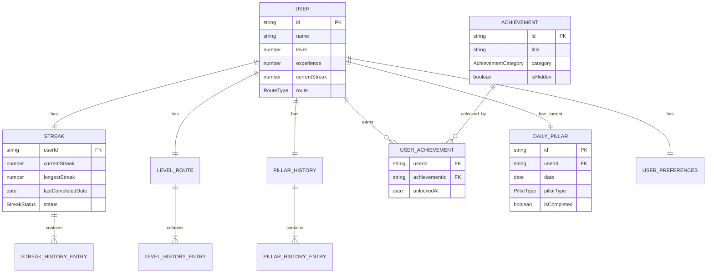

### Estrategia de Persistencia

#### AsyncStorage Keys

```typescript
const STORAGE_KEYS = {
  USER: '@zeal:user',
  STREAK: '@zeal:streak',
  DAILY_PILLAR: '@zeal:daily_pillar',
  PILLAR_HISTORY: '@zeal:pillar_history',
  ACHIEVEMENTS: '@zeal:achievements',
  USER_ACHIEVEMENTS: '@zeal:user_achievements',
  LEVEL_ROUTE: '@zeal:level_route',
  PREFERENCES: '@zeal:preferences',
  LAST_SYNC: '@zeal:last_sync'
};
```

#### Expo SecureStore Keys (datos sensibles)

```typescript
const SECURE_KEYS = {
  AUTH_TOKEN: '@zeal:secure:auth_token',
  REFRESH_TOKEN: '@zeal:secure:refresh_token',
  USER_ID: '@zeal:secure:user_id'
};
```

#### Estrategia de Backup

```typescript
/**
 * Sistema de backup automático cada 24 horas
 * Mantiene últimos 7 backups
 */
const BACKUP_KEYS = {
  BACKUP_PREFIX: '@zeal:backup:',
  BACKUP_INDEX: '@zeal:backup:index'
};

interface BackupEntry {
  timestamp: Date;
  key: string;
  data: any;
}
```


## Detailed Algorithms and Pseudocode

### 1. Streak Manager - Algoritmo de Cálculo de Rachas

#### Diagrama de Estados de Racha

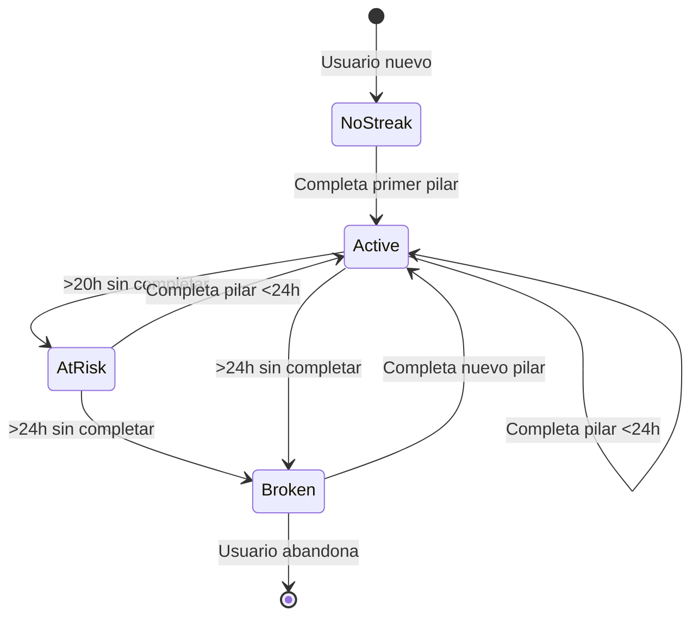

#### Pseudocódigo: calculateCurrentStreak

```typescript
/**
 * Calcula la racha actual del usuario basándose en el historial
 * Complejidad: O(n) donde n = días en el historial
 */
function calculateCurrentStreak(userId: string): Streak {
  // 1. Obtener historial de pilares del usuario
  history = getPillarHistory(userId)
  
  // 2. Ordenar entradas por fecha descendente (más reciente primero)
  sortedEntries = history.entries.sort((a, b) => b.date - a.date)
  
  // 3. Inicializar contador de racha
  currentStreak = 0
  lastCompletedDate = null
  
  // 4. Iterar desde el día más reciente hacia atrás
  for entry in sortedEntries:
    if not entry.completed:
      // Si encontramos un día no completado, la racha se rompe
      break
    
    // 5. Verificar continuidad (días consecutivos)
    if lastCompletedDate is null:
      // Primer día completado encontrado
      currentStreak = 1
      lastCompletedDate = entry.date
    else:
      // Calcular diferencia en días
      daysDifference = calculateDaysDifference(lastCompletedDate, entry.date)
      
      if daysDifference == 1:
        // Días consecutivos, incrementar racha
        currentStreak++
        lastCompletedDate = entry.date
      else:
        // Hay un gap, la racha se rompe
        break
  
  // 6. Determinar estado de la racha
  status = determineStreakStatus(lastCompletedDate)
  
  // 7. Obtener racha más larga histórica
  longestStreak = calculateLongestStreak(history)
  
  // 8. Retornar objeto Streak
  return {
    userId: userId,
    currentStreak: currentStreak,
    longestStreak: max(longestStreak, currentStreak),
    lastCompletedDate: lastCompletedDate,
    status: status
  }
}

/**
 * Determina el estado actual de la racha
 */
function determineStreakStatus(lastCompletedDate: Date): StreakStatus {
  if lastCompletedDate is null:
    return StreakStatus.BROKEN
  
  now = getCurrentDateTime()
  hoursSinceCompletion = calculateHoursDifference(now, lastCompletedDate)
  
  if hoursSinceCompletion < 20:
    return StreakStatus.ACTIVE
  else if hoursSinceCompletion < 24:
    return StreakStatus.AT_RISK
  else:
    return StreakStatus.BROKEN
}

/**
 * Calcula la racha más larga en el historial completo
 */
function calculateLongestStreak(history: PillarHistory): number {
  longestStreak = 0
  currentStreak = 0
  previousDate = null
  
  // Ordenar por fecha ascendente
  sortedEntries = history.entries.sort((a, b) => a.date - b.date)
  
  for entry in sortedEntries:
    if entry.completed:
      if previousDate is null:
        currentStreak = 1
      else:
        daysDiff = calculateDaysDifference(entry.date, previousDate)
        if daysDiff == 1:
          currentStreak++
        else:
          currentStreak = 1
      
      longestStreak = max(longestStreak, currentStreak)
      previousDate = entry.date
    else:
      currentStreak = 0
      previousDate = null
  
  return longestStreak
}
```


#### Pseudocódigo: validatePillarCompletion

```typescript
/**
 * Valida si un pilar cumple los criterios de completitud
 * Cada tipo de pilar tiene métricas específicas
 */
function validatePillarCompletion(pillar: DailyPillar): boolean {
  switch pillar.pillarType:
    case PillarType.NUTRITION:
      return validateNutritionPillar(pillar)
    
    case PillarType.SLEEP:
      return validateSleepPillar(pillar)
    
    case PillarType.MOVEMENT:
      return validateMovementPillar(pillar)
    
    default:
      throw new Error("Unknown pillar type")
}

/**
 * Validación de pilar de nutrición
 * Criterio: Alcanzar 90% de macros objetivo (configurable)
 */
function validateNutritionPillar(pillar: DailyPillar): boolean {
  target = pillar.targetMetrics
  actual = pillar.progress
  threshold = getUserPreferences(pillar.userId).pillarThresholds.nutrition
  
  // Calcular porcentaje de cada macro
  proteinPercentage = (actual.proteinActual / target.proteinTarget) * 100
  carbsPercentage = (actual.carbsActual / target.carbsTarget) * 100
  fatsPercentage = (actual.fatsActual / target.fatsTarget) * 100
  
  // Validar que cada macro alcance el umbral
  proteinMet = proteinPercentage >= threshold
  carbsMet = carbsPercentage >= threshold
  fatsMet = fatsPercentage >= threshold
  
  // Todas las macros deben cumplir
  return proteinMet AND carbsMet AND fatsMet
}

/**
 * Validación de pilar de sueño
 * Criterio: Mínimo 7 horas (configurable)
 */
function validateSleepPillar(pillar: DailyPillar): boolean {
  actual = pillar.progress.sleepHoursActual
  threshold = getUserPreferences(pillar.userId).pillarThresholds.sleep
  
  return actual >= threshold
}

/**
 * Validación de pilar de movimiento
 * Criterio: Alcanzar 100% de calorías objetivo (configurable)
 */
function validateMovementPillar(pillar: DailyPillar): boolean {
  target = pillar.targetMetrics.caloriesBurnedTarget
  actual = pillar.progress.caloriesBurnedActual
  threshold = getUserPreferences(pillar.userId).pillarThresholds.movement
  
  percentage = (actual / target) * 100
  
  return percentage >= threshold
}

/**
 * Calcula el porcentaje de completitud del pilar
 */
function calculateCompletionPercentage(pillar: DailyPillar): number {
  switch pillar.pillarType:
    case PillarType.NUTRITION:
      target = pillar.targetMetrics
      actual = pillar.progress
      
      proteinPct = min(100, (actual.proteinActual / target.proteinTarget) * 100)
      carbsPct = min(100, (actual.carbsActual / target.carbsTarget) * 100)
      fatsPct = min(100, (actual.fatsActual / target.fatsTarget) * 100)
      
      // Promedio de las tres macros
      return (proteinPct + carbsPct + fatsPct) / 3
    
    case PillarType.SLEEP:
      actual = pillar.progress.sleepHoursActual
      target = pillar.targetMetrics.sleepHoursTarget
      return min(100, (actual / target) * 100)
    
    case PillarType.MOVEMENT:
      actual = pillar.progress.caloriesBurnedActual
      target = pillar.targetMetrics.caloriesBurnedTarget
      return min(100, (actual / target) * 100)
}
```

### 2. Pillar Rotation Engine - Algoritmo de Rotación de Pilares

#### Diagrama de Flujo de Rotación

```mermaid
flowchart TD
    Start([Nuevo Día]) --> CheckManual{Usuario configuró<br/>rotación manual?}
    CheckManual -->|Sí| WaitManual[Esperar selección<br/>del usuario]
    CheckManual -->|No| CheckStrategy{Estrategia<br/>configurada?}
    
    CheckStrategy -->|Round Robin| RoundRobin[Algoritmo<br/>Round Robin]
    CheckStrategy -->|Stats Based| StatsB ased[Algoritmo<br/>Basado en Stats]
    CheckStrategy -->|Weighted Random| WeightedRandom[Algoritmo<br/>Aleatorio Ponderado]
    
    RoundRobin --> ValidateHistory[Validar historial<br/>últimos 7 días]
    StatsB ased --> GetUserStats[Obtener stats<br/>del usuario]
    WeightedRandom --> CalculateWeights[Calcular pesos<br/>por frecuencia]
    
    ValidateHistory --> SelectPillar[Seleccionar pilar]
    GetUserStats --> SelectPillar
    CalculateWeights --> SelectPillar
    WaitManual --> SelectPillar
    
    SelectPillar --> SetMetrics[Definir métricas<br/>objetivo]
    SetMetrics --> Notify[Notificar usuario<br/>9:00 AM]
    Notify --> End([Pilar del día<br/>asignado])
```

#### Pseudocódigo: selectDailyPillar

```typescript
/**
 * Selecciona el pilar del día usando la estrategia configurada
 */
function selectDailyPillar(userId: string, strategy: RotationStrategy): DailyPillar {
  // 1. Verificar si ya existe un pilar para hoy
  today = getCurrentDate()
  existingPillar = getDailyPillar(userId, today)
  
  if existingPillar is not null:
    return existingPillar
  
  // 2. Obtener datos necesarios
  user = getUser(userId)
  history = getPillarHistory(userId)
  
  // 3. Seleccionar tipo de pilar según estrategia
  pillarType = null
  
  switch strategy:
    case RotationStrategy.ROUND_ROBIN:
      pillarType = roundRobinRotation(history)
    
    case RotationStrategy.STATS_BASED:
      pillarType = statsBasedRotation(user)
    
    case RotationStrategy.WEIGHTED_RANDOM:
      pillarType = weightedRandomRotation(history)
    
    case RotationStrategy.MANUAL:
      // Esperar a que el usuario seleccione manualmente
      return createPendingPillar(userId, today)
  
  // 4. Definir métricas objetivo según el tipo de pilar y ruta del usuario
  targetMetrics = defineTargetMetrics(pillarType, user.route, user.stats)
  
  // 5. Crear el pilar del día
  dailyPillar = {
    id: generateUUID(),
    userId: userId,
    date: today,
    pillarType: pillarType,
    targetMetrics: targetMetrics,
    progress: initializeEmptyMetrics(),
    isCompleted: false,
    isManuallySet: false,
    completionPercentage: 0,
    createdAt: now()
  }
  
  // 6. Persistir el pilar
  saveDailyPillar(dailyPillar)
  
  // 7. Programar notificación
  scheduleNotification(userId, pillarType)
  
  return dailyPillar
}

/**
 * Rotación Round Robin: Selecciona el pilar menos usado recientemente
 */
function roundRobinRotation(history: PillarHistory): PillarType {
  // Obtener últimos 7 días
  last7Days = history.getLastNDays(7)
  
  // Contar frecuencia de cada pilar
  nutritionCount = 0
  sleepCount = 0
  movementCount = 0
  
  for entry in last7Days:
    if entry.completed:
      switch entry.pillarType:
        case PillarType.NUTRITION:
          nutritionCount++
        case PillarType.SLEEP:
          sleepCount++
        case PillarType.MOVEMENT:
          movementCount++
  
  // Seleccionar el pilar con menor frecuencia
  minCount = min(nutritionCount, sleepCount, movementCount)
  
  if nutritionCount == minCount:
    return PillarType.NUTRITION
  else if sleepCount == minCount:
    return PillarType.SLEEP
  else:
    return PillarType.MOVEMENT
}

/**
 * Rotación basada en estadísticas: Selecciona el pilar con score más bajo
 */
function statsBasedRotation(user: User): PillarType {
  stats = user.stats
  
  // Encontrar el score más bajo
  minScore = min(stats.nutritionScore, stats.sleepScore, stats.movementScore)
  
  if stats.nutritionScore == minScore:
    return PillarType.NUTRITION
  else if stats.sleepScore == minScore:
    return PillarType.SLEEP
  else:
    return PillarType.MOVEMENT
}

/**
 * Rotación aleatoria ponderada: Mayor probabilidad para pilares menos completados
 */
function weightedRandomRotation(history: PillarHistory): PillarType {
  // Obtener últimos 30 días
  last30Days = history.getLastNDays(30)
  
  // Contar completitudes de cada pilar
  nutritionCompleted = 0
  sleepCompleted = 0
  movementCompleted = 0
  totalDays = last30Days.length
  
  for entry in last30Days:
    if entry.completed:
      switch entry.pillarType:
        case PillarType.NUTRITION:
          nutritionCompleted++
        case PillarType.SLEEP:
          sleepCompleted++
        case PillarType.MOVEMENT:
          movementCompleted++
  
  // Calcular pesos inversos (menos completado = mayor peso)
  nutritionWeight = totalDays - nutritionCompleted
  sleepWeight = totalDays - sleepCompleted
  movementWeight = totalDays - movementCompleted
  
  totalWeight = nutritionWeight + sleepWeight + movementWeight
  
  // Selección aleatoria ponderada
  random = randomFloat(0, totalWeight)
  
  if random < nutritionWeight:
    return PillarType.NUTRITION
  else if random < (nutritionWeight + sleepWeight):
    return PillarType.SLEEP
  else:
    return PillarType.MOVEMENT
}
```


#### Pseudocódigo: defineTargetMetrics

```typescript
/**
 * Define métricas objetivo según el tipo de pilar y ruta del usuario
 * Las métricas escalan según el nivel de maestría
 */
function defineTargetMetrics(
  pillarType: PillarType, 
  route: RouteType, 
  userStats: UserStats
): PillarMetrics {
  
  // Multiplicadores según ruta de maestría
  routeMultipliers = {
    [RouteType.BEGINNER]: 0.7,
    [RouteType.INTERMEDIATE]: 1.0,
    [RouteType.ADVANCED]: 1.3,
    [RouteType.EXPERT]: 1.5
  }
  
  multiplier = routeMultipliers[route]
  
  switch pillarType:
    case PillarType.NUTRITION:
      // Métricas base para ruta intermedia
      baseCalories = 2000
      baseProtein = 150 // gramos
      baseCarbs = 200
      baseFats = 65
      
      return {
        caloriesTarget: baseCalories * multiplier,
        proteinTarget: baseProtein * multiplier,
        carbsTarget: baseCarbs * multiplier,
        fatsTarget: baseFats * multiplier
      }
    
    case PillarType.SLEEP:
      // Horas de sueño objetivo (no escala tanto con ruta)
      baseSleepHours = 7
      
      return {
        sleepHoursTarget: baseSleepHours + (multiplier - 1.0) * 1.5
      }
    
    case PillarType.MOVEMENT:
      // Calorías a quemar según ruta
      baseCaloriesBurned = 400
      baseSteps = 8000
      baseActiveMinutes = 30
      
      return {
        caloriesBurnedTarget: baseCaloriesBurned * multiplier,
        stepsTarget: baseSteps * multiplier,
        activeMinutesTarget: baseActiveMinutes * multiplier
      }
}
```

### 3. Level System - Algoritmo de Niveles y Experiencia

#### Diagrama de Progresión de Niveles

```mermaid
graph LR
    subgraph "Beginner Route"
        L1[Nivel 1<br/>0 XP] --> L5[Nivel 5<br/>2,500 XP]
        L5 --> L10[Nivel 10<br/>10,000 XP]
    end
    
    subgraph "Intermediate Route"
        L11[Nivel 11<br/>12,100 XP] --> L15[Nivel 15<br/>22,500 XP]
        L15 --> L25[Nivel 25<br/>62,500 XP]
    end
    
    subgraph "Advanced Route"
        L26[Nivel 26<br/>67,600 XP] --> L35[Nivel 35<br/>122,500 XP]
        L35 --> L50[Nivel 50<br/>250,000 XP]
    end
    
    subgraph "Expert Route"
        L51[Nivel 51<br/>260,100 XP] --> L75[Nivel 75<br/>562,500 XP]
        L75 --> L100[Nivel 100<br/>1,000,000 XP]
    end
    
    L10 -.->|Cambio de ruta| L11
    L25 -.->|Cambio de ruta| L26
    L50 -.->|Cambio de ruta| L51
```

#### Pseudocódigo: calculateLevel

```typescript
/**
 * Calcula el nivel basándose en puntos de experiencia
 * Fórmula: nivel = floor(sqrt(experience_points / 100))
 * 
 * Esta fórmula crea una curva de progresión que:
 * - Niveles iniciales son rápidos (motivación temprana)
 * - Niveles altos requieren más esfuerzo (sensación de logro)
 * - Escalamiento predecible y balanceado
 */
function calculateLevel(experiencePoints: number): number {
  if experiencePoints < 0:
    throw new Error("Experience points cannot be negative")
  
  // Fórmula de nivel
  level = floor(sqrt(experiencePoints / 100))
  
  // Nivel máximo es 100
  return min(level, 100)
}

/**
 * Calcula puntos necesarios para el siguiente nivel
 */
function calculateNextLevelThreshold(currentLevel: number): number {
  nextLevel = currentLevel + 1
  
  // Invertir la fórmula: experience = (level^2) * 100
  threshold = (nextLevel * nextLevel) * 100
  
  return threshold
}

/**
 * Calcula puntos de experiencia otorgados por completar un pilar
 * Los puntos varían según:
 * - Tipo de pilar
 * - Ruta de maestría
 * - Porcentaje de completitud
 * - Racha actual (bonus)
 */
function calculateExperienceReward(
  pillar: DailyPillar,
  user: User,
  streak: Streak
): number {
  
  // Puntos base por tipo de pilar
  basePillarPoints = {
    [PillarType.NUTRITION]: 100,
    [PillarType.SLEEP]: 80,
    [PillarType.MOVEMENT]: 120
  }
  
  basePoints = basePillarPoints[pillar.pillarType]
  
  // Multiplicador por ruta (rutas más difíciles dan más XP)
  routeMultipliers = {
    [RouteType.BEGINNER]: 1.0,
    [RouteType.INTERMEDIATE]: 1.2,
    [RouteType.ADVANCED]: 1.5,
    [RouteType.EXPERT]: 2.0
  }
  
  routeMultiplier = routeMultipliers[user.route]
  
  // Multiplicador por completitud (parcial vs completo)
  completionMultiplier = pillar.completionPercentage / 100
  
  // Bonus por racha (1% adicional por cada día de racha, máximo 50%)
  streakBonus = min(0.50, streak.currentStreak * 0.01)
  
  // Cálculo final
  totalPoints = basePoints * routeMultiplier * completionMultiplier * (1 + streakBonus)
  
  return round(totalPoints)
}

/**
 * Otorga experiencia al usuario y maneja subidas de nivel
 */
function addExperience(userId: string, points: number): User {
  // 1. Obtener usuario actual
  user = getUser(userId)
  levelRoute = getLevelRoute(userId)
  
  // 2. Guardar nivel anterior
  previousLevel = user.level
  
  // 3. Agregar puntos de experiencia
  levelRoute.experiencePoints += points
  
  // 4. Calcular nuevo nivel
  newLevel = calculateLevel(levelRoute.experiencePoints)
  
  // 5. Verificar si subió de nivel
  if newLevel > previousLevel:
    // Actualizar nivel
    user.level = newLevel
    levelRoute.currentLevel = newLevel
    
    // Registrar en historial
    levelRoute.levelHistory.push({
      level: newLevel,
      reachedAt: now(),
      experienceAtLevel: levelRoute.experiencePoints
    })
    
    // Desbloquear características según nivel
    unlockLevelFeatures(user, newLevel)
    
    // Enviar notificación
    notificationService.sendLevelUp(newLevel)
    
    // Registrar evento de analytics
    analyticsService.trackEvent('level_up', {
      userId: userId,
      newLevel: newLevel,
      experiencePoints: levelRoute.experiencePoints,
      route: user.route
    })
  
  // 6. Actualizar umbral del siguiente nivel
  levelRoute.nextLevelThreshold = calculateNextLevelThreshold(newLevel)
  
  // 7. Persistir cambios
  saveUser(user)
  saveLevelRoute(levelRoute)
  
  return user
}

/**
 * Desbloquea características según el nivel alcanzado
 */
function unlockLevelFeatures(user: User, level: number): void {
  switch level:
    case 5:
      // Desbloquear estadísticas avanzadas
      user.features.advancedStats = true
      showFeatureUnlockModal("Estadísticas Avanzadas")
    
    case 10:
      // Permitir cambio de ruta
      user.features.routeChange = true
      showFeatureUnlockModal("Cambio de Ruta")
    
    case 25:
      // Métricas personalizadas
      user.features.customMetrics = true
      showFeatureUnlockModal("Métricas Personalizadas")
    
    case 50:
      // Modo experto
      user.features.expertMode = true
      showFeatureUnlockModal("Modo Experto")
    
    case 100:
      // Nivel máximo alcanzado
      showCelebrationModal("¡Maestría Completa!")
}
```


#### Pseudocódigo: assignRoute

```typescript
/**
 * Asigna ruta de maestría basándose en el puntaje del test de evaluación
 */
function assignRoute(testScore: number): RouteType {
  // Validar rango del puntaje
  if testScore < 0 OR testScore > 100:
    throw new Error("Test score must be between 0 and 100")
  
  // Rangos de asignación
  if testScore <= 30:
    return RouteType.BEGINNER
  else if testScore <= 60:
    return RouteType.INTERMEDIATE
  else if testScore <= 85:
    return RouteType.ADVANCED
  else:
    return RouteType.EXPERT
}

/**
 * Permite cambiar de ruta (solo cada 30 días)
 */
function changeRoute(userId: string, newRoute: RouteType): boolean {
  levelRoute = getLevelRoute(userId)
  
  // Verificar si el usuario está en nivel 10 o superior
  if levelRoute.currentLevel < 10:
    showError("Debes alcanzar nivel 10 para cambiar de ruta")
    return false
  
  // Verificar si han pasado 30 días desde el último cambio
  if levelRoute.lastRouteChange is not null:
    daysSinceChange = calculateDaysDifference(now(), levelRoute.lastRouteChange)
    
    if daysSinceChange < 30:
      daysRemaining = 30 - daysSinceChange
      showError(`Podrás cambiar de ruta en ${daysRemaining} días`)
      return false
  
  // Confirmar con el usuario
  confirmed = showConfirmationDialog(
    "¿Cambiar de ruta?",
    `Cambiarás de ${levelRoute.routeType} a ${newRoute}. Las métricas objetivo se ajustarán.`
  )
  
  if not confirmed:
    return false
  
  // Realizar el cambio
  previousRoute = levelRoute.routeType
  levelRoute.routeType = newRoute
  levelRoute.lastRouteChange = now()
  
  // Actualizar usuario
  user = getUser(userId)
  user.route = newRoute
  
  // Persistir cambios
  saveLevelRoute(levelRoute)
  saveUser(user)
  
  // Registrar evento
  analyticsService.trackEvent('route_changed', {
    userId: userId,
    previousRoute: previousRoute,
    newRoute: newRoute,
    level: levelRoute.currentLevel
  })
  
  return true
}
```

### 4. Achievement System - Algoritmo de Desbloqueo de Logros

#### Diagrama de Flujo de Desbloqueo

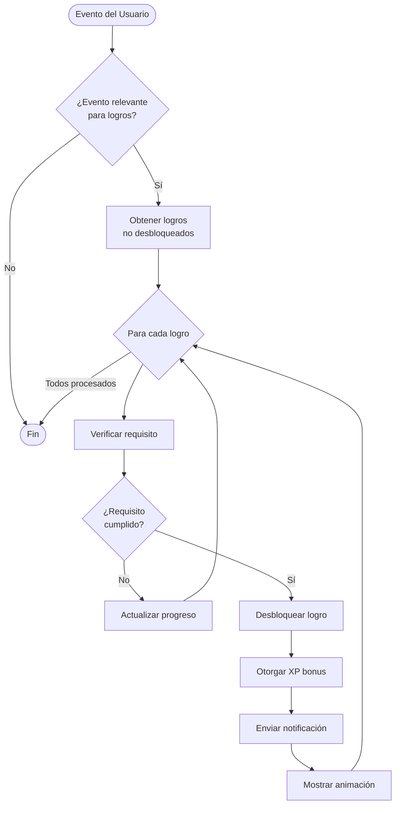

#### Pseudocódigo: checkAndUnlockAchievements

```typescript
/**
 * Verifica y desbloquea logros aplicables después de un evento
 * Se ejecuta después de: completar pilar, subir nivel, actualizar racha
 */
function checkAndUnlockAchievements(userId: string): Achievement[] {
  // 1. Obtener datos del usuario
  user = getUser(userId)
  streak = getStreak(userId)
  history = getPillarHistory(userId)
  
  // 2. Obtener logros no desbloqueados
  allAchievements = getAllAchievements()
  userAchievements = getUserAchievements(userId)
  unlockedIds = userAchievements.map(ua => ua.achievementId)
  
  pendingAchievements = allAchievements.filter(a => not unlockedIds.includes(a.id))
  
  // 3. Verificar cada logro pendiente
  newlyUnlocked = []
  
  for achievement in pendingAchievements:
    // Verificar si el requisito se cumple
    if checkAchievementRequirement(achievement, user, streak, history):
      // Desbloquear el logro
      unlockedAchievement = unlockAchievement(userId, achievement.id)
      newlyUnlocked.push(unlockedAchievement)
      
      // Otorgar XP bonus
      addExperience(userId, achievement.experienceReward)
      
      // Enviar notificación
      notificationService.sendAchievementUnlocked(unlockedAchievement)
      
      // Registrar evento
      analyticsService.trackEvent('achievement_unlocked', {
        userId: userId,
        achievementId: achievement.id,
        category: achievement.category
      })
    else:
      // Actualizar progreso hacia el logro
      progress = calculateAchievementProgress(userId, achievement.id)
      updateAchievementProgress(userId, achievement.id, progress)
  
  return newlyUnlocked
}

/**
 * Verifica si un logro cumple su requisito
 */
function checkAchievementRequirement(
  achievement: Achievement,
  user: User,
  streak: Streak,
  history: PillarHistory
): boolean {
  
  requirement = achievement.requirement
  
  switch requirement.type:
    case 'streak':
      // Logros basados en racha
      return streak.currentStreak >= requirement.value
    
    case 'level':
      // Logros basados en nivel
      return user.level >= requirement.value
    
    case 'pillar_count':
      // Logros basados en cantidad de pilares completados
      if requirement.pillarType is not null:
        // Contar pilares de un tipo específico
        count = history.entries.filter(e => 
          e.completed AND e.pillarType == requirement.pillarType
        ).length
      else:
        // Contar todos los pilares
        count = history.entries.filter(e => e.completed).length
      
      return count >= requirement.value
    
    case 'custom':
      // Logros con lógica personalizada
      if requirement.customCheck is not null:
        return requirement.customCheck(user)
      else:
        return false
    
    default:
      return false
}

/**
 * Calcula el progreso hacia un logro específico (0-100)
 */
function calculateAchievementProgress(
  userId: string,
  achievementId: string
): number {
  
  achievement = getAchievement(achievementId)
  user = getUser(userId)
  streak = getStreak(userId)
  history = getPillarHistory(userId)
  
  requirement = achievement.requirement
  
  switch requirement.type:
    case 'streak':
      current = streak.currentStreak
      target = requirement.value
      return min(100, (current / target) * 100)
    
    case 'level':
      current = user.level
      target = requirement.value
      return min(100, (current / target) * 100)
    
    case 'pillar_count':
      if requirement.pillarType is not null:
        current = history.entries.filter(e => 
          e.completed AND e.pillarType == requirement.pillarType
        ).length
      else:
        current = history.entries.filter(e => e.completed).length
      
      target = requirement.value
      return min(100, (current / target) * 100)
    
    case 'custom':
      // Los logros custom no tienen progreso cuantificable
      return 0
    
    default:
      return 0
}
```

#### Definición de Logros Predefinidos

```typescript
/**
 * Catálogo de logros del sistema
 * Total: 20 logros en 4 categorías
 */
const ACHIEVEMENTS: Achievement[] = [
  // STREAK ACHIEVEMENTS (5)
  {
    id: 'streak_week_warrior',
    title: 'Week Warrior',
    description: 'Mantén una racha de 7 días consecutivos',
    category: AchievementCategory.STREAK,
    requirement: { type: 'streak', value: 7 },
    icon: 'fire-7',
    isHidden: false,
    experienceReward: 200
  },
  {
    id: 'streak_monthly_champion',
    title: 'Monthly Champion',
    description: 'Mantén una racha de 30 días consecutivos',
    category: AchievementCategory.STREAK,
    requirement: { type: 'streak', value: 30 },
    icon: 'fire-30',
    isHidden: false,
    experienceReward: 1000
  },
  {
    id: 'streak_unstoppable',
    title: 'Unstoppable',
    description: 'Mantén una racha de 100 días consecutivos',
    category: AchievementCategory.STREAK,
    requirement: { type: 'streak', value: 100 },
    icon: 'fire-100',
    isHidden: false,
    experienceReward: 5000
  },
  {
    id: 'streak_phoenix',
    title: 'Phoenix',
    description: 'Recupera una racha después de romperla',
    category: AchievementCategory.STREAK,
    requirement: { 
      type: 'custom', 
      customCheck: (user) => {
        streak = getStreak(user.id)
        return streak.currentStreak >= 3 AND streak.longestStreak > streak.currentStreak
      }
    },
    icon: 'phoenix',
    isHidden: true,
    experienceReward: 300
  },
  {
    id: 'streak_legend',
    title: 'Legend',
    description: 'Mantén una racha de 365 días consecutivos',
    category: AchievementCategory.STREAK,
    requirement: { type: 'streak', value: 365 },
    icon: 'crown',
    isHidden: false,
    experienceReward: 10000
  },
  
  // LEVEL ACHIEVEMENTS (5)
  {
    id: 'level_novice',
    title: 'Novice',
    description: 'Alcanza el nivel 5',
    category: AchievementCategory.LEVEL,
    requirement: { type: 'level', value: 5 },
    icon: 'star-5',
    isHidden: false,
    experienceReward: 100
  },
  {
    id: 'level_apprentice',
    title: 'Apprentice',
    description: 'Alcanza el nivel 10',
    category: AchievementCategory.LEVEL,
    requirement: { type: 'level', value: 10 },
    icon: 'star-10',
    isHidden: false,
    experienceReward: 300
  },
  {
    id: 'level_expert',
    title: 'Expert',
    description: 'Alcanza el nivel 25',
    category: AchievementCategory.LEVEL,
    requirement: { type: 'level', value: 25 },
    icon: 'star-25',
    isHidden: false,
    experienceReward: 1000
  },
  {
    id: 'level_master',
    title: 'Master',
    description: 'Alcanza el nivel 50',
    category: AchievementCategory.LEVEL,
    requirement: { type: 'level', value: 50 },
    icon: 'star-50',
    isHidden: false,
    experienceReward: 3000
  },
  {
    id: 'level_grandmaster',
    title: 'Grandmaster',
    description: 'Alcanza el nivel 100',
    category: AchievementCategory.LEVEL,
    requirement: { type: 'level', value: 100 },
    icon: 'star-100',
    isHidden: false,
    experienceReward: 10000
  },
  
  // PILLAR ACHIEVEMENTS (6)
  {
    id: 'pillar_nutrition_10',
    title: 'Nutrition Enthusiast',
    description: 'Completa 10 pilares de nutrición',
    category: AchievementCategory.PILLAR,
    requirement: { type: 'pillar_count', value: 10, pillarType: PillarType.NUTRITION },
    icon: 'apple',
    isHidden: false,
    experienceReward: 200
  },
  {
    id: 'pillar_sleep_10',
    title: 'Sleep Champion',
    description: 'Completa 10 pilares de sueño',
    category: AchievementCategory.PILLAR,
    requirement: { type: 'pillar_count', value: 10, pillarType: PillarType.SLEEP },
    icon: 'moon',
    isHidden: false,
    experienceReward: 200
  },
  {
    id: 'pillar_movement_10',
    title: 'Movement Master',
    description: 'Completa 10 pilares de movimiento',
    category: AchievementCategory.PILLAR,
    requirement: { type: 'pillar_count', value: 10, pillarType: PillarType.MOVEMENT },
    icon: 'dumbbell',
    isHidden: false,
    experienceReward: 200
  },
  {
    id: 'pillar_balanced',
    title: 'Balanced Life',
    description: 'Completa al menos 5 pilares de cada tipo',
    category: AchievementCategory.PILLAR,
    requirement: {
      type: 'custom',
      customCheck: (user) => {
        history = getPillarHistory(user.id)
        nutritionCount = history.entries.filter(e => 
          e.completed AND e.pillarType == PillarType.NUTRITION
        ).length
        sleepCount = history.entries.filter(e => 
          e.completed AND e.pillarType == PillarType.SLEEP
        ).length
        movementCount = history.entries.filter(e => 
          e.completed AND e.pillarType == PillarType.MOVEMENT
        ).length
        return nutritionCount >= 5 AND sleepCount >= 5 AND movementCount >= 5
      }
    },
    icon: 'balance',
    isHidden: false,
    experienceReward: 500
  },
  {
    id: 'pillar_century',
    title: 'Century Club',
    description: 'Completa 100 pilares en total',
    category: AchievementCategory.PILLAR,
    requirement: { type: 'pillar_count', value: 100 },
    icon: 'trophy',
    isHidden: false,
    experienceReward: 2000
  },
  {
    id: 'pillar_perfectionist',
    title: 'Perfectionist',
    description: 'Completa 10 pilares con 100% de completitud',
    category: AchievementCategory.PILLAR,
    requirement: {
      type: 'custom',
      customCheck: (user) => {
        history = getPillarHistory(user.id)
        perfectCount = history.entries.filter(e => 
          e.completed AND e.completionPercentage >= 100
        ).length
        return perfectCount >= 10
      }
    },
    icon: 'diamond',
    isHidden: true,
    experienceReward: 1000
  },
  
  // SPECIAL ACHIEVEMENTS (4)
  {
    id: 'special_early_bird',
    title: 'Early Bird',
    description: 'Completa tu pilar antes de las 10 AM durante 7 días',
    category: AchievementCategory.SPECIAL,
    requirement: {
      type: 'custom',
      customCheck: (user) => {
        history = getPillarHistory(user.id)
        earlyCompletions = history.entries.filter(e => {
          if not e.completed: return false
          completedHour = e.completedAt.getHours()
          return completedHour < 10
        }).length
        return earlyCompletions >= 7
      }
    },
    icon: 'sunrise',
    isHidden: true,
    experienceReward: 500
  },
  {
    id: 'special_night_owl',
    title: 'Night Owl',
    description: 'Completa tu pilar después de las 10 PM durante 7 días',
    category: AchievementCategory.SPECIAL,
    requirement: {
      type: 'custom',
      customCheck: (user) => {
        history = getPillarHistory(user.id)
        lateCompletions = history.entries.filter(e => {
          if not e.completed: return false
          completedHour = e.completedAt.getHours()
          return completedHour >= 22
        }).length
        return lateCompletions >= 7
      }
    },
    icon: 'moon-stars',
    isHidden: true,
    experienceReward: 500
  },
  {
    id: 'special_comeback',
    title: 'Comeback King',
    description: 'Alcanza una racha más larga que tu récord anterior',
    category: AchievementCategory.SPECIAL,
    requirement: {
      type: 'custom',
      customCheck: (user) => {
        streak = getStreak(user.id)
        // Verificar que la racha actual sea mayor que la anterior más larga
        return streak.currentStreak > streak.longestStreak
      }
    },
    icon: 'comeback',
    isHidden: true,
    experienceReward: 1000
  },
  {
    id: 'special_first_steps',
    title: 'First Steps',
    description: 'Completa tu primer pilar',
    category: AchievementCategory.SPECIAL,
    requirement: { type: 'pillar_count', value: 1 },
    icon: 'footsteps',
    isHidden: false,
    experienceReward: 100
  }
];
```


## Sequence Diagrams - Flujos Críticos

### Flujo 1: Completar Pilar del Día

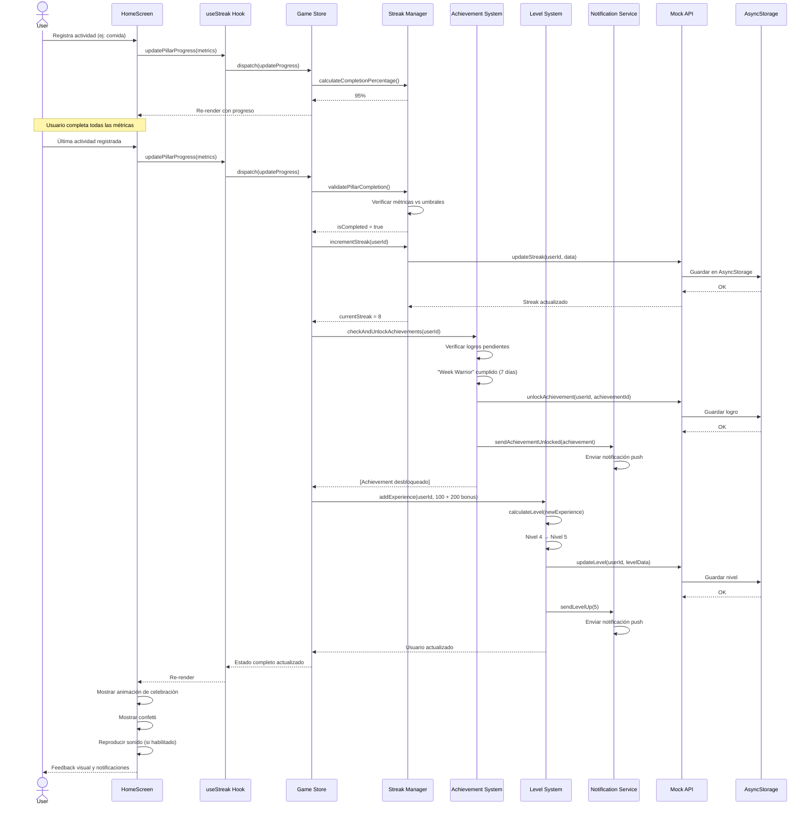

### Flujo 2: Subir de Nivel

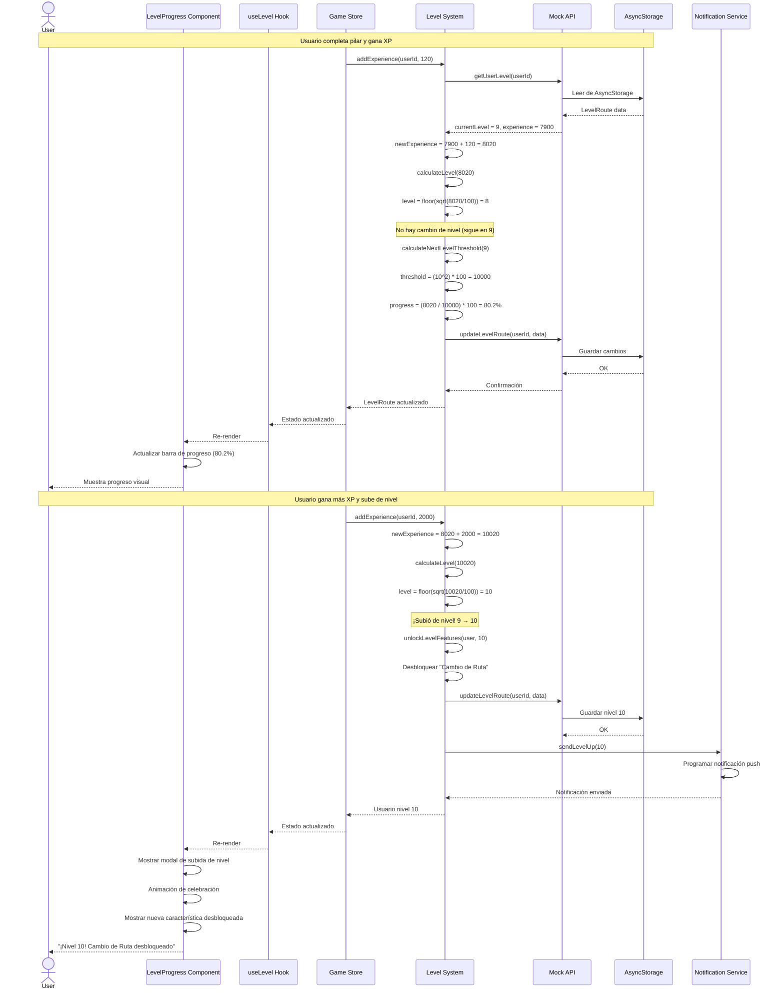

### Flujo 3: Desbloquear Logro

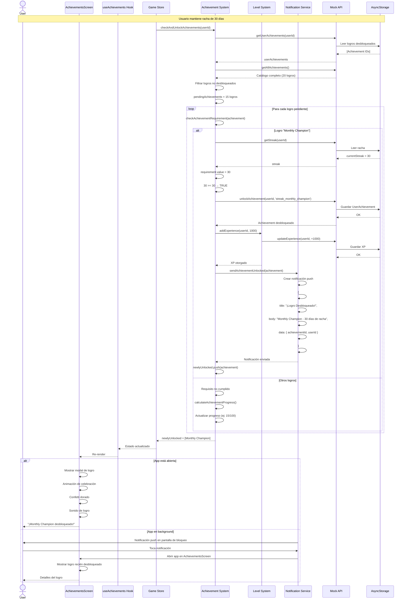

### Flujo 4: Rotación de Pilar (Nuevo Día)

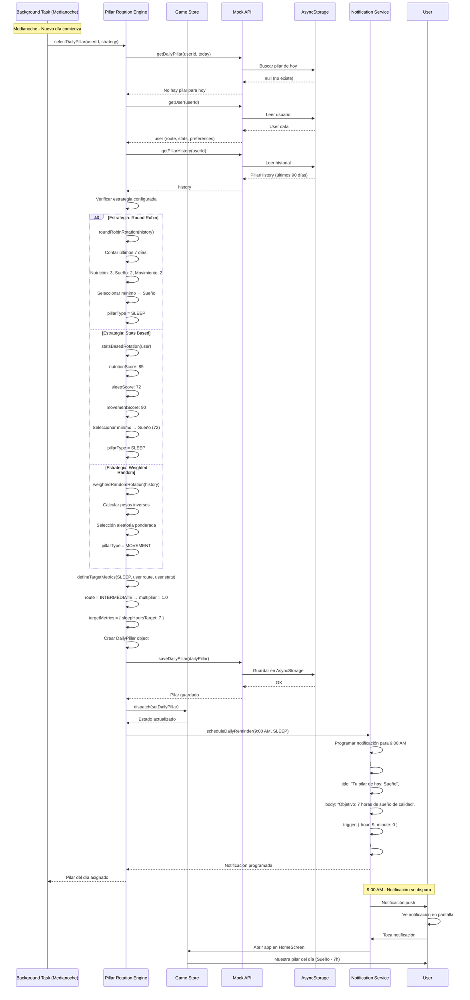


## Design Patterns and Technical Decisions

### Patrones de Diseño Aplicados

#### 1. Creational Patterns

##### Factory Pattern - Activity Factory

**Propósito**: Crear diferentes tipos de actividades (comidas, entrenamientos, registros de sueño) sin exponer lógica de creación.

**Justificación**: Cada tipo de actividad tiene validaciones y campos específicos. El Factory centraliza esta lógica y facilita agregar nuevos tipos.

```typescript
/**
 * Factory para crear actividades según tipo
 */
class ActivityFactory {
  static createActivity(type: ActivityType, data: any): Activity {
    switch (type) {
      case ActivityType.MEAL:
        return this.createMeal(data);
      
      case ActivityType.WORKOUT:
        return this.createWorkout(data);
      
      case ActivityType.SLEEP_LOG:
        return this.createSleepLog(data);
      
      default:
        throw new Error(`Unknown activity type: ${type}`);
    }
  }
  
  private static createMeal(data: MealData): MealActivity {
    // Validar datos de comida
    this.validateMealData(data);
    
    return {
      id: generateUUID(),
      type: ActivityType.MEAL,
      timestamp: data.timestamp || now(),
      metrics: {
        calories: data.calories,
        protein: data.protein,
        carbs: data.carbs,
        fats: data.fats
      },
      metadata: {
        mealType: data.mealType, // breakfast, lunch, dinner, snack
        foods: data.foods
      }
    };
  }
  
  private static createWorkout(data: WorkoutData): WorkoutActivity {
    this.validateWorkoutData(data);
    
    return {
      id: generateUUID(),
      type: ActivityType.WORKOUT,
      timestamp: data.timestamp || now(),
      metrics: {
        caloriesBurned: data.caloriesBurned,
        duration: data.duration,
        intensity: data.intensity
      },
      metadata: {
        workoutType: data.workoutType,
        exercises: data.exercises
      }
    };
  }
  
  private static createSleepLog(data: SleepData): SleepActivity {
    this.validateSleepData(data);
    
    return {
      id: generateUUID(),
      type: ActivityType.SLEEP_LOG,
      timestamp: data.wakeTime,
      metrics: {
        sleepHours: data.sleepHours,
        sleepQuality: data.sleepQuality
      },
      metadata: {
        bedTime: data.bedTime,
        wakeTime: data.wakeTime,
        interruptions: data.interruptions
      }
    };
  }
}
```

##### Builder Pattern - Plan Builder

**Propósito**: Construir planes de entrenamiento/nutrición complejos paso a paso.

**Justificación**: Los planes tienen muchas configuraciones opcionales. El Builder permite construcción fluida y validación incremental.

```typescript
/**
 * Builder para crear planes personalizados
 */
class PlanBuilder {
  private plan: Partial<Plan> = {};
  
  setGoal(goal: PlanGoal): this {
    this.plan.goal = goal;
    return this;
  }
  
  setDuration(weeks: number): this {
    if (weeks < 1 || weeks > 52) {
      throw new Error("Duration must be between 1 and 52 weeks");
    }
    this.plan.duration = weeks;
    return this;
  }
  
  setRoute(route: RouteType): this {
    this.plan.route = route;
    return this;
  }
  
  addPillarFocus(pillarType: PillarType, weight: number): this {
    if (!this.plan.pillarWeights) {
      this.plan.pillarWeights = {};
    }
    this.plan.pillarWeights[pillarType] = weight;
    return this;
  }
  
  setTargetMetrics(metrics: PlanMetrics): this {
    this.plan.targetMetrics = metrics;
    return this;
  }
  
  build(): Plan {
    // Validar que todos los campos requeridos estén presentes
    if (!this.plan.goal || !this.plan.duration || !this.plan.route) {
      throw new Error("Missing required plan fields");
    }
    
    // Validar que los pesos de pilares sumen 100%
    if (this.plan.pillarWeights) {
      const totalWeight = Object.values(this.plan.pillarWeights).reduce((a, b) => a + b, 0);
      if (Math.abs(totalWeight - 100) > 0.01) {
        throw new Error("Pillar weights must sum to 100%");
      }
    }
    
    return {
      id: generateUUID(),
      ...this.plan as Plan,
      createdAt: now(),
      status: PlanStatus.ACTIVE
    };
  }
}

// Uso
const plan = new PlanBuilder()
  .setGoal(PlanGoal.WEIGHT_LOSS)
  .setDuration(12)
  .setRoute(RouteType.INTERMEDIATE)
  .addPillarFocus(PillarType.NUTRITION, 50)
  .addPillarFocus(PillarType.MOVEMENT, 30)
  .addPillarFocus(PillarType.SLEEP, 20)
  .setTargetMetrics({ targetWeight: 75, targetBodyFat: 15 })
  .build();
```

##### Singleton Pattern - Store Instances

**Propósito**: Garantizar una única instancia de cada store de Zustand.

**Justificación**: Múltiples instancias causarían inconsistencias de estado. Zustand ya implementa Singleton internamente.

```typescript
/**
 * Game Store - Singleton via Zustand
 */
import create from 'zustand';
import { persist } from 'zustand/middleware';

interface GameState {
  user: User | null;
  streak: Streak | null;
  dailyPillar: DailyPillar | null;
  achievements: Achievement[];
  levelRoute: LevelRoute | null;
  
  // Actions
  setUser: (user: User) => void;
  updateStreak: (streak: Streak) => void;
  setDailyPillar: (pillar: DailyPillar) => void;
  addAchievement: (achievement: Achievement) => void;
  updateLevel: (levelRoute: LevelRoute) => void;
}

// Zustand garantiza que esto sea un Singleton
export const useGameStore = create<GameState>()(
  persist(
    (set) => ({
      user: null,
      streak: null,
      dailyPillar: null,
      achievements: [],
      levelRoute: null,
      
      setUser: (user) => set({ user }),
      updateStreak: (streak) => set({ streak }),
      setDailyPillar: (pillar) => set({ dailyPillar: pillar }),
      addAchievement: (achievement) => set((state) => ({
        achievements: [...state.achievements, achievement]
      })),
      updateLevel: (levelRoute) => set({ levelRoute })
    }),
    {
      name: 'game-storage',
      getStorage: () => AsyncStorage
    }
  )
);
```

#### 2. Structural Patterns

##### Adapter Pattern - Wearables Integration

**Propósito**: Adaptar diferentes APIs de wearables (Apple Health, Google Fit, Fitbit) a una interfaz común.

**Justificación**: Cada wearable tiene API diferente. El Adapter permite integración uniforme sin modificar lógica core.

```typescript
/**
 * Interfaz común para todos los wearables
 */
interface IWearableAdapter {
  connect(): Promise<boolean>;
  disconnect(): Promise<void>;
  getSleepData(date: Date): Promise<SleepData>;
  getActivityData(date: Date): Promise<ActivityData>;
  getHeartRateData(date: Date): Promise<HeartRateData>;
  isConnected(): boolean;
}

/**
 * Adapter para Apple Health
 */
class AppleHealthAdapter implements IWearableAdapter {
  private healthKit: any;
  
  async connect(): Promise<boolean> {
    // Solicitar permisos de Apple Health
    const permissions = await this.healthKit.requestAuthorization([
      'HKQuantityTypeIdentifierStepCount',
      'HKQuantityTypeIdentifierActiveEnergyBurned',
      'HKCategoryTypeIdentifierSleepAnalysis'
    ]);
    return permissions.granted;
  }
  
  async getSleepData(date: Date): Promise<SleepData> {
    const rawData = await this.healthKit.querySleepSamples(date);
    
    // Adaptar formato de Apple Health a nuestro formato
    return {
      sleepHours: rawData.totalSleepTime / 3600,
      sleepQuality: this.calculateQualityFromAppleData(rawData),
      bedTime: rawData.startDate,
      wakeTime: rawData.endDate,
      interruptions: rawData.awakenings
    };
  }
  
  // ... otros métodos
}

/**
 * Adapter para Google Fit
 */
class GoogleFitAdapter implements IWearableAdapter {
  private googleFit: any;
  
  async connect(): Promise<boolean> {
    const auth = await this.googleFit.authorize([
      'https://www.googleapis.com/auth/fitness.activity.read',
      'https://www.googleapis.com/auth/fitness.sleep.read'
    ]);
    return auth.success;
  }
  
  async getSleepData(date: Date): Promise<SleepData> {
    const rawData = await this.googleFit.readSleepData(date);
    
    // Adaptar formato de Google Fit a nuestro formato
    return {
      sleepHours: rawData.duration / 60,
      sleepQuality: this.calculateQualityFromGoogleData(rawData),
      bedTime: new Date(rawData.startTimeMillis),
      wakeTime: new Date(rawData.endTimeMillis),
      interruptions: rawData.segments.filter(s => s.type === 'awake').length
    };
  }
  
  // ... otros métodos
}

/**
 * Factory para crear el adapter apropiado
 */
class WearableAdapterFactory {
  static createAdapter(type: WearableType): IWearableAdapter {
    switch (type) {
      case WearableType.APPLE_HEALTH:
        return new AppleHealthAdapter();
      
      case WearableType.GOOGLE_FIT:
        return new GoogleFitAdapter();
      
      case WearableType.FITBIT:
        return new FitbitAdapter();
      
      default:
        throw new Error(`Unsupported wearable type: ${type}`);
    }
  }
}
```

##### Facade Pattern - API Abstraction Layer

**Propósito**: Simplificar interacción con servicios complejos (Mock API, Real API, Storage).

**Justificación**: Los componentes no deben conocer detalles de implementación de persistencia. El Facade proporciona interfaz simple.

```typescript
/**
 * Facade que abstrae Mock API y Real API
 */
class APIFacade {
  private mockAPI: MockAPIService;
  private realAPI: RealAPIService;
  private useMock: boolean;
  
  constructor() {
    this.mockAPI = new MockAPIService();
    this.realAPI = new RealAPIService();
    this.useMock = Config.USE_MOCK;
  }
  
  private getAPI(): IAPIService {
    return this.useMock ? this.mockAPI : this.realAPI;
  }
  
  async getUser(userId: string): Promise<User> {
    try {
      return await this.getAPI().getUser(userId);
    } catch (error) {
      console.error('Error fetching user:', error);
      throw new APIError('Failed to fetch user', error);
    }
  }
  
  async updateStreak(userId: string, data: StreakUpdate): Promise<Streak> {
    try {
      const result = await this.getAPI().updateStreak(userId, data);
      
      // Registrar evento de analytics
      AnalyticsService.trackEvent('streak_updated', {
        userId,
        currentStreak: result.currentStreak
      });
      
      return result;
    } catch (error) {
      console.error('Error updating streak:', error);
      throw new APIError('Failed to update streak', error);
    }
  }
  
  async unlockAchievement(
    userId: string, 
    achievementId: string
  ): Promise<Achievement> {
    try {
      const result = await this.getAPI().unlockAchievement(userId, achievementId);
      
      // Enviar notificación
      await NotificationService.sendAchievementUnlocked(result);
      
      // Registrar analytics
      AnalyticsService.trackEvent('achievement_unlocked', {
        userId,
        achievementId,
        category: result.category
      });
      
      return result;
    } catch (error) {
      console.error('Error unlocking achievement:', error);
      throw new APIError('Failed to unlock achievement', error);
    }
  }
  
  // Método para cambiar entre Mock y Real API
  setUseMock(useMock: boolean): void {
    this.useMock = useMock;
    console.log(`API mode changed to: ${useMock ? 'Mock' : 'Real'}`);
  }
}

// Instancia singleton del Facade
export const API = new APIFacade();
```

##### Composite Pattern - Objetivos Jerárquicos

**Propósito**: Representar objetivos compuestos (objetivo principal con sub-objetivos).

**Justificación**: Algunos objetivos son complejos y se componen de múltiples sub-objetivos. El Composite permite tratarlos uniformemente.

```typescript
/**
 * Componente base para objetivos
 */
interface IGoal {
  id: string;
  title: string;
  description: string;
  isCompleted(): boolean;
  getProgress(): number;
  complete(): void;
}

/**
 * Objetivo simple (hoja)
 */
class SimpleGoal implements IGoal {
  id: string;
  title: string;
  description: string;
  private completed: boolean = false;
  
  constructor(id: string, title: string, description: string) {
    this.id = id;
    this.title = title;
    this.description = description;
  }
  
  isCompleted(): boolean {
    return this.completed;
  }
  
  getProgress(): number {
    return this.completed ? 100 : 0;
  }
  
  complete(): void {
    this.completed = true;
  }
}

/**
 * Objetivo compuesto (contiene sub-objetivos)
 */
class CompositeGoal implements IGoal {
  id: string;
  title: string;
  description: string;
  private subGoals: IGoal[] = [];
  
  constructor(id: string, title: string, description: string) {
    this.id = id;
    this.title = title;
    this.description = description;
  }
  
  addSubGoal(goal: IGoal): void {
    this.subGoals.push(goal);
  }
  
  removeSubGoal(goalId: string): void {
    this.subGoals = this.subGoals.filter(g => g.id !== goalId);
  }
  
  isCompleted(): boolean {
    // Completado si todos los sub-objetivos están completados
    return this.subGoals.every(g => g.isCompleted());
  }
  
  getProgress(): number {
    if (this.subGoals.length === 0) return 0;
    
    // Progreso promedio de todos los sub-objetivos
    const totalProgress = this.subGoals.reduce(
      (sum, goal) => sum + goal.getProgress(), 
      0
    );
    return totalProgress / this.subGoals.length;
  }
  
  complete(): void {
    // Completar todos los sub-objetivos
    this.subGoals.forEach(g => g.complete());
  }
}

// Ejemplo de uso
const weeklyGoal = new CompositeGoal(
  'weekly_1',
  'Semana Balanceada',
  'Completar objetivos de los 3 pilares'
);

weeklyGoal.addSubGoal(new SimpleGoal(
  'nutrition_1',
  'Nutrición',
  'Alcanzar macros 5 días'
));

weeklyGoal.addSubGoal(new SimpleGoal(
  'sleep_1',
  'Sueño',
  'Dormir 7+ horas 5 días'
));

weeklyGoal.addSubGoal(new SimpleGoal(
  'movement_1',
  'Movimiento',
  'Entrenar 4 días'
));

console.log(weeklyGoal.getProgress()); // 0%
weeklyGoal.subGoals[0].complete();
console.log(weeklyGoal.getProgress()); // 33.3%
```


#### 3. Behavioral Patterns

##### Strategy Pattern - Pillar Rotation Strategies

**Propósito**: Encapsular diferentes algoritmos de rotación de pilares y hacerlos intercambiables.

**Justificación**: Diferentes usuarios prefieren diferentes estrategias. El Strategy permite cambiar algoritmo sin modificar código cliente.

```typescript
/**
 * Interfaz para estrategias de rotación
 */
interface IRotationStrategy {
  selectPillar(user: User, history: PillarHistory): PillarType;
  getName(): string;
  getDescription(): string;
}

/**
 * Estrategia Round Robin
 */
class RoundRobinStrategy implements IRotationStrategy {
  selectPillar(user: User, history: PillarHistory): PillarType {
    const last7Days = history.getLastNDays(7);
    
    const counts = {
      [PillarType.NUTRITION]: 0,
      [PillarType.SLEEP]: 0,
      [PillarType.MOVEMENT]: 0
    };
    
    last7Days.forEach(entry => {
      if (entry.completed) {
        counts[entry.pillarType]++;
      }
    });
    
    // Seleccionar el menos usado
    const minCount = Math.min(...Object.values(counts));
    const leastUsed = Object.entries(counts)
      .filter(([_, count]) => count === minCount)
      .map(([type, _]) => type as PillarType);
    
    // Si hay empate, seleccionar aleatoriamente
    return leastUsed[Math.floor(Math.random() * leastUsed.length)];
  }
  
  getName(): string {
    return 'Round Robin';
  }
  
  getDescription(): string {
    return 'Rota entre pilares de forma balanceada';
  }
}

/**
 * Estrategia basada en estadísticas
 */
class StatsBasedStrategy implements IRotationStrategy {
  selectPillar(user: User, history: PillarHistory): PillarType {
    const stats = user.stats;
    
    const scores = {
      [PillarType.NUTRITION]: stats.nutritionScore,
      [PillarType.SLEEP]: stats.sleepScore,
      [PillarType.MOVEMENT]: stats.movementScore
    };
    
    // Seleccionar el pilar con score más bajo
    const minScore = Math.min(...Object.values(scores));
    return Object.entries(scores)
      .find(([_, score]) => score === minScore)![0] as PillarType;
  }
  
  getName(): string {
    return 'Basado en Estadísticas';
  }
  
  getDescription(): string {
    return 'Prioriza el pilar con menor puntuación';
  }
}

/**
 * Estrategia aleatoria ponderada
 */
class WeightedRandomStrategy implements IRotationStrategy {
  selectPillar(user: User, history: PillarHistory): PillarType {
    const last30Days = history.getLastNDays(30);
    
    const completed = {
      [PillarType.NUTRITION]: 0,
      [PillarType.SLEEP]: 0,
      [PillarType.MOVEMENT]: 0
    };
    
    last30Days.forEach(entry => {
      if (entry.completed) {
        completed[entry.pillarType]++;
      }
    });
    
    // Calcular pesos inversos
    const totalDays = last30Days.length;
    const weights = {
      [PillarType.NUTRITION]: totalDays - completed[PillarType.NUTRITION],
      [PillarType.SLEEP]: totalDays - completed[PillarType.SLEEP],
      [PillarType.MOVEMENT]: totalDays - completed[PillarType.MOVEMENT]
    };
    
    // Selección aleatoria ponderada
    const totalWeight = Object.values(weights).reduce((a, b) => a + b, 0);
    let random = Math.random() * totalWeight;
    
    for (const [type, weight] of Object.entries(weights)) {
      random -= weight;
      if (random <= 0) {
        return type as PillarType;
      }
    }
    
    return PillarType.NUTRITION; // Fallback
  }
  
  getName(): string {
    return 'Aleatorio Ponderado';
  }
  
  getDescription(): string {
    return 'Mayor probabilidad para pilares menos completados';
  }
}

/**
 * Context que usa las estrategias
 */
class PillarRotationContext {
  private strategy: IRotationStrategy;
  
  constructor(strategy: IRotationStrategy) {
    this.strategy = strategy;
  }
  
  setStrategy(strategy: IRotationStrategy): void {
    this.strategy = strategy;
  }
  
  selectDailyPillar(user: User, history: PillarHistory): PillarType {
    return this.strategy.selectPillar(user, history);
  }
  
  getStrategyInfo(): { name: string; description: string } {
    return {
      name: this.strategy.getName(),
      description: this.strategy.getDescription()
    };
  }
}

// Uso
const context = new PillarRotationContext(new RoundRobinStrategy());
const pillarType = context.selectDailyPillar(user, history);

// Cambiar estrategia dinámicamente
context.setStrategy(new StatsBasedStrategy());
const newPillarType = context.selectDailyPillar(user, history);
```

##### Observer Pattern - Reactive State Management

**Propósito**: Notificar automáticamente a componentes cuando el estado cambia.

**Justificación**: Zustand implementa Observer internamente. Los componentes se suscriben a cambios de estado y re-renderizan automáticamente.

```typescript
/**
 * Zustand implementa Observer Pattern internamente
 * Los componentes se suscriben a cambios de estado
 */

// Store (Subject)
const useGameStore = create<GameState>((set) => ({
  streak: null,
  
  updateStreak: (newStreak) => {
    set({ streak: newStreak });
    // Todos los observers (componentes suscritos) se notifican automáticamente
  }
}));

// Observer 1 - Componente que muestra contador de racha
function StreakCounter() {
  // Se suscribe solo a 'streak'
  const streak = useGameStore(state => state.streak);
  
  // Se re-renderiza automáticamente cuando streak cambia
  return (
    <View>
      <Text>{streak?.currentStreak || 0} días</Text>
    </View>
  );
}

// Observer 2 - Componente que muestra estado de racha
function StreakStatus() {
  // Se suscribe solo a 'streak.status'
  const status = useGameStore(state => state.streak?.status);
  
  return (
    <View>
      <Text>Estado: {status}</Text>
    </View>
  );
}

// Cuando se actualiza el streak, ambos componentes se notifican
useGameStore.getState().updateStreak(newStreak);
```

##### Command Pattern - Acciones Reversibles

**Propósito**: Encapsular acciones como objetos para permitir undo/redo.

**Justificación**: Algunas acciones del usuario deben ser reversibles (ej: marcar pilar como completado manualmente).

```typescript
/**
 * Interfaz para comandos
 */
interface ICommand {
  execute(): Promise<void>;
  undo(): Promise<void>;
  canUndo(): boolean;
}

/**
 * Comando para completar pilar manualmente
 */
class CompletePillarCommand implements ICommand {
  private userId: string;
  private pillarId: string;
  private previousState: DailyPillar | null = null;
  
  constructor(userId: string, pillarId: string) {
    this.userId = userId;
    this.pillarId = pillarId;
  }
  
  async execute(): Promise<void> {
    // Guardar estado anterior
    this.previousState = await API.getDailyPillar(this.userId, this.pillarId);
    
    // Ejecutar acción
    await API.completePillar(this.userId, this.pillarId, {
      manualCompletion: true,
      completedAt: new Date()
    });
    
    // Actualizar racha
    await StreakManager.incrementStreak(this.userId);
    
    // Verificar logros
    await AchievementSystem.checkAndUnlockAchievements(this.userId);
  }
  
  async undo(): Promise<void> {
    if (!this.previousState) {
      throw new Error('Cannot undo: no previous state');
    }
    
    // Restaurar estado anterior
    await API.updateDailyPillar(this.userId, this.pillarId, this.previousState);
    
    // Revertir racha
    await StreakManager.decrementStreak(this.userId);
  }
  
  canUndo(): boolean {
    return this.previousState !== null;
  }
}

/**
 * Comando para cambiar pilar del día
 */
class ChangePillarCommand implements ICommand {
  private userId: string;
  private newPillarType: PillarType;
  private previousPillar: DailyPillar | null = null;
  
  constructor(userId: string, newPillarType: PillarType) {
    this.userId = userId;
    this.newPillarType = newPillarType;
  }
  
  async execute(): Promise<void> {
    // Guardar pilar anterior
    this.previousPillar = await API.getCurrentDailyPillar(this.userId);
    
    // Crear nuevo pilar
    const newPillar = await PillarRotationEngine.manuallySetPillar(
      this.userId,
      this.newPillarType
    );
    
    // Notificar usuario
    await NotificationService.sendPillarChanged(newPillar);
  }
  
  async undo(): Promise<void> {
    if (!this.previousPillar) {
      throw new Error('Cannot undo: no previous pillar');
    }
    
    // Restaurar pilar anterior
    await API.setDailyPillar(this.userId, this.previousPillar);
  }
  
  canUndo(): boolean {
    return this.previousPillar !== null;
  }
}

/**
 * Command Manager - Gestiona historial de comandos
 */
class CommandManager {
  private history: ICommand[] = [];
  private currentIndex: number = -1;
  
  async execute(command: ICommand): Promise<void> {
    await command.execute();
    
    // Eliminar comandos después del índice actual (si hicimos undo antes)
    this.history = this.history.slice(0, this.currentIndex + 1);
    
    // Agregar nuevo comando
    this.history.push(command);
    this.currentIndex++;
    
    // Limitar historial a últimos 10 comandos
    if (this.history.length > 10) {
      this.history.shift();
      this.currentIndex--;
    }
  }
  
  async undo(): Promise<void> {
    if (!this.canUndo()) {
      throw new Error('Nothing to undo');
    }
    
    const command = this.history[this.currentIndex];
    await command.undo();
    this.currentIndex--;
  }
  
  async redo(): Promise<void> {
    if (!this.canRedo()) {
      throw new Error('Nothing to redo');
    }
    
    this.currentIndex++;
    const command = this.history[this.currentIndex];
    await command.execute();
  }
  
  canUndo(): boolean {
    return this.currentIndex >= 0 && 
           this.history[this.currentIndex]?.canUndo();
  }
  
  canRedo(): boolean {
    return this.currentIndex < this.history.length - 1;
  }
}

// Uso
const commandManager = new CommandManager();

// Ejecutar comando
const command = new CompletePillarCommand(userId, pillarId);
await commandManager.execute(command);

// Deshacer
await commandManager.undo();

// Rehacer
await commandManager.redo();
```

##### State Pattern - Estados de Racha

**Propósito**: Permitir que un objeto (Streak) cambie su comportamiento cuando su estado interno cambia.

**Justificación**: Las rachas tienen diferentes comportamientos según su estado (activa, en riesgo, rota).

```typescript
/**
 * Interfaz para estados de racha
 */
interface IStreakState {
  getStatus(): StreakStatus;
  getColor(): string;
  getIcon(): string;
  getMessage(): string;
  canIncrement(): boolean;
  handleDayPassed(streak: Streak): IStreakState;
}

/**
 * Estado: Racha Activa
 */
class ActiveStreakState implements IStreakState {
  getStatus(): StreakStatus {
    return StreakStatus.ACTIVE;
  }
  
  getColor(): string {
    return '#FF6B35'; // Naranja
  }
  
  getIcon(): string {
    return 'fire';
  }
  
  getMessage(): string {
    return '¡Racha activa! Sigue así';
  }
  
  canIncrement(): boolean {
    return true;
  }
  
  handleDayPassed(streak: Streak): IStreakState {
    const hoursSinceCompletion = calculateHoursSince(streak.lastCompletedDate);
    
    if (hoursSinceCompletion < 20) {
      return this; // Sigue activa
    } else if (hoursSinceCompletion < 24) {
      return new AtRiskStreakState(); // Pasa a en riesgo
    } else {
      return new BrokenStreakState(); // Se rompe
    }
  }
}

/**
 * Estado: Racha en Riesgo
 */
class AtRiskStreakState implements IStreakState {
  getStatus(): StreakStatus {
    return StreakStatus.AT_RISK;
  }
  
  getColor(): string {
    return '#FFD700'; // Amarillo
  }
  
  getIcon(): string {
    return 'fire-alert';
  }
  
  getMessage(): string {
    return '⚠️ Tu racha está en riesgo. ¡Completa tu pilar hoy!';
  }
  
  canIncrement(): boolean {
    return true; // Aún puede incrementar si completa a tiempo
  }
  
  handleDayPassed(streak: Streak): IStreakState {
    const hoursSinceCompletion = calculateHoursSince(streak.lastCompletedDate);
    
    if (hoursSinceCompletion < 24) {
      return new ActiveStreakState(); // Vuelve a activa si completa
    } else {
      return new BrokenStreakState(); // Se rompe
    }
  }
}

/**
 * Estado: Racha Rota
 */
class BrokenStreakState implements IStreakState {
  getStatus(): StreakStatus {
    return StreakStatus.BROKEN;
  }
  
  getColor(): string {
    return '#808080'; // Gris
  }
  
  getIcon(): string {
    return 'fire-off';
  }
  
  getMessage(): string {
    return 'Racha rota. ¡Empieza una nueva hoy!';
  }
  
  canIncrement(): boolean {
    return false; // No puede incrementar, debe reiniciar
  }
  
  handleDayPassed(streak: Streak): IStreakState {
    return this; // Permanece rota hasta que se reinicie
  }
}

/**
 * Context - Streak con estado
 */
class StreakContext {
  private state: IStreakState;
  private streak: Streak;
  
  constructor(streak: Streak) {
    this.streak = streak;
    this.state = this.determineInitialState(streak);
  }
  
  private determineInitialState(streak: Streak): IStreakState {
    const hoursSince = calculateHoursSince(streak.lastCompletedDate);
    
    if (hoursSince < 20) {
      return new ActiveStreakState();
    } else if (hoursSince < 24) {
      return new AtRiskStreakState();
    } else {
      return new BrokenStreakState();
    }
  }
  
  getStatus(): StreakStatus {
    return this.state.getStatus();
  }
  
  getDisplayInfo() {
    return {
      color: this.state.getColor(),
      icon: this.state.getIcon(),
      message: this.state.getMessage()
    };
  }
  
  canIncrement(): boolean {
    return this.state.canIncrement();
  }
  
  updateState(): void {
    this.state = this.state.handleDayPassed(this.streak);
  }
  
  increment(): void {
    if (!this.canIncrement()) {
      throw new Error('Cannot increment broken streak');
    }
    
    this.streak.currentStreak++;
    this.streak.lastCompletedDate = new Date();
    this.state = new ActiveStreakState();
  }
  
  break(): void {
    this.streak.currentStreak = 0;
    this.state = new BrokenStreakState();
  }
  
  reset(): void {
    this.streak.currentStreak = 1;
    this.streak.lastCompletedDate = new Date();
    this.state = new ActiveStreakState();
  }
}

// Uso
const streakContext = new StreakContext(userStreak);

// Obtener información de display según estado
const displayInfo = streakContext.getDisplayInfo();
console.log(displayInfo.message); // "¡Racha activa! Sigue así"

// Actualizar estado basándose en tiempo transcurrido
streakContext.updateState();

// Intentar incrementar
if (streakContext.canIncrement()) {
  streakContext.increment();
}
```


### Technical Decisions and Justifications

#### Por qué Zustand sobre Redux/Context API

**Decisión**: Usar Zustand para gestión de estado global.

**Alternativas Consideradas**:
- Redux: Estándar de la industria, muy maduro
- Context API: Nativo de React, sin dependencias
- MobX: Reactivo, menos boilerplate

**Justificación**:
1. **Menos Boilerplate**: Zustand no requiere actions, reducers, ni providers separados
2. **Performance Superior**: Re-renders selectivos sin necesidad de memoization manual
3. **API Simple**: Curva de aprendizaje mínima comparada con Redux
4. **Middleware Integrado**: persist middleware funciona out-of-the-box con AsyncStorage
5. **TypeScript Friendly**: Excelente soporte de tipos sin configuración adicional
6. **Bundle Size**: ~1KB vs ~3KB de Redux
7. **DevTools**: Soporte para Redux DevTools cuando se necesita debugging

**Código Comparativo**:

```typescript
// Redux - Requiere múltiples archivos
// actions.ts
export const UPDATE_STREAK = 'UPDATE_STREAK';
export const updateStreak = (streak) => ({ type: UPDATE_STREAK, payload: streak });

// reducer.ts
const initialState = { streak: null };
export const gameReducer = (state = initialState, action) => {
  switch (action.type) {
    case UPDATE_STREAK:
      return { ...state, streak: action.payload };
    default:
      return state;
  }
};

// store.ts
import { createStore } from 'redux';
const store = createStore(gameReducer);

// Zustand - Todo en un archivo
import create from 'zustand';
export const useGameStore = create((set) => ({
  streak: null,
  updateStreak: (streak) => set({ streak })
}));
```

#### Por qué AsyncStorage + SecureStore

**Decisión**: Usar AsyncStorage para datos generales y SecureStore para datos sensibles.

**Alternativas Consideradas**:
- Solo AsyncStorage: Más simple pero menos seguro
- Solo SecureStore: Más seguro pero más lento
- SQLite: Más potente pero overkill para este caso
- Realm: Base de datos móvil completa

**Justificación**:
1. **Seguridad Apropiada**: SecureStore encripta datos sensibles (tokens), AsyncStorage para datos no sensibles
2. **Performance**: AsyncStorage es más rápido para lecturas/escrituras frecuentes
3. **Simplicidad**: APIs simples de key-value, sin necesidad de esquemas complejos
4. **Tamaño de Datos**: Nuestros datos son pequeños (<10MB), no necesitamos base de datos completa
5. **Compatibilidad**: Funciona en iOS y Android sin configuración nativa
6. **Zustand Integration**: Middleware persist funciona perfectamente con AsyncStorage

**Estrategia de Uso**:
```typescript
// AsyncStorage - Datos no sensibles
const NON_SENSITIVE_KEYS = [
  '@zeal:user',           // Perfil público
  '@zeal:streak',         // Racha actual
  '@zeal:achievements',   // Logros
  '@zeal:preferences'     // Configuración
];

// SecureStore - Datos sensibles
const SENSITIVE_KEYS = [
  '@zeal:secure:auth_token',     // Token de autenticación
  '@zeal:secure:refresh_token',  // Token de refresh
  '@zeal:secure:user_id'         // ID de usuario
];
```

#### Por qué Mock API Service

**Decisión**: Implementar capa de abstracción con Mock API durante desarrollo.

**Alternativas Consideradas**:
- Desarrollo directo contra backend: Requiere backend funcional desde día 1
- JSON Server: Servidor mock externo
- MSW (Mock Service Worker): Intercepta requests HTTP

**Justificación**:
1. **Desarrollo Paralelo**: Frontend y backend pueden desarrollarse independientemente
2. **Testing Sin Dependencias**: Tests no requieren servidor corriendo
3. **Desarrollo Offline**: Desarrolladores pueden trabajar sin conexión
4. **Migración Gradual**: Fácil cambio a API real mediante toggle
5. **Simulación Realista**: Latencia artificial y errores simulados preparan para producción
6. **Datos Consistentes**: Datos de prueba controlados y reproducibles

**Arquitectura**:
```typescript
// Interfaz común
interface IAPIService {
  getUser(userId: string): Promise<User>;
  updateStreak(userId: string, data: StreakUpdate): Promise<Streak>;
  // ... otros métodos
}

// Mock implementation
class MockAPIService implements IAPIService {
  async getUser(userId: string): Promise<User> {
    await this.simulateLatency();
    return this.mockData.users[userId];
  }
  
  private async simulateLatency(): Promise<void> {
    await new Promise(resolve => setTimeout(resolve, 500));
  }
}

// Real implementation
class RealAPIService implements IAPIService {
  async getUser(userId: string): Promise<User> {
    const response = await fetch(`${API_URL}/users/${userId}`);
    return response.json();
  }
}

// Factory con toggle
const API = Config.USE_MOCK ? new MockAPIService() : new RealAPIService();
```

#### Por qué Strategy Pattern para Rotación de Pilares

**Decisión**: Usar Strategy Pattern para algoritmos de rotación de pilares.

**Alternativas Consideradas**:
- If/else statements: Más simple pero menos extensible
- Configuración con funciones: Menos estructura
- Hardcoded algorithm: Sin flexibilidad

**Justificación**:
1. **Extensibilidad**: Fácil agregar nuevas estrategias sin modificar código existente
2. **Testabilidad**: Cada estrategia se puede testear independientemente
3. **Configurabilidad**: Usuario puede elegir estrategia preferida
4. **Mantenibilidad**: Cada algoritmo está encapsulado en su propia clase
5. **Open/Closed Principle**: Abierto para extensión, cerrado para modificación

**Beneficios Concretos**:
- Agregar nueva estrategia: Solo crear nueva clase que implemente interfaz
- Cambiar estrategia en runtime: Sin reiniciar app
- A/B testing: Fácil comparar efectividad de diferentes estrategias
- Personalización futura: Estrategias basadas en ML/AI


## Correctness Properties

*A property is a characteristic or behavior that should hold true across all valid executions of a system—essentially, a formal statement about what the system should do. Properties serve as the bridge between human-readable specifications and machine-verifiable correctness guarantees.*

These properties will be implemented using property-based testing (minimum 100 iterations per test) to ensure the gamification system behaves correctly across all possible inputs and states.

### Property 1: Streak Calculation Consistency

*For any* valid pillar history, calculating the current streak should produce a value that equals the number of consecutive days (from most recent backwards) where pillars were completed.

**Validates: Requirements 1.1**

**Rationale**: The streak calculation is the core of the gamification system. This property ensures that regardless of history length or pattern, the streak count is always accurate.

### Property 2: Streak Increment Correctness

*For any* user with a current streak of N, completing a daily pillar within 24 hours of the last completion should result in a streak of exactly N+1.

**Validates: Requirements 1.2**

**Rationale**: Streak increments must be deterministic and predictable. This property ensures no double-counting or missed increments.

### Property 3: Streak Break Detection

*For any* user with an active streak, if more than 24 hours pass since the last completed pillar without a new completion, the streak status should transition to BROKEN and currentStreak should reset to 0.

**Validates: Requirements 1.3**

**Rationale**: Streak breaks must be detected reliably to maintain system integrity and user trust.

### Property 4: Longest Streak Invariant

*For any* user at any point in time, the longestStreak value must be greater than or equal to the currentStreak value.

**Validates: Requirements 1.6**

**Rationale**: This is a fundamental invariant. The longest streak is a historical maximum that should never be less than the current value.

### Property 5: Streak Persistence Round Trip

*For any* streak object, saving it to AsyncStorage and then reading it back should produce an equivalent streak object with identical values for currentStreak, longestStreak, lastCompletedDate, and status.

**Validates: Requirements 1.9**

**Rationale**: Data persistence is critical. This round-trip property ensures no data loss or corruption during save/load cycles.

### Property 6: Active Streak Time Invariant

*For any* streak with status ACTIVE, the lastCompletedDate must be within the last 20 hours from the current time.

**Validates: Requirements 1.10**

**Rationale**: This invariant ensures that the ACTIVE status accurately reflects recent activity. If this invariant is violated, the status should be AT_RISK or BROKEN.

### Property 7: Manual Pillar Selection Flag

*For any* daily pillar that was manually selected by the user, the isManuallySet flag must be true, and for any automatically selected pillar, the flag must be false.

**Validates: Requirements 2.3**

**Rationale**: Tracking manual vs automatic selection is important for analytics and understanding user behavior patterns.

### Property 8: Rotation History Consideration

*For any* pillar rotation using round-robin strategy, given a history where one pillar type appears N times more than others in the last 7 days, that pillar type should not be selected (unless all types have equal frequency).

**Validates: Requirements 2.4**

**Rationale**: The rotation algorithm should balance pillar types to ensure holistic development across all three pillars.

### Property 9: Stats-Based Rotation Minimum Selection

*For any* user with defined stats (nutritionScore, sleepScore, movementScore), when using stats-based rotation strategy, the selected pillar type must correspond to the pillar with the minimum score.

**Validates: Requirements 2.5**

**Rationale**: Stats-based rotation should prioritize the weakest area to drive balanced improvement.

### Property 10: Pillar Change Time Constraint

*For any* attempt to change the daily pillar, if the current time is before 12:00 PM, the change should succeed; if after 12:00 PM, the change should either fail or require additional confirmation.

**Validates: Requirements 2.6**

**Rationale**: Time-based constraints prevent gaming the system by changing pillars late in the day.

### Property 11: Pillar Target Metrics Completeness

*For any* assigned daily pillar, the targetMetrics object must contain all required fields for that pillar type (nutrition: protein/carbs/fats targets, sleep: hours target, movement: calories/steps targets).

**Validates: Requirements 2.8**

**Rationale**: Incomplete target metrics would make completion validation impossible. This property ensures all necessary data is present.

### Property 12: Route Assignment from Test Score

*For any* test score between 0-100, the assigned route must match the defined ranges: 0-30 → BEGINNER, 31-60 → INTERMEDIATE, 61-85 → ADVANCED, 86-100 → EXPERT.

**Validates: Requirements 3.3**

**Rationale**: Route assignment must be deterministic and consistent with the defined scoring rubric.

### Property 13: Experience Points Calculation

*For any* completed pillar, the experience points awarded must be calculated as: basePoints × routeMultiplier × completionMultiplier × (1 + streakBonus), where all multipliers are within valid ranges.

**Validates: Requirements 3.4**

**Rationale**: XP calculation must be consistent and predictable to maintain fair progression.

### Property 14: Level Calculation Formula

*For any* experience points value E, the calculated level must equal floor(sqrt(E / 100)), and must never exceed the maximum level of 100.

**Validates: Requirements 3.5**

**Rationale**: The level formula is the foundation of progression. This property ensures it's applied correctly for all XP values.

### Property 15: Level Up Detection

*For any* user with experience points E1 and level L1, after adding experience points ΔE, if the new level L2 = floor(sqrt((E1 + ΔE) / 100)) > L1, then a level-up event must be triggered.

**Validates: Requirements 3.6**

**Rationale**: Level-ups must be detected reliably to trigger celebrations and unlock features.

### Property 16: Route Change Time Constraint

*For any* user at level 10 or higher, route changes should be allowed only if either (a) no previous route change exists, or (b) at least 30 days have passed since the last route change.

**Validates: Requirements 3.8**

**Rationale**: The 30-day cooldown prevents frequent route switching that could game the system.

### Property 17: Level Progress Percentage

*For any* user with experience points E and current level L, the progress percentage toward the next level must equal ((E - (L² × 100)) / ((L+1)² × 100 - L² × 100)) × 100, and must be between 0 and 100.

**Validates: Requirements 3.9**

**Rationale**: Progress percentage must accurately reflect how close the user is to the next level.

### Property 18: Expert Route XP Multiplier

*For any* user on the EXPERT route completing a pillar, the base experience points must be multiplied by 1.5 (or the configured expert multiplier).

**Validates: Requirements 3.10**

**Rationale**: Expert users should receive bonus XP to reflect the higher difficulty of their targets.

### Property 19: Achievement Unlock Atomicity

*For any* achievement requirement that is met, the achievement must be unlocked exactly once, and subsequent checks with the same conditions must not unlock it again.

**Validates: Requirements 4.2**

**Rationale**: Achievements should only unlock once. This property prevents duplicate unlocks and ensures idempotency.

### Property 20: Achievement Notification Coupling

*For any* achievement that is unlocked, a notification must be sent to the notification service, and the notification must contain the achievement's title and description.

**Validates: Requirements 4.3**

**Rationale**: Users must be notified of achievements immediately to maintain engagement.

### Property 21: Achievement Unlock Timestamp

*For any* unlocked achievement, the unlockedAt field must contain a valid timestamp that is not in the future and not before the user's account creation date.

**Validates: Requirements 4.7**

**Rationale**: Unlock timestamps must be logically consistent with the user's timeline.

### Property 22: Notification Token Registration

*For any* user who grants notification permissions, a valid notification token must be registered with Expo, and the token must be stored in the user's profile.

**Validates: Requirements 5.2**

**Rationale**: Without a valid token, push notifications cannot be delivered. This property ensures proper registration.

### Property 23: Daily Notification Scheduling

*For any* user with notifications enabled, a recurring daily notification must be scheduled at the user's configured time (between 6:00 AM and 12:00 PM).

**Validates: Requirements 5.3**

**Rationale**: Daily reminders are core to maintaining engagement. This property ensures they're scheduled correctly.

### Property 24: Event-Based Notification Sending

*For any* achievement unlock or level-up event, an immediate notification must be sent within 1 second of the event occurring (when the app is running).

**Validates: Requirements 5.5, 5.6**

**Rationale**: Immediate feedback is crucial for gamification. Delayed notifications reduce impact.

### Property 25: Notification Time Configuration Validation

*For any* notification time configuration, the time must be between 6:00 AM and 12:00 PM, and attempting to set a time outside this range must be rejected.

**Validates: Requirements 5.7**

**Rationale**: Time constraints prevent notifications at inappropriate hours (e.g., middle of the night).

### Property 26: Notification Type Filtering

*For any* notification type that is disabled in user preferences, notifications of that type must not be sent, even when the triggering event occurs.

**Validates: Requirements 5.8**

**Rationale**: Users must have control over which notifications they receive. This property ensures preferences are respected.

### Property 27: Notification Deep Linking

*For any* notification that is tapped, the app must open to the screen specified in the notification's data payload (e.g., achievement notification → AchievementsScreen).

**Validates: Requirements 5.9**

**Rationale**: Deep linking provides context and reduces friction in the user experience.

### Property 28: Notification Rate Limiting

*For any* 24-hour period, the total number of notifications sent to a user must not exceed 5, regardless of how many events occur.

**Validates: Requirements 5.10**

**Rationale**: Excessive notifications cause fatigue and lead to users disabling all notifications.

### Property 29: Mock API Latency Simulation

*For any* Mock API call, the operation must take at least 500ms to complete (simulating network latency).

**Validates: Requirements 6.2**

**Rationale**: Simulating realistic latency helps identify UI issues that would only appear in production.

### Property 30: Mock API Schema Validation

*For any* data returned by Mock API, the data must conform to the defined TypeScript interfaces/schemas (User, Streak, Achievement, etc.).

**Validates: Requirements 6.3**

**Rationale**: Schema validation ensures the mock API accurately represents the real API's behavior.

### Property 31: Mock API Persistence Round Trip

*For any* data saved through Mock API (e.g., updateStreak), reading that data back (e.g., getStreak) must return equivalent data with all fields matching.

**Validates: Requirements 6.4**

**Rationale**: The mock API must behave like a real persistent backend, maintaining data across operations.

### Property 32: API Service Selection by Configuration

*For any* API call, when USE_MOCK is true, the Mock API Service must be used; when false, the Real API Service must be used, without any code changes in calling components.

**Validates: Requirements 6.5**

**Rationale**: The abstraction layer must allow seamless switching between mock and real APIs.

### Property 33: Mock API Error Simulation Rate

*For any* large number of Mock API calls (N > 100), approximately 5% (±2%) should fail with simulated network errors.

**Validates: Requirements 6.7**

**Rationale**: Error simulation helps ensure the app handles failures gracefully.

### Property 34: Mock API Operation Logging

*For any* Mock API operation, a log entry must be created in the console containing the operation name, parameters, and result.

**Validates: Requirements 6.8**

**Rationale**: Logging aids debugging during development and helps track API usage patterns.

### Property 35: Store Persistence Automatic Save

*For any* state change in Game Store, the new state must be automatically saved to AsyncStorage within 100ms.

**Validates: Requirements 7.3**

**Rationale**: Automatic persistence ensures no data loss if the app crashes or is closed unexpectedly.

### Property 36: Store State Restoration Round Trip

*For any* Game Store state, saving the state, clearing the store, and then restoring from AsyncStorage must produce an equivalent state with all fields matching.

**Validates: Requirements 7.4**

**Rationale**: State restoration is critical for app reopening. This round-trip property ensures perfect restoration.

### Property 37: Store State Immutability

*For any* state update in Game Store, the previous state object must remain unchanged (immutability), and a new state object must be created.

**Validates: Requirements 7.5**

**Rationale**: Immutability is required for React's change detection and prevents subtle bugs from state mutation.

### Property 38: Store Subscriber Synchronization

*For any* state update in Game Store, all subscribed components must receive the same updated state value within the same render cycle.

**Validates: Requirements 7.6**

**Rationale**: State synchronization ensures UI consistency across all components.

### Property 39: Store Error Handling State Preservation

*For any* async action that fails, the Game Store state must remain unchanged (rollback), and an error must be logged.

**Validates: Requirements 7.9**

**Rationale**: Failed operations should not corrupt state. This property ensures transactional behavior.

### Property 40: Pillar Progress Calculation Accuracy

*For any* activity registered toward a daily pillar, the calculated completion percentage must accurately reflect the progress toward target metrics (e.g., if 45g of 50g protein target is met, progress should be 90%).

**Validates: Requirements 8.2**

**Rationale**: Progress calculation must be accurate for users to trust the system.

### Property 41: Automatic Completion at 100%

*For any* daily pillar where the completion percentage reaches or exceeds 100%, the isCompleted flag must be automatically set to true.

**Validates: Requirements 8.4**

**Rationale**: Automatic completion reduces friction and provides immediate gratification.

### Property 42: Manual Completion Flag Persistence

*For any* pillar completed manually, the manualCompletion flag must be true in the Pillar History entry, and for automatically completed pillars, it must be false.

**Validates: Requirements 8.6**

**Rationale**: Distinguishing manual from automatic completion is important for analytics and detecting potential gaming of the system.

### Property 43: Pillar Metrics Validation

*For any* pillar completion metrics, values must be within realistic ranges (e.g., sleep hours between 0-24, protein grams between 0-500), and values outside these ranges must be rejected.

**Validates: Requirements 8.7**

**Rationale**: Unrealistic values indicate data entry errors or attempts to game the system.

### Property 44: Pillar Metrics Persistence

*For any* completed pillar, the specific metrics (calories, protein, sleep hours, etc.) must be stored in the Pillar History and must be retrievable later.

**Validates: Requirements 8.9**

**Rationale**: Historical metrics enable progress tracking and analytics.

### Property 45: Pillar Completion Timestamp Invariant

*For any* completed pillar, the completedAt timestamp must be present, must not be in the future, and must be after the pillar's creation date.

**Validates: Requirements 8.10**

**Rationale**: Completion timestamps must be logically consistent for streak calculations and analytics.

### Property 46: History Statistics Calculation

*For any* pillar history, calculated statistics (total days active, most completed pillar type, average streak) must accurately reflect the data in the history entries.

**Validates: Requirements 11.4**

**Rationale**: Aggregate statistics must be computed correctly to provide meaningful insights.

### Property 47: History Filtering Correctness

*For any* pillar history filtered by pillar type, all returned entries must match the specified type, and no entries of other types should be included.

**Validates: Requirements 11.8**

**Rationale**: Filtering must be accurate for users to analyze specific pillar types.

### Property 48: Consistency Rate Calculation

*For any* pillar history over N days, the consistency rate must equal (number of days with completed pillar / N) × 100, and must be between 0 and 100.

**Validates: Requirements 11.9**

**Rationale**: Consistency rate is a key metric for user progress. The calculation must be accurate.

### Property 49: History Export Round Trip

*For any* pillar history, exporting to JSON and then parsing the JSON must produce an equivalent history object with all entries and fields matching.

**Validates: Requirements 11.10**

**Rationale**: Export/import functionality must preserve all data without loss or corruption.

### Property 50: Critical Action Persistence

*For any* critical action (complete pillar, unlock achievement, level up), the resulting state change must be saved to AsyncStorage before the action is considered complete.

**Validates: Requirements 12.1**

**Rationale**: Critical actions must be durable. This property ensures no progress is lost.

### Property 51: Save Retry with Exponential Backoff

*For any* failed save operation, the system must retry up to 3 times with delays of 1s, 2s, and 4s respectively.

**Validates: Requirements 12.2**

**Rationale**: Transient failures (e.g., storage temporarily full) can often be resolved with retries.

### Property 52: State Preservation on Save Failure

*For any* save operation that fails after all retries, the state must remain in memory unchanged, and the user must be notified of the failure.

**Validates: Requirements 12.3**

**Rationale**: Even if persistence fails, the user's session should continue functioning with in-memory state.


## Error Handling

### Error Handling Strategy

El sistema implementa una estrategia de error handling en capas que garantiza que ningún error cause pérdida de datos del usuario o crash de la aplicación.

#### 1. Error Boundaries (React)

```typescript
/**
 * Error Boundary para capturar errores de renderizado
 */
class GameErrorBoundary extends React.Component<Props, State> {
  state = { hasError: false, error: null };
  
  static getDerivedStateFromError(error: Error) {
    return { hasError: true, error };
  }
  
  componentDidCatch(error: Error, errorInfo: React.ErrorInfo) {
    // Registrar error
    ErrorLogger.log('React Error Boundary', error, errorInfo);
    
    // Enviar a analytics
    AnalyticsService.trackEvent('app_error', {
      error: error.message,
      stack: error.stack,
      componentStack: errorInfo.componentStack
    });
  }
  
  render() {
    if (this.state.hasError) {
      return <ErrorFallbackScreen error={this.state.error} />;
    }
    
    return this.props.children;
  }
}
```

#### 2. API Error Handling

```typescript
/**
 * Clase de error personalizada para API
 */
class APIError extends Error {
  constructor(
    message: string,
    public statusCode?: number,
    public originalError?: Error
  ) {
    super(message);
    this.name = 'APIError';
  }
}

/**
 * Wrapper para llamadas API con manejo de errores
 */
async function apiCall<T>(
  operation: () => Promise<T>,
  retries: number = 3
): Promise<T> {
  let lastError: Error;
  
  for (let attempt = 0; attempt < retries; attempt++) {
    try {
      return await operation();
    } catch (error) {
      lastError = error;
      
      // Determinar si el error es recuperable
      if (isRecoverableError(error)) {
        // Esperar con backoff exponencial
        const delay = Math.pow(2, attempt) * 1000;
        await sleep(delay);
        continue;
      } else {
        // Error no recuperable, fallar inmediatamente
        throw new APIError(
          `API call failed: ${error.message}`,
          error.statusCode,
          error
        );
      }
    }
  }
  
  // Todos los reintentos fallaron
  throw new APIError(
    `API call failed after ${retries} attempts`,
    undefined,
    lastError
  );
}

function isRecoverableError(error: any): boolean {
  // Errores de red temporales
  if (error.message?.includes('Network request failed')) return true;
  
  // Timeouts
  if (error.message?.includes('timeout')) return true;
  
  // Errores 5xx del servidor
  if (error.statusCode >= 500 && error.statusCode < 600) return true;
  
  // Rate limiting (429)
  if (error.statusCode === 429) return true;
  
  return false;
}
```

#### 3. Storage Error Handling

```typescript
/**
 * Wrapper para operaciones de AsyncStorage con manejo de errores
 */
class SafeStorage {
  static async setItem(key: string, value: string): Promise<boolean> {
    try {
      await AsyncStorage.setItem(key, value);
      return true;
    } catch (error) {
      ErrorLogger.log('Storage Write Error', error, { key });
      
      // Intentar limpiar storage si está lleno
      if (error.message?.includes('QuotaExceededError')) {
        await this.cleanupOldData();
        
        // Reintentar una vez
        try {
          await AsyncStorage.setItem(key, value);
          return true;
        } catch (retryError) {
          ErrorLogger.log('Storage Write Retry Failed', retryError, { key });
          return false;
        }
      }
      
      return false;
    }
  }
  
  static async getItem(key: string): Promise<string | null> {
    try {
      return await AsyncStorage.getItem(key);
    } catch (error) {
      ErrorLogger.log('Storage Read Error', error, { key });
      return null;
    }
  }
  
  private static async cleanupOldData(): Promise<void> {
    try {
      // Eliminar backups antiguos (mantener solo últimos 3)
      const backupKeys = await AsyncStorage.getAllKeys();
      const backupPattern = /@zeal:backup:/;
      const oldBackups = backupKeys
        .filter(k => backupPattern.test(k))
        .sort()
        .slice(0, -3);
      
      await AsyncStorage.multiRemove(oldBackups);
    } catch (error) {
      ErrorLogger.log('Storage Cleanup Error', error);
    }
  }
}
```

#### 4. Validation Errors

```typescript
/**
 * Errores de validación con mensajes user-friendly
 */
class ValidationError extends Error {
  constructor(
    public field: string,
    public value: any,
    public constraint: string
  ) {
    super(`Validation failed for ${field}: ${constraint}`);
    this.name = 'ValidationError';
  }
  
  toUserMessage(): string {
    const messages: Record<string, string> = {
      'required': `${this.field} es requerido`,
      'min': `${this.field} debe ser mayor a ${this.constraint}`,
      'max': `${this.field} debe ser menor a ${this.constraint}`,
      'range': `${this.field} debe estar entre ${this.constraint}`,
      'format': `${this.field} tiene un formato inválido`
    };
    
    return messages[this.constraint] || `${this.field} es inválido`;
  }
}

/**
 * Validador de métricas de pilares
 */
function validatePillarMetrics(
  pillarType: PillarType,
  metrics: PillarMetrics
): void {
  switch (pillarType) {
    case PillarType.NUTRITION:
      if (metrics.proteinActual < 0 || metrics.proteinActual > 500) {
        throw new ValidationError(
          'Proteína',
          metrics.proteinActual,
          'range: 0-500g'
        );
      }
      if (metrics.caloriesActual < 0 || metrics.caloriesActual > 10000) {
        throw new ValidationError(
          'Calorías',
          metrics.caloriesActual,
          'range: 0-10000'
        );
      }
      break;
    
    case PillarType.SLEEP:
      if (metrics.sleepHoursActual < 0 || metrics.sleepHoursActual > 24) {
        throw new ValidationError(
          'Horas de sueño',
          metrics.sleepHoursActual,
          'range: 0-24'
        );
      }
      break;
    
    case PillarType.MOVEMENT:
      if (metrics.caloriesBurnedActual < 0 || metrics.caloriesBurnedActual > 5000) {
        throw new ValidationError(
          'Calorías quemadas',
          metrics.caloriesBurnedActual,
          'range: 0-5000'
        );
      }
      break;
  }
}
```

#### 5. Error Logging and Reporting

```typescript
/**
 * Servicio centralizado de logging de errores
 */
class ErrorLogger {
  private static logs: ErrorLog[] = [];
  private static readonly MAX_LOGS = 100;
  
  static log(
    context: string,
    error: Error,
    metadata?: Record<string, any>
  ): void {
    const errorLog: ErrorLog = {
      timestamp: new Date(),
      context,
      message: error.message,
      stack: error.stack,
      metadata
    };
    
    // Agregar a logs en memoria
    this.logs.push(errorLog);
    if (this.logs.length > this.MAX_LOGS) {
      this.logs.shift();
    }
    
    // Log a console en desarrollo
    if (__DEV__) {
      console.error(`[${context}]`, error, metadata);
    }
    
    // Persistir logs críticos
    if (this.isCriticalError(error)) {
      this.persistLog(errorLog);
    }
    
    // Enviar a servicio de error tracking (futuro)
    // Sentry.captureException(error, { contexts: { custom: metadata } });
  }
  
  private static isCriticalError(error: Error): boolean {
    // Errores que causan pérdida de datos
    if (error.message?.includes('Storage')) return true;
    if (error.message?.includes('corruption')) return true;
    
    // Errores de lógica de negocio crítica
    if (error.message?.includes('Streak')) return true;
    if (error.message?.includes('Level')) return true;
    
    return false;
  }
  
  private static async persistLog(log: ErrorLog): Promise<void> {
    try {
      const existingLogs = await SafeStorage.getItem('@zeal:error_logs');
      const logs = existingLogs ? JSON.parse(existingLogs) : [];
      logs.push(log);
      
      // Mantener solo últimos 50 logs persistidos
      const recentLogs = logs.slice(-50);
      await SafeStorage.setItem('@zeal:error_logs', JSON.stringify(recentLogs));
    } catch (error) {
      console.error('Failed to persist error log', error);
    }
  }
  
  static async getRecentLogs(): Promise<ErrorLog[]> {
    try {
      const logs = await SafeStorage.getItem('@zeal:error_logs');
      return logs ? JSON.parse(logs) : [];
    } catch {
      return [];
    }
  }
}

interface ErrorLog {
  timestamp: Date;
  context: string;
  message: string;
  stack?: string;
  metadata?: Record<string, any>;
}
```

### Error Recovery Strategies

#### Corrupted Data Recovery

```typescript
/**
 * Recuperación de datos corruptos
 */
class DataRecoveryService {
  static async recoverUserData(userId: string): Promise<User | null> {
    // 1. Intentar leer datos principales
    try {
      const userData = await SafeStorage.getItem(`@zeal:user:${userId}`);
      if (userData) {
        const user = JSON.parse(userData);
        if (this.validateUserData(user)) {
          return user;
        }
      }
    } catch (error) {
      ErrorLogger.log('User Data Corrupted', error, { userId });
    }
    
    // 2. Intentar recuperar desde backup
    try {
      const backups = await this.getBackups(userId);
      for (const backup of backups.reverse()) {
        try {
          const user = JSON.parse(backup.data);
          if (this.validateUserData(user)) {
            ErrorLogger.log('Recovered from Backup', null, { 
              userId, 
              backupDate: backup.timestamp 
            });
            return user;
          }
        } catch {
          continue;
        }
      }
    } catch (error) {
      ErrorLogger.log('Backup Recovery Failed', error, { userId });
    }
    
    // 3. Crear usuario con datos mínimos
    ErrorLogger.log('Creating Minimal User', null, { userId });
    return this.createMinimalUser(userId);
  }
  
  private static validateUserData(user: any): boolean {
    return (
      user &&
      typeof user.id === 'string' &&
      typeof user.level === 'number' &&
      typeof user.experience === 'number' &&
      user.level >= 0 &&
      user.experience >= 0
    );
  }
  
  private static async getBackups(userId: string): Promise<Backup[]> {
    const backupIndex = await SafeStorage.getItem('@zeal:backup:index');
    if (!backupIndex) return [];
    
    const index = JSON.parse(backupIndex);
    return index.filter((b: Backup) => b.userId === userId);
  }
  
  private static createMinimalUser(userId: string): User {
    return {
      id: userId,
      name: 'Usuario',
      level: 1,
      experience: 0,
      currentStreak: 0,
      longestStreak: 0,
      route: RouteType.BEGINNER,
      stats: {
        nutritionScore: 50,
        sleepScore: 50,
        movementScore: 50,
        overallScore: 50
      },
      preferences: getDefaultPreferences(),
      createdAt: new Date(),
      updatedAt: new Date()
    };
  }
}
```


## Testing Strategy

### Dual Testing Approach

El sistema de gamificación requiere dos tipos complementarios de testing:

1. **Unit Tests**: Casos específicos, edge cases, y ejemplos concretos
2. **Property-Based Tests**: Propiedades universales que deben cumplirse para todos los inputs

Ambos son necesarios para cobertura completa. Los unit tests capturan bugs concretos y casos conocidos, mientras que los property tests verifican correctitud general y descubren edge cases inesperados.

### Property-Based Testing Configuration

#### Librería Seleccionada: fast-check

**Justificación**:
- Diseñada específicamente para JavaScript/TypeScript
- Excelente integración con Jest
- Generadores potentes y componibles
- Shrinking automático para encontrar casos mínimos que fallan
- Documentación completa y comunidad activa

**Configuración**:

```typescript
// jest.config.js
module.exports = {
  preset: 'react-native',
  setupFilesAfterEnv: ['<rootDir>/jest.setup.js'],
  testMatch: [
    '**/__tests__/**/*.test.ts',
    '**/__tests__/**/*.property.test.ts'
  ]
};

// jest.setup.js
import fc from 'fast-check';

// Configuración global para property tests
fc.configureGlobal({
  numRuns: 100, // Mínimo 100 iteraciones por property
  verbose: true,
  seed: Date.now() // Seed aleatorio pero reproducible
});
```

#### Generadores Personalizados

```typescript
/**
 * Generadores para entidades del dominio
 */

// Generador de User
const userArbitrary = fc.record({
  id: fc.uuid(),
  name: fc.string({ minLength: 1, maxLength: 50 }),
  level: fc.integer({ min: 1, max: 100 }),
  experience: fc.integer({ min: 0, max: 1000000 }),
  currentStreak: fc.integer({ min: 0, max: 365 }),
  longestStreak: fc.integer({ min: 0, max: 365 }),
  route: fc.constantFrom(
    RouteType.BEGINNER,
    RouteType.INTERMEDIATE,
    RouteType.ADVANCED,
    RouteType.EXPERT
  ),
  stats: fc.record({
    nutritionScore: fc.integer({ min: 0, max: 100 }),
    sleepScore: fc.integer({ min: 0, max: 100 }),
    movementScore: fc.integer({ min: 0, max: 100 }),
    overallScore: fc.integer({ min: 0, max: 100 })
  }),
  createdAt: fc.date({ min: new Date('2020-01-01'), max: new Date() }),
  updatedAt: fc.date({ min: new Date('2020-01-01'), max: new Date() })
}).filter(user => 
  // Invariante: longestStreak >= currentStreak
  user.longestStreak >= user.currentStreak &&
  // Invariante: updatedAt >= createdAt
  user.updatedAt >= user.createdAt
);

// Generador de Streak
const streakArbitrary = fc.record({
  userId: fc.uuid(),
  currentStreak: fc.integer({ min: 0, max: 365 }),
  longestStreak: fc.integer({ min: 0, max: 365 }),
  lastCompletedDate: fc.date({ min: new Date('2020-01-01'), max: new Date() }),
  status: fc.constantFrom(
    StreakStatus.ACTIVE,
    StreakStatus.AT_RISK,
    StreakStatus.BROKEN
  )
}).filter(streak => streak.longestStreak >= streak.currentStreak);

// Generador de PillarHistory
const pillarHistoryArbitrary = fc.record({
  userId: fc.uuid(),
  entries: fc.array(
    fc.record({
      date: fc.date({ min: new Date('2020-01-01'), max: new Date() }),
      pillarType: fc.constantFrom(
        PillarType.NUTRITION,
        PillarType.SLEEP,
        PillarType.MOVEMENT
      ),
      completed: fc.boolean(),
      completionPercentage: fc.integer({ min: 0, max: 100 }),
      manualCompletion: fc.boolean()
    }),
    { minLength: 0, maxLength: 365 }
  )
});

// Generador de DailyPillar
const dailyPillarArbitrary = fc.record({
  id: fc.uuid(),
  userId: fc.uuid(),
  date: fc.date({ min: new Date('2020-01-01'), max: new Date() }),
  pillarType: fc.constantFrom(
    PillarType.NUTRITION,
    PillarType.SLEEP,
    PillarType.MOVEMENT
  ),
  isCompleted: fc.boolean(),
  isManuallySet: fc.boolean(),
  completionPercentage: fc.integer({ min: 0, max: 100 })
});
```

#### Ejemplos de Property Tests

```typescript
/**
 * Property Test: Streak Calculation Consistency
 * Feature: zeal-ai-phase-4-gamification-ecosystem, Property 1
 */
describe('Streak Manager - Property Tests', () => {
  it('Property 1: Streak calculation should be consistent with history', () => {
    fc.assert(
      fc.property(pillarHistoryArbitrary, (history) => {
        // Calcular racha usando el algoritmo
        const streak = StreakManager.calculateCurrentStreak(history.userId);
        
        // Verificar manualmente contando días consecutivos desde el final
        let expectedStreak = 0;
        const sortedEntries = [...history.entries].sort((a, b) => 
          b.date.getTime() - a.date.getTime()
        );
        
        let previousDate: Date | null = null;
        for (const entry of sortedEntries) {
          if (!entry.completed) break;
          
          if (previousDate === null) {
            expectedStreak = 1;
            previousDate = entry.date;
          } else {
            const daysDiff = calculateDaysDifference(previousDate, entry.date);
            if (daysDiff === 1) {
              expectedStreak++;
              previousDate = entry.date;
            } else {
              break;
            }
          }
        }
        
        // La racha calculada debe coincidir con la esperada
        return streak.currentStreak === expectedStreak;
      }),
      { numRuns: 100 }
    );
  });
  
  /**
   * Property Test: Streak Increment Correctness
   * Feature: zeal-ai-phase-4-gamification-ecosystem, Property 2
   */
  it('Property 2: Completing pillar should increment streak by exactly 1', () => {
    fc.assert(
      fc.property(
        streakArbitrary,
        fc.uuid(),
        (initialStreak, userId) => {
          // Guardar racha inicial
          const initialCount = initialStreak.currentStreak;
          
          // Completar pilar
          const updatedStreak = StreakManager.incrementStreak(userId);
          
          // Verificar incremento de exactamente 1
          return updatedStreak.currentStreak === initialCount + 1;
        }
      ),
      { numRuns: 100 }
    );
  });
  
  /**
   * Property Test: Longest Streak Invariant
   * Feature: zeal-ai-phase-4-gamification-ecosystem, Property 4
   */
  it('Property 4: Longest streak must always be >= current streak', () => {
    fc.assert(
      fc.property(streakArbitrary, (streak) => {
        return streak.longestStreak >= streak.currentStreak;
      }),
      { numRuns: 100 }
    );
  });
  
  /**
   * Property Test: Streak Persistence Round Trip
   * Feature: zeal-ai-phase-4-gamification-ecosystem, Property 5
   */
  it('Property 5: Saving and loading streak should preserve all data', async () => {
    await fc.assert(
      fc.asyncProperty(streakArbitrary, async (originalStreak) => {
        // Guardar
        await SafeStorage.setItem(
          `@zeal:streak:${originalStreak.userId}`,
          JSON.stringify(originalStreak)
        );
        
        // Leer
        const loadedData = await SafeStorage.getItem(
          `@zeal:streak:${originalStreak.userId}`
        );
        const loadedStreak = JSON.parse(loadedData);
        
        // Verificar igualdad
        return (
          loadedStreak.userId === originalStreak.userId &&
          loadedStreak.currentStreak === originalStreak.currentStreak &&
          loadedStreak.longestStreak === originalStreak.longestStreak &&
          loadedStreak.status === originalStreak.status &&
          new Date(loadedStreak.lastCompletedDate).getTime() === 
            originalStreak.lastCompletedDate.getTime()
        );
      }),
      { numRuns: 100 }
    );
  });
});

/**
 * Property Tests: Level System
 */
describe('Level System - Property Tests', () => {
  /**
   * Property Test: Level Calculation Formula
   * Feature: zeal-ai-phase-4-gamification-ecosystem, Property 14
   */
  it('Property 14: Level should equal floor(sqrt(experience / 100))', () => {
    fc.assert(
      fc.property(
        fc.integer({ min: 0, max: 1000000 }),
        (experience) => {
          const calculatedLevel = LevelSystem.calculateLevel(experience);
          const expectedLevel = Math.min(
            100,
            Math.floor(Math.sqrt(experience / 100))
          );
          
          return calculatedLevel === expectedLevel;
        }
      ),
      { numRuns: 100 }
    );
  });
  
  /**
   * Property Test: Level Up Detection
   * Feature: zeal-ai-phase-4-gamification-ecosystem, Property 15
   */
  it('Property 15: Adding XP should trigger level-up when threshold crossed', () => {
    fc.assert(
      fc.property(
        fc.integer({ min: 0, max: 10000 }),
        fc.integer({ min: 1, max: 1000 }),
        (initialXP, deltaXP) => {
          const initialLevel = LevelSystem.calculateLevel(initialXP);
          const newLevel = LevelSystem.calculateLevel(initialXP + deltaXP);
          
          // Si el nivel cambió, debe haber sido un incremento
          if (newLevel !== initialLevel) {
            return newLevel === initialLevel + 1 || 
                   newLevel === initialLevel + 2; // Puede subir 2 niveles con mucho XP
          }
          
          return true;
        }
      ),
      { numRuns: 100 }
    );
  });
  
  /**
   * Property Test: Route Assignment from Test Score
   * Feature: zeal-ai-phase-4-gamification-ecosystem, Property 12
   */
  it('Property 12: Test score should map to correct route', () => {
    fc.assert(
      fc.property(
        fc.integer({ min: 0, max: 100 }),
        (testScore) => {
          const route = LevelSystem.assignRoute(testScore);
          
          if (testScore <= 30) return route === RouteType.BEGINNER;
          if (testScore <= 60) return route === RouteType.INTERMEDIATE;
          if (testScore <= 85) return route === RouteType.ADVANCED;
          return route === RouteType.EXPERT;
        }
      ),
      { numRuns: 100 }
    );
  });
});

/**
 * Property Tests: Pillar Rotation
 */
describe('Pillar Rotation Engine - Property Tests', () => {
  /**
   * Property Test: Stats-Based Rotation Minimum Selection
   * Feature: zeal-ai-phase-4-gamification-ecosystem, Property 9
   */
  it('Property 9: Stats-based rotation should select pillar with minimum score', () => {
    fc.assert(
      fc.property(userArbitrary, (user) => {
        const selectedPillar = PillarRotationEngine.statsBasedRotation(user);
        
        const minScore = Math.min(
          user.stats.nutritionScore,
          user.stats.sleepScore,
          user.stats.movementScore
        );
        
        // El pilar seleccionado debe corresponder al score mínimo
        if (user.stats.nutritionScore === minScore && 
            selectedPillar === PillarType.NUTRITION) return true;
        if (user.stats.sleepScore === minScore && 
            selectedPillar === PillarType.SLEEP) return true;
        if (user.stats.movementScore === minScore && 
            selectedPillar === PillarType.MOVEMENT) return true;
        
        return false;
      }),
      { numRuns: 100 }
    );
  });
});
```

### Unit Testing Strategy

#### Casos Específicos y Edge Cases

```typescript
/**
 * Unit Tests: Casos específicos y edge cases
 */
describe('Streak Manager - Unit Tests', () => {
  it('should unlock Week Warrior achievement at 7 days', async () => {
    const user = createTestUser();
    const streak = { ...user.streak, currentStreak: 7 };
    
    const achievements = await AchievementSystem.checkAndUnlockAchievements(
      user.id
    );
    
    expect(achievements).toContainEqual(
      expect.objectContaining({ id: 'streak_week_warrior' })
    );
  });
  
  it('should unlock Monthly Champion achievement at 30 days', async () => {
    const user = createTestUser();
    const streak = { ...user.streak, currentStreak: 30 };
    
    const achievements = await AchievementSystem.checkAndUnlockAchievements(
      user.id
    );
    
    expect(achievements).toContainEqual(
      expect.objectContaining({ id: 'streak_monthly_champion' })
    );
  });
  
  it('should show warning when changing pillar after 12:00 PM', () => {
    // Mock current time to 1:00 PM
    jest.spyOn(Date, 'now').mockReturnValue(
      new Date('2024-01-01T13:00:00').getTime()
    );
    
    const result = PillarRotationEngine.manuallySetPillar(
      'user-123',
      PillarType.NUTRITION
    );
    
    expect(result.warning).toBe(
      'Cambiar el pilar después de las 12:00 PM puede afectar tu racha'
    );
  });
  
  it('should send streak warning notification at 8:00 PM if pillar not completed', async () => {
    const user = createTestUser();
    const pillar = createIncompletePillar(user.id);
    
    // Mock current time to 8:00 PM
    jest.spyOn(Date, 'now').mockReturnValue(
      new Date('2024-01-01T20:00:00').getTime()
    );
    
    await NotificationService.checkAndSendWarnings(user.id);
    
    expect(NotificationService.sendStreakWarning).toHaveBeenCalledWith(
      expect.objectContaining({ userId: user.id })
    );
  });
});

describe('Level System - Unit Tests', () => {
  it('should unlock advanced stats at level 5', async () => {
    const user = createTestUser({ level: 4, experience: 2400 });
    
    // Add enough XP to reach level 5
    await LevelSystem.addExperience(user.id, 100);
    
    const updatedUser = await API.getUser(user.id);
    expect(updatedUser.features.advancedStats).toBe(true);
  });
  
  it('should allow route change at level 10', async () => {
    const user = createTestUser({ level: 10 });
    
    const result = await LevelSystem.changeRoute(user.id, RouteType.ADVANCED);
    
    expect(result).toBe(true);
  });
  
  it('should not allow route change before 30 days', async () => {
    const user = createTestUser({ 
      level: 15,
      lastRouteChange: new Date(Date.now() - 20 * 24 * 60 * 60 * 1000) // 20 days ago
    });
    
    const result = await LevelSystem.changeRoute(user.id, RouteType.EXPERT);
    
    expect(result).toBe(false);
  });
});

describe('Onboarding Flow - Integration Tests', () => {
  it('should complete full onboarding flow', async () => {
    // 1. Start onboarding
    const session = await OnboardingService.start();
    expect(session.step).toBe('welcome');
    
    // 2. Choose evaluation
    await OnboardingService.chooseEvaluation(session.id);
    expect(session.step).toBe('test');
    
    // 3. Complete test
    const testAnswers = generateTestAnswers(75); // 75% score
    await OnboardingService.submitTest(session.id, testAnswers);
    expect(session.assignedRoute).toBe(RouteType.ADVANCED);
    
    // 4. Configure notifications
    await OnboardingService.configureNotifications(session.id, {
      enabled: true,
      time: '09:00'
    });
    
    // 5. Complete onboarding
    const user = await OnboardingService.complete(session.id);
    
    expect(user.route).toBe(RouteType.ADVANCED);
    expect(user.preferences.notificationTime).toBe('09:00');
    expect(user.dailyPillar).toBeDefined();
  });
});
```

### Test Coverage Requirements

- **Módulos Core**: Mínimo 80% de cobertura
  - Streak_Manager: 85%
  - Level_System: 85%
  - Achievement_System: 80%
  - Pillar_Rotation_Engine: 80%
  - Validation_Service: 90%

- **Servicios**: Mínimo 70% de cobertura
  - Mock_API_Service: 75%
  - Notification_Service: 70%
  - Analytics_Service: 70%

- **Componentes UI**: Mínimo 60% de cobertura
  - Componentes críticos (StreakCounter, LevelProgress): 75%
  - Pantallas principales: 60%
  - Componentes auxiliares: 50%

### Continuous Integration

```yaml
# .github/workflows/test.yml
name: Test Suite

on: [push, pull_request]

jobs:
  test:
    runs-on: ubuntu-latest
    
    steps:
      - uses: actions/checkout@v2
      
      - name: Setup Node.js
        uses: actions/setup-node@v2
        with:
          node-version: '16'
      
      - name: Install dependencies
        run: npm ci
      
      - name: Run linter
        run: npm run lint
      
      - name: Run type check
        run: npm run type-check
      
      - name: Run unit tests
        run: npm run test:unit
      
      - name: Run property tests
        run: npm run test:property
      
      - name: Run integration tests
        run: npm run test:integration
      
      - name: Generate coverage report
        run: npm run test:coverage
      
      - name: Upload coverage to Codecov
        uses: codecov/codecov-action@v2
        with:
          files: ./coverage/lcov.info
      
      - name: Check coverage thresholds
        run: npm run test:coverage:check
```


## Implementation Effort Estimates

### Módulos Core

#### 1. Streak Manager
- **Diseño**: 4 horas
- **Implementación**: 16 horas
  - Algoritmo de cálculo de rachas: 6h
  - Validación de completitud de pilares: 4h
  - Persistencia y recuperación: 3h
  - Integración con Achievement System: 3h
- **Testing**: 12 horas
  - Unit tests: 6h
  - Property tests: 6h
- **Documentación**: 2 horas
- **Total**: 34 horas (4.25 días)

#### 2. Level System
- **Diseño**: 3 horas
- **Implementación**: 14 horas
  - Cálculo de niveles y experiencia: 4h
  - Rutas de maestría: 3h
  - Desbloqueo de características: 3h
  - Cambio de ruta: 2h
  - Integración con UI: 2h
- **Testing**: 10 horas
  - Unit tests: 5h
  - Property tests: 5h
- **Documentación**: 2 horas
- **Total**: 29 horas (3.6 días)

#### 3. Achievement System
- **Diseño**: 3 horas
- **Implementación**: 18 horas
  - Sistema de verificación de requisitos: 6h
  - Catálogo de 20 logros: 4h
  - Cálculo de progreso: 3h
  - Integración con notificaciones: 3h
  - UI de logros: 2h
- **Testing**: 10 horas
  - Unit tests: 6h
  - Property tests: 4h
- **Documentación**: 2 horas
- **Total**: 33 horas (4.1 días)

#### 4. Pillar Rotation Engine
- **Diseño**: 4 horas
- **Implementación**: 16 horas
  - Estrategia Round Robin: 3h
  - Estrategia Stats-Based: 3h
  - Estrategia Weighted Random: 3h
  - Strategy Pattern implementation: 3h
  - Definición de métricas objetivo: 2h
  - Selección manual: 2h
- **Testing**: 10 horas
  - Unit tests: 5h
  - Property tests: 5h
- **Documentación**: 2 horas
- **Total**: 32 horas (4 días)

#### 5. Validation Service
- **Diseño**: 2 horas
- **Implementación**: 8 horas
  - Validación de métricas de nutrición: 2h
  - Validación de métricas de sueño: 2h
  - Validación de métricas de movimiento: 2h
  - Validación de inputs del usuario: 2h
- **Testing**: 6 horas
  - Unit tests: 4h
  - Property tests: 2h
- **Documentación**: 1 hora
- **Total**: 17 horas (2.1 días)

### Service Layer

#### 6. Mock API Service
- **Diseño**: 3 horas
- **Implementación**: 12 horas
  - Implementación de endpoints: 5h
  - Simulación de latencia y errores: 2h
  - Datos mock y generadores: 3h
  - Persistencia en AsyncStorage: 2h
- **Testing**: 6 horas
- **Documentación**: 2 horas
- **Total**: 23 horas (2.9 días)

#### 7. Notification Service
- **Diseño**: 2 horas
- **Implementación**: 14 horas
  - Configuración de Expo Notifications: 3h
  - Notificaciones diarias recurrentes: 3h
  - Notificaciones de eventos (logros, nivel): 3h
  - Notificaciones de advertencia: 2h
  - Deep linking: 3h
- **Testing**: 8 horas
- **Documentación**: 2 horas
- **Total**: 26 horas (3.25 días)

#### 8. Analytics Service
- **Diseño**: 2 horas
- **Implementación**: 8 horas
  - Tracking de eventos: 3h
  - Batching y persistencia: 2h
  - Integración con providers: 2h
  - Privacy controls: 1h
- **Testing**: 4 horas
- **Documentación**: 1 hora
- **Total**: 15 horas (1.9 días)

### State Management

#### 9. Zustand Stores
- **Diseño**: 3 horas
- **Implementación**: 12 horas
  - Game Store: 4h
  - User Store: 3h
  - Persist middleware configuration: 2h
  - Selectors y actions: 3h
- **Testing**: 8 horas
  - Unit tests: 5h
  - Integration tests: 3h
- **Documentación**: 2 horas
- **Total**: 25 horas (3.1 días)

### UI Components

#### 10. Componentes de Gamificación
- **Diseño**: 6 horas
- **Implementación**: 32 horas
  - StreakCounter component: 4h
  - LevelProgress component: 4h
  - AchievementCard component: 4h
  - PillarCard component: 4h
  - Animaciones y celebraciones: 8h
  - Micro-interacciones: 4h
  - Accesibilidad: 4h
- **Testing**: 12 horas
  - Component tests: 8h
  - Visual regression tests: 4h
- **Documentación**: 2 horas
- **Total**: 52 horas (6.5 días)

#### 11. Pantallas Principales
- **Diseño**: 8 horas
- **Implementación**: 40 horas
  - HomeScreen: 8h
  - StreakScreen (historial): 8h
  - AchievementsScreen: 6h
  - SettingsScreen: 6h
  - OnboardingFlow: 8h
  - Navegación: 4h
- **Testing**: 16 horas
  - Screen tests: 10h
  - Integration tests: 6h
- **Documentación**: 3 horas
- **Total**: 67 horas (8.4 días)

### Infrastructure

#### 12. Error Handling y Recovery
- **Diseño**: 3 horas
- **Implementación**: 12 horas
  - Error boundaries: 2h
  - API error handling: 3h
  - Storage error handling: 3h
  - Data recovery service: 4h
- **Testing**: 8 horas
- **Documentación**: 2 horas
- **Total**: 25 horas (3.1 días)

#### 13. Performance Optimization
- **Análisis**: 4 horas
- **Implementación**: 16 horas
  - Memoization y optimización de re-renders: 4h
  - FlatList optimization: 3h
  - Image lazy loading: 2h
  - Bundle size optimization: 3h
  - Animation optimization: 4h
- **Testing**: 8 horas
  - Performance benchmarks: 8h
- **Documentación**: 2 horas
- **Total**: 30 horas (3.75 días)

#### 14. Internacionalización
- **Diseño**: 2 horas
- **Implementación**: 12 horas
  - Setup de i18n: 2h
  - Traducción de textos (ES/EN): 6h
  - Formateo de fechas y números: 2h
  - Testing de traducciones: 2h
- **Testing**: 4 horas
- **Documentación**: 1 hora
- **Total**: 19 horas (2.4 días)

#### 15. Security y Privacy
- **Diseño**: 3 horas
- **Implementación**: 10 horas
  - SecureStore integration: 3h
  - Data encryption: 2h
  - Privacy policy: 2h
  - Data export/delete: 3h
- **Testing**: 6 horas
- **Documentación**: 2 horas
- **Total**: 21 horas (2.6 días)

### Integration y QA

#### 16. Integración de Módulos
- **Implementación**: 16 horas
  - Integración de todos los módulos: 8h
  - Resolución de conflictos: 4h
  - Testing end-to-end: 4h
- **Total**: 16 horas (2 días)

#### 17. QA y Bug Fixing
- **Testing Manual**: 16 horas
- **Bug Fixing**: 24 horas
- **Regression Testing**: 8 horas
- **Total**: 48 horas (6 días)

#### 18. Documentación Final
- **README y guías**: 8 horas
- **API documentation**: 6 horas
- **Architecture documentation**: 4 horas
- **Total**: 18 horas (2.25 días)

### Resumen de Estimaciones

| Categoría | Horas | Días (8h) |
|-----------|-------|-----------|
| Módulos Core | 145 | 18.1 |
| Service Layer | 64 | 8.0 |
| State Management | 25 | 3.1 |
| UI Components | 119 | 14.9 |
| Infrastructure | 95 | 11.9 |
| Integration y QA | 82 | 10.25 |
| **TOTAL** | **530** | **66.25** |

### Estimación por Fases

#### Fase 1: Fundamentos (2 semanas)
- Zustand Stores
- Mock API Service
- Validation Service
- Error Handling básico
- **Total**: 90 horas

#### Fase 2: Core Gamification (3 semanas)
- Streak Manager
- Level System
- Achievement System
- Pillar Rotation Engine
- **Total**: 128 horas

#### Fase 3: Services y Notificaciones (1.5 semanas)
- Notification Service
- Analytics Service
- **Total**: 41 horas

#### Fase 4: UI y UX (3 semanas)
- Componentes de gamificación
- Pantallas principales
- Animaciones
- **Total**: 119 horas

#### Fase 5: Polish y QA (2 semanas)
- Performance optimization
- Internacionalización
- Security
- Integration
- QA y bug fixing
- Documentación
- **Total**: 152 horas

### Recursos Recomendados

#### Equipo Mínimo
- 1 Senior React Native Developer (full-time)
- 1 Mid-level React Native Developer (full-time)
- 1 QA Engineer (part-time, 50%)
- 1 UI/UX Designer (part-time, 25%)

#### Equipo Óptimo
- 2 Senior React Native Developers
- 1 Mid-level React Native Developer
- 1 QA Engineer (full-time)
- 1 UI/UX Designer (part-time, 50%)
- 1 Product Manager (part-time, 25%)

### Timeline con Equipo Óptimo

Con el equipo óptimo (3 developers full-time):
- **Duración**: 11-12 semanas (2.75-3 meses)
- **Incluye**: Buffer del 20% para imprevistos

### Riesgos y Contingencias

| Riesgo | Probabilidad | Impacto | Tiempo Adicional | Mitigación |
|--------|--------------|---------|------------------|------------|
| Complejidad de animaciones mayor a la esperada | Media | +1 semana | +40h | Usar librerías probadas, prototipos tempranos |
| Problemas de performance en dispositivos de gama baja | Media | +1 semana | +40h | Testing temprano en dispositivos reales |
| Cambios en requisitos durante desarrollo | Alta | +2 semanas | +80h | Sprints cortos, feedback frecuente |
| Bugs críticos en producción | Media | +1 semana | +40h | QA exhaustivo, beta testing |
| Integración con wearables más compleja | Baja | +2 semanas | +80h | Fase futura, no crítico para MVP |

### Recomendaciones

1. **Desarrollo Iterativo**: Implementar en sprints de 2 semanas con demos al final de cada sprint
2. **Testing Continuo**: Ejecutar tests en cada commit, no dejar testing para el final
3. **Prototipos de UI**: Crear prototipos de animaciones complejas antes de implementación completa
4. **Beta Testing**: Lanzar beta con usuarios reales después de Fase 4
5. **Monitoreo**: Implementar analytics y error tracking desde Fase 1
6. **Documentación Continua**: Documentar mientras se desarrolla, no al final

## Conclusion

Este documento de diseño proporciona una especificación técnica completa para el sistema de gamificación integral de Zeal AI Fase 4. El diseño se basa en principios sólidos de arquitectura de software, patrones de diseño probados, y mejores prácticas de desarrollo móvil.

### Puntos Clave

1. **Arquitectura Modular**: Separación clara de responsabilidades facilita mantenimiento y testing
2. **Patrones de Diseño**: Strategy, Factory, Observer, Command, State proporcionan flexibilidad y extensibilidad
3. **Testing Robusto**: Combinación de unit tests y property-based tests garantiza correctitud
4. **Error Handling Completo**: Sistema de recuperación multi-capa previene pérdida de datos
5. **Performance Optimizado**: Diseñado para 60 FPS en dispositivos de gama media
6. **Preparado para Escala**: Mock API facilita migración a backend real

### Próximos Pasos

1. **Revisión del Diseño**: Stakeholders revisan y aprueban el diseño técnico
2. **Creación de Tasks**: Descomponer el diseño en tareas implementables (tasks.md)
3. **Setup del Proyecto**: Configurar repositorio, CI/CD, y herramientas de desarrollo
4. **Fase 1 - Fundamentos**: Comenzar implementación con stores y servicios base
5. **Iteración Continua**: Desarrollar, testear, y refinar en ciclos cortos

### Métricas de Éxito

El sistema se considerará exitoso cuando:

- ✅ Todos los 52 correctness properties pasen con 100 iteraciones
- ✅ Cobertura de tests >80% en módulos core
- ✅ Performance: HomeScreen carga en <500ms
- ✅ Performance: Animaciones a 60 FPS constantes
- ✅ Tasa de crash <0.1% en beta testing
- ✅ Retención de usuarios día 7 >40%
- ✅ Tiempo promedio de completitud de pilar <3 minutos
- ✅ NPS (Net Promoter Score) >50

---

**Documento generado para:** Zeal AI - Fase 4: Sistema de Gamificación Integral  
**Fecha:** Febrero 2025  
**Versión:** 1.0  
**Workflow:** Requirements-First  
**Spec ID:** af6a2549-c261-437d-aa4d-aee33d000844  
**Autor:** Kiro AI Design Agent

