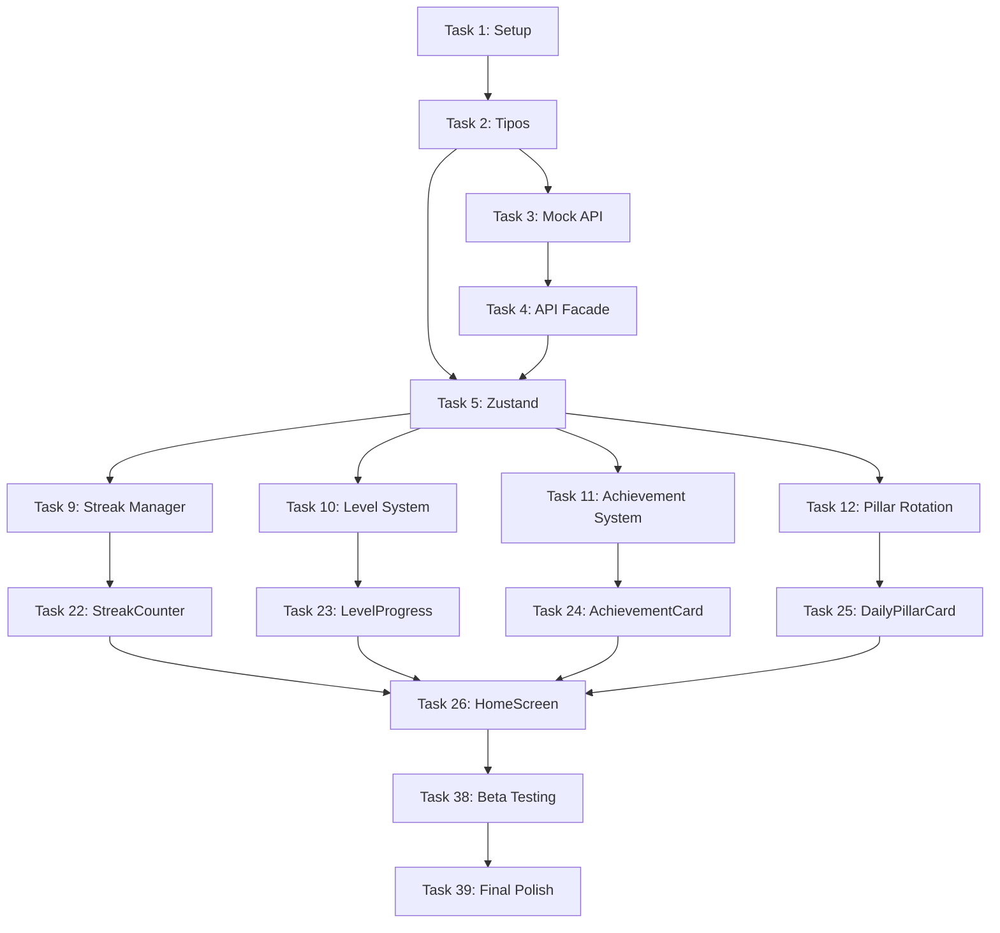

# Implementation Plan: Zeal AI - Fase 4: Sistema de Gamificación Integral

## Overview

Este documento desglosa la implementación del sistema de gamificación integral en tareas específicas y ejecutables. El plan está organizado en 5 fases principales que abarcan desde la configuración inicial hasta el polish final y QA.

El sistema implementa:
- Rachas multi-factor con validación automática
- Niveles de maestría tipo RPG (Beginner → Expert)
- Sistema de logros con 20+ achievements
- Rotación inteligente de pilares (nutrición, sueño, movimiento)
- Notificaciones push contextuales
- Persistencia robusta con AsyncStorage + SecureStore

**Duración Estimada Total**: 11.5 semanas (230 horas)

**Stack Tecnológico**:
- React Native 0.71+ con TypeScript
- Zustand para gestión de estado
- Expo SDK 48+ (Notifications, SecureStore)
- React Navigation para navegación
- React Native Reanimated para animaciones
- Jest + React Native Testing Library para testing

---

## FASE 1: FUNDAMENTOS (2 semanas - 80 horas)

### Task 1: Configuración Inicial del Proyecto

**Estimación**: 8 horas  
**Fase**: 1 - Fundamentos  
**Dependencias**: Ninguna  
**Requisitos**: Setup técnico base

#### Descripción

Configurar el proyecto base con todas las herramientas, dependencias y estructura de carpetas necesarias para el desarrollo del sistema de gamificación.

#### Sub-tareas

**1.1 Configurar TypeScript**
- Instalar TypeScript y tipos para React Native (`@types/react`, `@types/react-native`)
- Crear `tsconfig.json` con configuración estricta (strict mode, noImplicitAny)
- Configurar path aliases: `@/components`, `@/services`, `@/stores`, `@/types`, `@/utils`
- Validar que el proyecto compila sin errores

_Estimación: 2 horas_

**1.2 Configurar Jest y Testing**
- Instalar Jest, React Native Testing Library, @testing-library/jest-native
- Instalar fast-check para property-based testing
- Crear `jest.config.js` y `jest.setup.js`
- Configurar coverage thresholds (80% para módulos core)
- Crear script `npm test` y `npm run test:coverage`

_Estimación: 3 horas_

**1.3 Configurar ESLint y Prettier**
- Instalar ESLint con configuración para TypeScript y React Native
- Instalar Prettier y configurar integración con ESLint
- Crear `.eslintrc.js` con reglas estrictas
- Crear `.prettierrc` con formato consistente
- Configurar pre-commit hook con husky

_Estimación: 2 horas_

**1.4 Crear Estructura de Carpetas**
- Crear estructura modular:
  ```
  src/
    components/      # Componentes UI reutilizables
    screens/         # Pantallas principales
    services/        # Lógica de negocio y servicios
    stores/          # Zustand stores
    types/           # TypeScript types e interfaces
    utils/           # Utilidades y helpers
    constants/       # Constantes y configuración
    hooks/           # Custom hooks
  ```
- Crear archivos `index.ts` para exports limpios

_Estimación: 1 hora_

#### Criterios de Aceptación

- [ ] TypeScript compila sin errores con strict mode
- [ ] Tests pueden ejecutarse con `npm test`
- [ ] Coverage report se genera correctamente
- [ ] ESLint y Prettier funcionan sin conflictos
- [ ] Pre-commit hook valida código antes de commit

#### Notas Técnicas

- Usar TypeScript 4.9+ para mejor inferencia de tipos
- Configurar `skipLibCheck: true` en tsconfig para mejorar velocidad de compilación
- Habilitar `esModuleInterop` para mejor compatibilidad con librerías

---

### Task 2: Definir Tipos y Esquemas de Datos

**Estimación**: 12 horas  
**Fase**: 1 - Fundamentos  
**Dependencias**: Task 1  
**Requisitos**: Requirement 15 (Preparación para Backend), Design - Data Models

#### Descripción

Definir todos los tipos TypeScript, interfaces y esquemas de datos que serán usados en todo el sistema. Esto incluye entidades del dominio, enums, y tipos de utilidad.

#### Sub-tareas

**2.1 Definir Enums y Tipos Base**
- Crear `src/types/enums.ts` con:
  - `PillarType` (NUTRITION, SLEEP, MOVEMENT)
  - `RouteType` (BEGINNER, INTERMEDIATE, ADVANCED, EXPERT)
  - `StreakStatus` (ACTIVE, AT_RISK, BROKEN)
  - `AchievementCategory` (STREAK, LEVEL, PILLAR, SPECIAL)
  - `RotationStrategy` (ROUND_ROBIN, STATS_BASED, WEIGHTED_RANDOM, MANUAL)
- Documentar cada enum con comentarios JSDoc

_Estimación: 2 horas_  
_Requirements: 1.1, 2.1, 3.1, 4.1_

**2.2 Definir Interfaces de Entidades del Dominio**
- Crear `src/types/entities.ts` con interfaces:
  - `User`: id, name, level, experience, currentStreak, route, stats, preferences
  - `Streak`: userId, currentStreak, longestStreak, lastCompletedDate, status
  - `DailyPillar`: id, userId, date, pillarType, targetMetrics, progress, isCompleted
  - `Achievement`: id, title, description, category, requirement, icon, experienceReward
  - `LevelRoute`: userId, routeType, currentLevel, experiencePoints, nextLevelThreshold
  - `PillarHistory`: userId, entries[]
- Incluir campos de sincronización: createdAt, updatedAt, syncedAt

_Estimación: 4 horas_  
_Requirements: 1.1-1.10, 3.1-3.10, 15.3-15.4_

**2.3 Definir Interfaces de Métricas y Configuración**
- Crear `src/types/metrics.ts`:
  - `PillarMetrics`: métricas específicas por tipo de pilar
  - `UserStats`: nutritionScore, sleepScore, movementScore, overallScore
  - `UserPreferences`: notificationTime, notificationTypes, rotationStrategy, pillarThresholds
- Crear `src/types/requirements.ts`:
  - `AchievementRequirement`: type, value, pillarType, customCheck

_Estimación: 3 horas_  
_Requirements: 2.8, 8.1-8.3, 16.1-16.10_

**2.4 Definir Tipos de Utilidad y Helpers**
- Crear `src/types/api.ts`:
  - `APIResponse<T>`: success, data, error
  - `StreakUpdate`, `LevelUpdate`, `PillarUpdate`
- Crear `src/types/storage.ts`:
  - `StorageKeys`: constantes para AsyncStorage
  - `SecureKeys`: constantes para SecureStore
- Crear type guards y validadores

_Estimación: 3 horas_  
_Requirements: 6.1-6.4, 15.2_

#### Criterios de Aceptación

- [ ] Todos los tipos están definidos con JSDoc completo
- [ ] No hay tipos `any` en el código
- [ ] Interfaces incluyen campos de sincronización (createdAt, updatedAt, syncedAt)
- [ ] Type guards validan correctamente los tipos en runtime
- [ ] Tipos son exportados correctamente desde `src/types/index.ts`

#### Notas Técnicas

- Usar `Readonly<T>` para tipos inmutables
- Usar `Partial<T>` para updates opcionales
- Considerar usar Zod o Yup para validación en runtime si es necesario

---

### Task 3: Implementar Mock API Service

**Estimación**: 16 horas  
**Fase**: 1 - Fundamentos  
**Dependencias**: Task 2  
**Requisitos**: Requirement 6 (Mock API), Requirement 15 (Preparación Backend)

#### Descripción

Implementar una capa de abstracción que simule el backend durante desarrollo. El Mock API Service debe replicar el comportamiento de un API real incluyendo latencia, errores simulados y persistencia en AsyncStorage.

#### Sub-tareas

**3.1 Crear Interfaz IAPIService**
- Crear `src/services/api/IAPIService.ts` con métodos:
  - `getUser(userId: string): Promise<User>`
  - `updateUser(userId: string, data: Partial<User>): Promise<User>`
  - `getStreak(userId: string): Promise<Streak>`
  - `updateStreak(userId: string, data: StreakUpdate): Promise<Streak>`
  - `getDailyPillar(userId: string, date: Date): Promise<DailyPillar>`
  - `updateDailyPillar(userId: string, pillarId: string, data: Partial<DailyPillar>): Promise<DailyPillar>`
  - `getAchievements(): Promise<Achievement[]>`
  - `getUserAchievements(userId: string): Promise<UserAchievement[]>`
  - `unlockAchievement(userId: string, achievementId: string): Promise<Achievement>`
  - `getLevelRoute(userId: string): Promise<LevelRoute>`
  - `updateLevelRoute(userId: string, data: Partial<LevelRoute>): Promise<LevelRoute>`
  - `getPillarHistory(userId: string): Promise<PillarHistory>`
- Documentar cada método con JSDoc

_Estimación: 3 horas_  
_Requirements: 6.1, 15.1_

**3.2 Implementar MockAPIService**
- Crear `src/services/api/MockAPIService.ts` implementando `IAPIService`
- Implementar simulación de latencia (500ms configurable)
- Implementar simulación de errores aleatorios (5% de las llamadas)
- Usar AsyncStorage para persistir cambios entre sesiones
- Implementar logging de operaciones en console.log

_Estimación: 6 horas_  
_Requirements: 6.2, 6.7, 6.8_

**3.3 Crear Datos Mock de Ejemplo**
- Crear `src/services/api/mockData.ts` con:
  - 3 usuarios de ejemplo con diferentes niveles y rachas
  - Historial de pilares de los últimos 30 días
  - 20 logros predefinidos (según design.md)
  - Rutas de maestría configuradas
- Datos deben ser consistentes con esquemas definidos

_Estimación: 4 horas_  
_Requirements: 6.3, 6.6_

**3.4 Implementar Métodos de Utilidad**
- Crear métodos para resetear datos mock
- Crear métodos para generar escenarios de testing específicos:
  - Usuario con racha larga (30+ días)
  - Usuario con racha rota
  - Usuario en diferentes rutas de maestría
- Implementar método para exportar/importar estado completo

_Estimación: 3 hours_  
_Requirements: 6.10_

#### Criterios de Aceptación

- [ ] Todos los métodos de IAPIService están implementados
- [ ] Latencia simulada de 500ms funciona correctamente
- [ ] Errores aleatorios se simulan en ~5% de llamadas
- [ ] Cambios persisten en AsyncStorage entre sesiones
- [ ] Datos mock son consistentes con esquemas TypeScript
- [ ] Métodos de utilidad permiten resetear y generar escenarios

#### Notas Técnicas

- Usar `setTimeout` para simular latencia
- Usar `Math.random()` para simular errores aleatorios
- Implementar retry logic en el cliente, no en el mock
- Considerar usar `faker.js` para generar datos realistas

---

### Task 4: Implementar Capa de Abstracción de API

**Estimación**: 8 horas  
**Fase**: 1 - Fundamentos  
**Dependencias**: Task 3  
**Requisitos**: Requirement 6 (Mock API), Requirement 15 (Preparación Backend)

#### Descripción

Crear una capa de abstracción (Facade Pattern) que permita cambiar entre Mock API y Real API mediante un toggle de configuración, sin modificar código de componentes.

#### Sub-tareas

**4.1 Crear RealAPIService (Stub)**
- Crear `src/services/api/RealAPIService.ts` implementando `IAPIService`
- Implementar métodos usando `fetch` o `axios`
- Configurar base URL desde variables de entorno
- Implementar manejo de errores HTTP
- Por ahora, métodos pueden lanzar "Not Implemented" ya que backend no existe

_Estimación: 3 horas_  
_Requirements: 15.1, 15.9_

**4.2 Crear APIFacade**
- Crear `src/services/api/APIFacade.ts`
- Implementar Singleton pattern
- Leer toggle `USE_MOCK` desde configuración
- Delegar llamadas a MockAPIService o RealAPIService según toggle
- Implementar logging y analytics en el facade

_Estimación: 3 horas_  
_Requirements: 6.5, 6.9, 15.2_

**4.3 Crear Configuración Global**
- Crear `src/constants/config.ts` con:
  - `USE_MOCK`: boolean (default: true)
  - `API_BASE_URL`: string
  - `MOCK_LATENCY_MS`: number (default: 500)
  - `MOCK_ERROR_RATE`: number (default: 0.05)
- Permitir override desde variables de entorno

_Estimación: 1 hora_  
_Requirements: 6.5_

**4.4 Exportar API Singleton**
- Crear `src/services/api/index.ts`
- Exportar instancia singleton de APIFacade como `API`
- Documentar uso con ejemplos

_Estimación: 1 hora_  
_Requirements: 6.9_

#### Criterios de Aceptación

- [ ] Toggle USE_MOCK permite cambiar entre Mock y Real API
- [ ] APIFacade implementa Singleton correctamente
- [ ] Cambiar toggle no requiere modificar código de componentes
- [ ] Errores de API se manejan consistentemente
- [ ] Configuración puede overridearse desde variables de entorno

#### Notas Técnicas

- Usar patrón Singleton para garantizar una sola instancia de API
- Implementar retry logic con exponential backoff en el facade
- Considerar usar `axios` para mejor manejo de requests HTTP

---

### Task 5: Implementar Gestión de Estado con Zustand

**Estimación**: 12 horas  
**Fase**: 1 - Fundamentos  
**Dependencias**: Task 2, Task 4  
**Requisitos**: Requirement 7 (Zustand), Design - State Management

#### Descripción

Implementar stores de Zustand para gestionar el estado global de gamificación con persistencia automática en AsyncStorage.

#### Sub-tareas

**5.1 Configurar Zustand con Persist Middleware**
- Instalar `zustand` y configurar persist middleware
- Crear `src/stores/middleware/persistConfig.ts`
- Configurar AsyncStorage como storage engine
- Implementar serialización/deserialización de fechas

_Estimación: 2 horas_  
_Requirements: 7.3, 7.4_

**5.2 Crear Game Store**
- Crear `src/stores/gameStore.ts`
- Definir estado: `user`, `streak`, `dailyPillar`, `achievements`, `levelRoute`
- Implementar acciones:
  - `setUser(user: User)`
  - `updateStreak(streak: Streak)`
  - `setDailyPillar(pillar: DailyPillar)`
  - `addAchievement(achievement: Achievement)`
  - `updateLevel(levelRoute: LevelRoute)`
  - `resetState()` para testing
- Aplicar persist middleware

_Estimación: 4 horas_  
_Requirements: 7.1, 7.2, 7.5_

**5.3 Crear User Store**
- Crear `src/stores/userStore.ts`
- Definir estado: `preferences`, `pillarHistory`, `isOnboarded`
- Implementar acciones:
  - `updatePreferences(prefs: Partial<UserPreferences>)`
  - `addPillarHistoryEntry(entry: PillarHistoryEntry)`
  - `setOnboarded(value: boolean)`
- Aplicar persist middleware

_Estimación: 3 horas_  
_Requirements: 7.1, 16.9_

**5.4 Implementar Selectores Optimizados**
- Crear selectores específicos para evitar re-renders innecesarios:
  - `useCurrentStreak()`: solo retorna currentStreak
  - `useStreakStatus()`: solo retorna streak.status
  - `useUserLevel()`: solo retorna user.level
  - `useDailyPillar()`: solo retorna dailyPillar
- Documentar uso de selectores

_Estimación: 2 horas_  
_Requirements: 7.7_

**5.5 Implementar Acciones Asíncronas**
- Integrar stores con API facade
- Implementar acciones asíncronas:
  - `loadUserData(userId: string)`
  - `syncWithServer()`
- Implementar manejo de errores en acciones asíncronas
- Mantener estado anterior si la acción falla

_Estimación: 1 hora_  
_Requirements: 7.8, 7.9_

#### Criterios de Aceptación

- [ ] Estado persiste automáticamente en AsyncStorage
- [ ] Estado se restaura correctamente al reabrir la app
- [ ] Selectores optimizados previenen re-renders innecesarios
- [ ] Acciones asíncronas integran correctamente con API
- [ ] Errores en acciones asíncronas no corrompen el estado
- [ ] resetState() permite limpiar estado para testing

#### Notas Técnicas

- Usar `shallow` de zustand para comparaciones de objetos
- Implementar `devtools` middleware solo en desarrollo
- Considerar separar stores por dominio si crecen mucho

---

### Task 6: Implementar Sistema de Persistencia y Backup

**Estimación**: 12 horas  
**Fase**: 1 - Fundamentos  
**Dependencias**: Task 2, Task 5  
**Requisitos**: Requirement 12 (Manejo de Errores), Requirement 17 (Seguridad)

#### Descripción

Implementar sistema robusto de persistencia con AsyncStorage para datos generales, SecureStore para datos sensibles, y sistema de backup automático.

#### Sub-tareas

**6.1 Crear Storage Service**
- Crear `src/services/storage/StorageService.ts`
- Implementar wrapper sobre AsyncStorage con:
  - `get<T>(key: string): Promise<T | null>`
  - `set<T>(key: string, value: T): Promise<void>`
  - `remove(key: string): Promise<void>`
  - `clear(): Promise<void>`
- Implementar serialización/deserialización automática
- Implementar retry con exponential backoff (3 intentos)

_Estimación: 4 horas_  
_Requirements: 12.1, 12.2_

**6.2 Crear Secure Storage Service**
- Crear `src/services/storage/SecureStorageService.ts`
- Implementar wrapper sobre Expo SecureStore
- Métodos similares a StorageService pero para datos sensibles
- Implementar validación de disponibilidad de SecureStore

_Estimación: 2 horas_  
_Requirements: 17.1_

**6.3 Implementar Sistema de Backup**
- Crear `src/services/storage/BackupService.ts`
- Implementar backup automático cada 24 horas
- Mantener últimos 7 backups
- Implementar método `createBackup()`
- Implementar método `restoreFromBackup(timestamp: Date)`
- Guardar índice de backups en AsyncStorage

_Estimación: 4 horas_  
_Requirements: 12.5_

**6.4 Implementar Validación de Integridad**
- Crear `src/services/storage/IntegrityService.ts`
- Implementar checksums para detectar corrupción
- Implementar validación de esquemas con Zod
- Implementar recuperación automática desde backup si hay corrupción

_Estimación: 2 horas_  
_Requirements: 12.5_

#### Criterios de Aceptación

- [ ] StorageService implementa retry con backoff exponencial
- [ ] SecureStore se usa solo para datos sensibles (tokens)
- [ ] Backups se crean automáticamente cada 24 horas
- [ ] Sistema mantiene últimos 7 backups
- [ ] Corrupción de datos se detecta y recupera automáticamente
- [ ] Validación de esquemas previene datos inválidos

#### Notas Técnicas

- Usar Zod para validación de esquemas en runtime
- Implementar checksums con CRC32 o similar
- Considerar comprimir backups para ahorrar espacio

---

### Task 7: Implementar Servicio de Notificaciones

**Estimación**: 12 horas  
**Fase**: 1 - Fundamentos  
**Dependencias**: Task 2  
**Requisitos**: Requirement 5 (Notificaciones Push)

#### Descripción

Implementar servicio de notificaciones push usando Expo Notifications con soporte para notificaciones programadas, inmediatas y configuración de permisos.

#### Sub-tareas

**7.1 Configurar Expo Notifications**
- Instalar `expo-notifications`
- Configurar permisos en `app.json` (iOS y Android)
- Crear `src/services/notifications/NotificationService.ts`
- Implementar solicitud de permisos con explicación clara

_Estimación: 2 horas_  
_Requirements: 5.1, 5.2_

**7.2 Implementar Notificaciones Programadas**
- Implementar `scheduleDailyReminder(time: string, pillarType: PillarType)`
- Implementar notificación recurrente diaria a las 9:00 AM (configurable)
- Implementar notificación de advertencia a las 8:00 PM si pilar no completado
- Permitir configurar horario entre 6:00 AM y 12:00 PM

_Estimación: 4 horas_  
_Requirements: 5.3, 5.4, 5.7_

**7.3 Implementar Notificaciones Inmediatas**
- Implementar `sendStreakWarning(streak: Streak)`
- Implementar `sendAchievementUnlocked(achievement: Achievement)`
- Implementar `sendLevelUp(newLevel: number)`
- Personalizar contenido según contexto del usuario

_Estimación: 3 horas_  
_Requirements: 5.5, 5.6_

**7.4 Implementar Configuración de Notificaciones**
- Implementar `updateNotificationPreferences(prefs: NotificationPreferences)`
- Permitir activar/desactivar tipos específicos de notificaciones
- Implementar límite de 5 notificaciones por día
- Implementar `cancelAllNotifications()`

_Estimación: 2 horas_  
_Requirements: 5.8, 5.10_

**7.5 Implementar Deep Linking**
- Configurar manejo de notificaciones tocadas
- Navegar a pantalla relevante según tipo de notificación:
  - Recordatorio diario → HomeScreen
  - Logro desbloqueado → AchievementsScreen
  - Subida de nivel → LevelScreen
  - Advertencia de racha → HomeScreen

_Estimación: 1 hora_  
_Requirements: 5.9_

#### Criterios de Aceptación

- [ ] Permisos de notificaciones se solicitan durante onboarding
- [ ] Notificación diaria se programa correctamente
- [ ] Notificación de advertencia se envía a las 8 PM si pilar no completado
- [ ] Notificaciones inmediatas se envían al desbloquear logros y subir nivel
- [ ] Usuario puede configurar horario y tipos de notificaciones
- [ ] Tocar notificación abre la app en pantalla relevante
- [ ] Límite de 5 notificaciones por día se respeta

#### Notas Técnicas

- Usar `Notifications.scheduleNotificationAsync` para notificaciones programadas
- Usar `Notifications.addNotificationReceivedListener` para manejar notificaciones
- Implementar badge count en iOS para mostrar notificaciones pendientes

---

### Task 8: Implementar Custom Hooks

**Estimación**: 8 horas  
**Fase**: 1 - Fundamentos  
**Dependencias**: Task 5  
**Requisitos**: Design - Custom Hooks, Requirement 20 (Documentación)

#### Descripción

Crear custom hooks que encapsulen lógica común y simplifiquen el uso de stores en componentes.

#### Sub-tareas

**8.1 Crear useStreak Hook**
- Crear `src/hooks/useStreak.ts`
- Exponer: `streak`, `isActive`, `isAtRisk`, `canIncrement`
- Exponer acciones: `incrementStreak()`, `breakStreak()`, `resetStreak()`
- Documentar con JSDoc y ejemplos de uso

_Estimación: 2 horas_

**8.2 Crear useLevel Hook**
- Crear `src/hooks/useLevel.ts`
- Exponer: `level`, `experience`, `nextLevelThreshold`, `progressPercentage`
- Exponer acciones: `addExperience(points)`, `changeRoute(newRoute)`
- Calcular progreso hacia siguiente nivel automáticamente

_Estimación: 2 horas_

**8.3 Crear useAchievements Hook**
- Crear `src/hooks/useAchievements.ts`
- Exponer: `achievements`, `unlockedCount`, `totalCount`
- Exponer acciones: `checkAndUnlock()`, `getProgress(achievementId)`
- Filtrar logros por categoría

_Estimación: 2 horas_

**8.4 Crear useDailyPillar Hook**
- Crear `src/hooks/useDailyPillar.ts`
- Exponer: `dailyPillar`, `completionPercentage`, `isCompleted`
- Exponer acciones: `updateProgress(metrics)`, `completePillar()`, `changePillar(type)`
- Validar completitud automáticamente

_Estimación: 2 horas_

#### Criterios de Aceptación

- [ ] Todos los hooks tienen documentación JSDoc completa
- [ ] Hooks incluyen ejemplos de uso en comentarios
- [ ] Hooks encapsulan lógica compleja del store
- [ ] Hooks previenen re-renders innecesarios con selectores
- [ ] Hooks son exportados desde `src/hooks/index.ts`

#### Notas Técnicas

- Usar `useCallback` para memoizar funciones
- Usar selectores de Zustand para optimizar performance
- Considerar agregar hooks de utilidad como `useDebounce`, `useThrottle`

---

## FASE 2: CORE GAMIFICATION (3 semanas - 120 horas)

### Task 9: Implementar Streak Manager

**Estimación**: 16 horas  
**Fase**: 2 - Core Gamification  
**Dependencias**: Task 2, Task 4, Task 5  
**Requisitos**: Requirement 1 (Rachas Multi-Factor), Design - Streak Manager

#### Descripción

Implementar el módulo core que gestiona las rachas del usuario, incluyendo cálculo, validación, incremento y detección de estado.

#### Sub-tareas

**9.1 Crear Interfaz IStreakManager**
- Crear `src/services/gamification/IStreakManager.ts`
- Definir métodos según design.md:
  - `calculateCurrentStreak(userId: string): Promise<Streak>`
  - `validatePillarCompletion(pillar: DailyPillar): boolean`
  - `incrementStreak(userId: string): Promise<Streak>`
  - `breakStreak(userId: string): Promise<Streak>`
  - `isStreakAtRisk(streak: Streak): boolean`

_Estimación: 2 horas_  
_Requirements: 1.1_

**9.2 Implementar Cálculo de Racha**
- Implementar `calculateCurrentStreak()` según pseudocódigo en design.md
- Iterar historial de pilares desde más reciente
- Detectar días consecutivos
- Calcular racha más larga histórica
- Manejar edge cases: cambio de zona horaria, días sin datos

_Estimación: 4 horas_  
_Requirements: 1.1, 1.10_

**9.3 Implementar Validación de Completitud**
- Implementar `validatePillarCompletion()` con lógica específica por tipo:
  - Nutrición: 90% de macros objetivo (configurable)
  - Sueño: mínimo 7 horas (configurable)
  - Movimiento: 100% de calorías objetivo (configurable)
- Implementar `calculateCompletionPercentage()`
- Validar métricas realistas (no permitir 20 horas de sueño)

_Estimación: 4 horas_  
_Requirements: 8.1, 8.2, 8.3, 8.7_

**9.4 Implementar Gestión de Estado de Racha**
- Implementar `determineStreakStatus()`:
  - ACTIVE: <20h desde última completitud
  - AT_RISK: 20-24h desde última completitud
  - BROKEN: >24h desde última completitud
- Implementar `incrementStreak()` con validaciones
- Implementar `breakStreak()` con registro en historial

_Estimación: 3 horas_  
_Requirements: 1.2, 1.3, 1.4, 1.5_

**9.5 Implementar Persistencia de Racha**
- Integrar con API facade para persistir cambios
- Guardar en AsyncStorage después de cada actualización
- Implementar retry logic si falla el guardado
- Registrar eventos en analytics

_Estimación: 3 horas_  
_Requirements: 1.9, 1.10_

#### Criterios de Aceptación

- [ ] calculateCurrentStreak() calcula correctamente rachas consecutivas
- [ ] validatePillarCompletion() valida según tipo de pilar
- [ ] Estado de racha se determina correctamente según horas transcurridas
- [ ] Racha se incrementa solo si pilar está completado
- [ ] Racha se rompe automáticamente después de 24h sin completar
- [ ] Cambios persisten en AsyncStorage
- [ ] Racha más larga se actualiza correctamente

#### Notas Técnicas

- Usar `date-fns` para cálculos de fechas
- Considerar zona horaria del usuario para cálculos precisos
- Implementar cache para evitar recalcular racha en cada render

---

### Task 10: Implementar Level System

**Estimación**: 16 horas  
**Fase**: 2 - Core Gamification  
**Dependencias**: Task 2, Task 4, Task 5  
**Requisitos**: Requirement 3 (Niveles y Rutas), Design - Level System

#### Descripción

Implementar el sistema de niveles tipo RPG con rutas de maestría, cálculo de experiencia y desbloqueo de características.

#### Sub-tareas

**10.1 Crear Interfaz ILevelSystem**
- Crear `src/services/gamification/ILevelSystem.ts`
- Definir métodos:
  - `calculateLevel(experiencePoints: number): number`
  - `calculateNextLevelThreshold(currentLevel: number): number`
  - `addExperience(userId: string, points: number): Promise<User>`
  - `assignRoute(testScore: number): RouteType`
  - `changeRoute(userId: string, newRoute: RouteType): Promise<boolean>`

_Estimación: 2 horas_  
_Requirements: 3.1_

**10.2 Implementar Cálculo de Nivel**
- Implementar fórmula: `nivel = floor(sqrt(experience_points / 100))`
- Implementar `calculateNextLevelThreshold()`: `(nivel+1)^2 * 100`
- Limitar nivel máximo a 100
- Validar que experiencia no sea negativa

_Estimación: 2 horas_  
_Requirements: 3.5, 3.6_

**10.3 Implementar Sistema de Experiencia**
- Implementar `calculateExperienceReward()`:
  - Puntos base por tipo de pilar (Nutrition: 100, Sleep: 80, Movement: 120)
  - Multiplicador por ruta (Beginner: 1.0, Intermediate: 1.2, Advanced: 1.5, Expert: 2.0)
  - Multiplicador por completitud (porcentaje / 100)
  - Bonus por racha (1% por día, máximo 50%)
- Implementar `addExperience()` con detección de subida de nivel

_Estimación: 4 horas_  
_Requirements: 3.4, 3.10_

**10.4 Implementar Rutas de Maestría**
- Implementar `assignRoute()` basándose en puntaje de test:
  - 0-30%: Beginner
  - 31-60%: Intermediate
  - 61-85%: Advanced
  - 86-100%: Expert
- Implementar `changeRoute()` con validaciones:
  - Requiere nivel 10+
  - Solo cada 30 días
  - Mostrar confirmación al usuario

_Estimación: 4 horas_  
_Requirements: 3.2, 3.3, 3.8_

**10.5 Implementar Desbloqueo de Características**
- Implementar `unlockLevelFeatures()`:
  - Nivel 5: Estadísticas avanzadas
  - Nivel 10: Cambio de ruta
  - Nivel 25: Métricas personalizadas
  - Nivel 50: Modo experto
  - Nivel 100: Maestría completa
- Registrar desbloqueos en perfil del usuario
- Enviar notificaciones de desbloqueo

_Estimación: 3 horas_  
_Requirements: 3.7_

**10.6 Implementar Historial de Niveles**
- Registrar cada subida de nivel en `levelHistory`
- Incluir: nivel alcanzado, fecha, experiencia en ese momento
- Permitir visualizar progresión histórica

_Estimación: 1 hora_  
_Requirements: 3.9_

#### Criterios de Aceptación

- [ ] Fórmula de nivel calcula correctamente según experiencia
- [ ] Experiencia otorgada varía según pilar, ruta y racha
- [ ] Subida de nivel se detecta automáticamente
- [ ] Rutas se asignan correctamente según puntaje de test
- [ ] Cambio de ruta valida nivel 10+ y 30 días desde último cambio
- [ ] Características se desbloquean en niveles correctos
- [ ] Notificaciones se envían al subir de nivel
- [ ] Historial de niveles se registra correctamente

#### Notas Técnicas

- Usar `Math.floor` y `Math.sqrt` para cálculo de nivel
- Considerar balanceo de experiencia basándose en analytics
- Implementar curva de experiencia ajustable mediante configuración

---

### Task 11: Implementar Achievement System

**Estimación**: 20 horas  
**Fase**: 2 - Core Gamification  
**Dependencias**: Task 2, Task 4, Task 5, Task 9, Task 10  
**Requisitos**: Requirement 4 (Logros y Celebraciones), Design - Achievement System

#### Descripción

Implementar el sistema de logros con 20+ achievements predefinidos, verificación automática, tracking de progreso y celebraciones.

#### Sub-tareas

**11.1 Crear Interfaz IAchievementSystem**
- Crear `src/services/gamification/IAchievementSystem.ts`
- Definir métodos:
  - `checkAndUnlockAchievements(userId: string): Promise<Achievement[]>`
  - `getUserAchievements(userId: string, includeHidden: boolean): Promise<Achievement[]>`
  - `calculateAchievementProgress(userId: string, achievementId: string): Promise<number>`
  - `unlockAchievement(userId: string, achievementId: string): Promise<Achievement>`

_Estimación: 2 horas_  
_Requirements: 4.1_

**11.2 Definir Catálogo de Logros**
- Crear `src/constants/achievements.ts` con 20 logros:
  - **Streak** (5): Week Warrior (7 días), Monthly Champion (30 días), Unstoppable (100 días), Phoenix (recuperar racha), Legend (365 días)
  - **Level** (5): Novice (nivel 5), Apprentice (nivel 10), Expert (nivel 25), Master (nivel 50), Grandmaster (nivel 100)
  - **Pillar** (6): Nutrition Enthusiast (10 pilares), Sleep Champion (10 pilares), Movement Master (10 pilares), Balanced Life (5 de cada tipo), Century Club (100 pilares), Perfectionist (10 pilares al 100%)
  - **Special** (4): Early Bird (completar antes 10 AM), Night Owl (completar después 10 PM), Comeback King (superar récord), First Steps (primer pilar)
- Incluir: id, title, description, category, requirement, icon, isHidden, experienceReward

_Estimación: 4 horas_  
_Requirements: 4.1, 4.9_

**11.3 Implementar Verificación de Requisitos**
- Implementar `checkAchievementRequirement()` con soporte para:
  - Tipo 'streak': verificar racha actual
  - Tipo 'level': verificar nivel actual
  - Tipo 'pillar_count': contar pilares completados (total o por tipo)
  - Tipo 'custom': ejecutar función personalizada
- Manejar edge cases y validaciones

_Estimación: 5 horas_  
_Requirements: 4.2_

**11.4 Implementar Desbloqueo de Logros**
- Implementar `checkAndUnlockAchievements()`:
  - Obtener logros no desbloqueados
  - Verificar cada requisito
  - Desbloquear logros cumplidos
  - Otorgar XP bonus (100 puntos por primer logro)
  - Enviar notificaciones
  - Registrar en analytics
- Implementar `unlockAchievement()` con persistencia

_Estimación: 5 horas_  
_Requirements: 4.2, 4.3, 4.7, 4.8_

**11.5 Implementar Tracking de Progreso**
- Implementar `calculateAchievementProgress()`:
  - Calcular porcentaje de progreso (0-100)
  - Manejar diferentes tipos de requisitos
  - Logros custom retornan 0 (no cuantificables)
- Actualizar progreso en UserAchievement

_Estimación: 3 horas_  
_Requirements: 4.6_

**11.6 Implementar Visualización de Logros**
- Implementar `getUserAchievements()` con filtros:
  - Incluir/excluir logros ocultos bloqueados
  - Filtrar por categoría
  - Ordenar por fecha de desbloqueo
- Mostrar requisitos para logros bloqueados

_Estimación: 1 hora_  
_Requirements: 4.5, 4.6_

#### Criterios de Aceptación

- [ ] 20 logros están definidos en 4 categorías
- [ ] Requisitos se verifican correctamente para cada tipo
- [ ] Logros se desbloquean automáticamente al cumplir requisitos
- [ ] Notificaciones se envían al desbloquear logros
- [ ] XP bonus se otorga al desbloquear primer logro
- [ ] Progreso se calcula correctamente para logros cuantificables
- [ ] Logros ocultos no se muestran hasta desbloquearse
- [ ] Fecha de desbloqueo se registra correctamente

#### Notas Técnicas

- Ejecutar `checkAndUnlockAchievements()` después de completar pilar, subir nivel, actualizar racha
- Considerar implementar sistema de badges visuales
- Implementar rate limiting para evitar spam de notificaciones

---

### Task 12: Implementar Pillar Rotation Engine

**Estimación**: 16 horas  
**Fase**: 2 - Core Gamification  
**Dependencias**: Task 2, Task 4, Task 5  
**Requisitos**: Requirement 2 (Rotación de Pilares), Design - Pillar Rotation Engine

#### Descripción

Implementar el motor de rotación inteligente de pilares con múltiples estrategias (round-robin, basado en stats, aleatorio ponderado, manual).

#### Sub-tareas

**12.1 Crear Interfaz IPillarRotationEngine**
- Crear `src/services/gamification/IPillarRotationEngine.ts`
- Definir métodos:
  - `selectDailyPillar(userId: string, strategy: RotationStrategy): Promise<DailyPillar>`
  - `roundRobinRotation(history: PillarHistory): PillarType`
  - `statsBasedRotation(user: User): PillarType`
  - `weightedRandomRotation(history: PillarHistory): PillarType`
  - `manuallySetPillar(userId: string, pillarType: PillarType): Promise<boolean>`

_Estimación: 2 horas_  
_Requirements: 2.1_

**12.2 Implementar Estrategia Round Robin**
- Implementar `roundRobinRotation()`:
  - Obtener últimos 7 días del historial
  - Contar frecuencia de cada pilar
  - Seleccionar el menos usado
  - Si hay empate, seleccionar aleatoriamente
- Evitar repetición excesiva del mismo pilar

_Estimación: 3 horas_  
_Requirements: 2.2, 2.4_

**12.3 Implementar Estrategia Basada en Stats**
- Implementar `statsBasedRotation()`:
  - Obtener scores del usuario (nutritionScore, sleepScore, movementScore)
  - Seleccionar pilar con score más bajo
  - Si hay empate, usar round-robin como tiebreaker

_Estimación: 2 horas_  
_Requirements: 2.2, 2.5_

**12.4 Implementar Estrategia Aleatoria Ponderada**
- Implementar `weightedRandomRotation()`:
  - Obtener últimos 30 días del historial
  - Contar completitudes por tipo de pilar
  - Calcular pesos inversos (menos completado = mayor peso)
  - Selección aleatoria ponderada

_Estimación: 3 horas_  
_Requirements: 2.2_

**12.5 Implementar Selección de Pilar del Día**
- Implementar `selectDailyPillar()`:
  - Verificar si ya existe pilar para hoy
  - Aplicar estrategia configurada
  - Definir métricas objetivo según tipo y ruta
  - Crear DailyPillar y persistir
  - Programar notificación a las 9 AM
- Implementar `defineTargetMetrics()` con multiplicadores por ruta

_Estimación: 4 horas_  
_Requirements: 2.1, 2.8, 2.9_

**12.6 Implementar Cambio Manual de Pilar**
- Implementar `manuallySetPillar()`:
  - Validar que sea antes de las 12 PM
  - Mostrar advertencia si es después de las 12 PM
  - Marcar pilar como "isManuallySet"
  - Actualizar notificación programada

_Estimación: 2 horas_  
_Requirements: 2.3, 2.6, 2.7_

#### Criterios de Aceptación

- [ ] Tres estrategias de rotación funcionan correctamente
- [ ] Round-robin balancea pilares en últimos 7 días
- [ ] Stats-based selecciona pilar con menor score
- [ ] Weighted-random pondera según historial de 30 días
- [ ] Pilar del día se asigna automáticamente cada día
- [ ] Métricas objetivo escalan según ruta de maestría
- [ ] Cambio manual valida hora límite (12 PM)
- [ ] Notificación se programa al asignar pilar

#### Notas Técnicas

- Ejecutar `selectDailyPillar()` en background task a medianoche
- Considerar implementar Strategy Pattern para estrategias
- Cachear pilar del día para evitar recalcular

---

### Task 13: Implementar Validation Service

**Estimación**: 12 horas  
**Fase**: 2 - Core Gamification  
**Dependencias**: Task 2, Task 9  
**Requisitos**: Requirement 8 (Validación de Completitud)

#### Descripción

Implementar servicio de validación que verifica automáticamente si un pilar está completado basándose en métricas específicas.

#### Sub-tareas

**13.1 Crear Interfaz IValidationService**
- Crear `src/services/gamification/IValidationService.ts`
- Definir métodos:
  - `validatePillarCompletion(pillar: DailyPillar): boolean`
  - `validateNutritionPillar(pillar: DailyPillar): boolean`
  - `validateSleepPillar(pillar: DailyPillar): boolean`
  - `validateMovementPillar(pillar: DailyPillar): boolean`
  - `validateMetricsRealistic(metrics: PillarMetrics, type: PillarType): boolean`

_Estimación: 2 horas_  
_Requirements: 8.1_

**13.2 Implementar Validación de Nutrición**
- Implementar `validateNutritionPillar()`:
  - Calcular porcentaje de cada macro (proteína, carbos, grasas)
  - Validar que cada macro alcance umbral (default: 90%)
  - Todas las macros deben cumplir para completar
- Obtener umbral desde preferencias del usuario

_Estimación: 3 horas_  
_Requirements: 8.1, 8.2_

**13.3 Implementar Validación de Sueño**
- Implementar `validateSleepPillar()`:
  - Validar horas de sueño >= umbral (default: 7 horas)
  - Obtener umbral desde preferencias del usuario
- Considerar calidad de sueño como factor opcional

_Estimación: 2 horas_  
_Requirements: 8.1, 8.2_

**13.4 Implementar Validación de Movimiento**
- Implementar `validateMovementPillar()`:
  - Calcular porcentaje de calorías quemadas vs objetivo
  - Validar que alcance umbral (default: 100%)
  - Obtener umbral desde preferencias del usuario

_Estimación: 2 horas_  
_Requirements: 8.1, 8.2_

**13.5 Implementar Validación de Métricas Realistas**
- Implementar `validateMetricsRealistic()`:
  - Nutrición: calorías 500-5000, proteína 0-500g, carbos 0-800g, grasas 0-300g
  - Sueño: horas 0-16, calidad 0-100
  - Movimiento: calorías 0-5000, pasos 0-100000, minutos activos 0-1440
- Rechazar métricas fuera de rangos realistas

_Estimación: 2 horas_  
_Requirements: 8.7_

**13.6 Implementar Completitud Manual**
- Permitir marcar pilar como completado manualmente
- Solicitar confirmación del usuario
- Registrar "manual_completion" en historial
- Validar que métricas sean consistentes antes de aceptar

_Estimación: 1 hora_  
_Requirements: 8.5, 8.6, 8.8_

#### Criterios de Aceptación

- [ ] Validación de nutrición verifica 90% de cada macro
- [ ] Validación de sueño verifica mínimo 7 horas
- [ ] Validación de movimiento verifica 100% de calorías
- [ ] Umbrales son configurables por usuario
- [ ] Métricas irrealistas son rechazadas
- [ ] Completitud manual requiere confirmación
- [ ] Timestamp de completitud se registra correctamente

#### Notas Técnicas

- Ejecutar validación automáticamente al actualizar progreso
- Considerar implementar validación asíncrona con debounce
- Implementar feedback visual inmediato al alcanzar 100%

---

### Task 14: Implementar Analytics Service

**Estimación**: 12 horas  
**Fase**: 2 - Core Gamification  
**Dependencias**: Task 2, Task 4  
**Requisitos**: Requirement 19 (Monitoreo y Analytics)

#### Descripción

Implementar servicio de analytics que registra eventos clave de gamificación para análisis de engagement y toma de decisiones.

#### Sub-tareas

**14.1 Crear Interfaz IAnalyticsService**
- Crear `src/services/analytics/IAnalyticsService.ts`
- Definir métodos:
  - `trackEvent(eventName: string, properties: Record<string, any>): void`
  - `setUserProperties(properties: Record<string, any>): void`
  - `flush(): Promise<void>`
  - `optOut(): void`
  - `optIn(): void`

_Estimación: 2 horas_  
_Requirements: 19.1_

**14.2 Implementar Tracking de Eventos**
- Implementar eventos clave:
  - `streak_completed`: userId, currentStreak, pillarType
  - `streak_broken`: userId, previousStreak, daysSinceCompletion
  - `level_up`: userId, newLevel, experiencePoints, route
  - `achievement_unlocked`: userId, achievementId, category
  - `pillar_completed`: userId, pillarType, completionPercentage, manualCompletion
  - `pillar_changed`: userId, previousPillar, newPillar, isManual
- Incluir timestamp y contexto en cada evento

_Estimación: 4 horas_  
_Requirements: 19.2, 19.3_

**14.3 Implementar Batching de Eventos**
- Implementar cola de eventos en memoria
- Enviar batch cada 5 minutos o al acumular 20 eventos
- Persistir cola en AsyncStorage si app se cierra
- Enviar eventos pendientes al reabrir app

_Estimación: 3 horas_  
_Requirements: 19.5, 19.6_

**14.4 Implementar Eventos de Funnel**
- Implementar eventos de onboarding:
  - `onboarding_started`
  - `test_completed`: testScore, assignedRoute
  - `route_assigned`: routeType
  - `first_pillar_completed`: pillarType, timeToComplete
- Implementar eventos de performance:
  - `app_launch_time`: duration
  - `screen_load_time`: screenName, duration
  - `api_response_time`: endpoint, duration

_Estimación: 2 horas_  
_Requirements: 19.7, 19.8_

**14.5 Implementar Opt-Out y Privacidad**
- Implementar `optOut()` y `optIn()`
- Respetar preferencia del usuario en configuración
- Usar identificadores anónimos (UUID) en lugar de PII
- En modo desarrollo, solo registrar en console.log

_Estimación: 1 hora_  
_Requirements: 19.4, 19.9, 19.10_

#### Criterios de Aceptación

- [ ] Eventos clave se registran con propiedades contextuales
- [ ] Batching reduce consumo de batería y datos
- [ ] Eventos persisten si app se cierra antes de enviar
- [ ] Funnel de onboarding se trackea completamente
- [ ] Usuario puede hacer opt-out desde configuración
- [ ] En desarrollo, eventos se registran en console
- [ ] No se envía información personal identificable

#### Notas Técnicas

- Considerar usar Firebase Analytics, Amplitude o Mixpanel
- Implementar abstracción para cambiar proveedor fácilmente
- Usar AsyncStorage para persistir cola de eventos

---

### Task 15: Implementar Wearables Integration (Opcional)

**Estimación**: 16 horas  
**Fase**: 2 - Core Gamification  
**Dependencias**: Task 2, Task 13  
**Requisitos**: Design - Adapter Pattern (Wearables)

#### Descripción

Implementar integración con wearables (Apple Health, Google Fit) usando Adapter Pattern para obtener datos de sueño y actividad automáticamente.

#### Sub-tareas

**15.1 Crear Interfaz IWearableAdapter**
- Crear `src/services/wearables/IWearableAdapter.ts`
- Definir métodos:
  - `connect(): Promise<boolean>`
  - `disconnect(): Promise<void>`
  - `getSleepData(date: Date): Promise<SleepData>`
  - `getActivityData(date: Date): Promise<ActivityData>`
  - `isConnected(): boolean`

_Estimación: 2 horas_

**15.2 Implementar Apple Health Adapter**
- Crear `src/services/wearables/AppleHealthAdapter.ts`
- Solicitar permisos de Apple Health
- Implementar `getSleepData()` adaptando formato de Apple Health
- Implementar `getActivityData()` para pasos y calorías

_Estimación: 6 horas_

**15.3 Implementar Google Fit Adapter**
- Crear `src/services/wearables/GoogleFitAdapter.ts`
- Solicitar permisos de Google Fit
- Implementar `getSleepData()` adaptando formato de Google Fit
- Implementar `getActivityData()` para pasos y calorías

_Estimación: 6 horas_

**15.4 Crear Wearable Factory**
- Crear `src/services/wearables/WearableAdapterFactory.ts`
- Detectar plataforma (iOS/Android)
- Crear adapter apropiado según plataforma
- Manejar caso donde wearable no está disponible

_Estimación: 2 horas_

#### Criterios de Aceptación

- [ ] Adapter Pattern permite integración uniforme
- [ ] Apple Health se integra correctamente en iOS
- [ ] Google Fit se integra correctamente en Android
- [ ] Datos de sueño y actividad se adaptan a formato común
- [ ] Permisos se solicitan correctamente
- [ ] App funciona sin wearables conectados

#### Notas Técnicas

- Usar `react-native-health` para Apple Health
- Usar `react-native-google-fit` para Google Fit
- Esta tarea es opcional y puede implementarse en fase posterior

---

## FASE 3: SERVICES Y NOTIFICACIONES (1.5 semanas - 60 horas)

### Task 16: Implementar Error Handling y Recovery

**Estimación**: 12 horas  
**Fase**: 3 - Services y Notificaciones  
**Dependencias**: Task 6  
**Requisitos**: Requirement 12 (Manejo de Errores)

#### Descripción

Implementar sistema robusto de manejo de errores con retry automático, recuperación desde backup y logging de errores.

#### Sub-tareas

**16.1 Crear Error Classes**
- Crear `src/utils/errors.ts` con clases de error personalizadas:
  - `APIError`: errores de API
  - `StorageError`: errores de persistencia
  - `ValidationError`: errores de validación
  - `NetworkError`: errores de red
- Incluir código de error, mensaje y contexto

_Estimación: 2 horas_  
_Requirements: 12.7_

**16.2 Implementar Retry Logic**
- Crear `src/utils/retry.ts`
- Implementar retry con exponential backoff (1s, 2s, 4s)
- Máximo 3 reintentos
- Aplicar a operaciones de storage y API

_Estimación: 3 horas_  
_Requirements: 12.2_

**16.3 Implementar Cola de Operaciones Pendientes**
- Crear `src/services/queue/OperationQueue.ts`
- Mantener cola de operaciones fallidas
- Reintentar cuando app vuelva a estar disponible
- Persistir cola en AsyncStorage

_Estimación: 4 horas_  
_Requirements: 12.4_

**16.4 Implementar Error Logging**
- Crear `src/services/logging/ErrorLogger.ts`
- Registrar errores críticos en log local
- Incluir: timestamp, tipo de error, stack trace, contexto
- Limitar tamaño del log (últimos 100 errores)

_Estimación: 2 horas_  
_Requirements: 12.6_

**16.5 Implementar Error Boundaries**
- Crear `src/components/ErrorBoundary.tsx`
- Capturar errores de renderizado
- Mostrar pantalla de error amigable
- Opción de reportar problema y reiniciar app

_Estimación: 1 hour_  
_Requirements: 12.8, 12.9_

#### Criterios de Aceptación

- [ ] Operaciones críticas implementan retry con backoff
- [ ] Operaciones fallidas se encolan y reintentan
- [ ] Errores críticos se registran en log local
- [ ] Error boundaries previenen crashes completos
- [ ] Usuario ve mensajes de error amigables
- [ ] Opción de reportar errores está disponible

#### Notas Técnicas

- Usar `react-error-boundary` para error boundaries
- Considerar integrar con Sentry para error tracking en producción
- Implementar rate limiting para evitar spam de reintentos

---

### Task 17: Implementar Security y Privacy

**Estimación**: 12 horas  
**Fase**: 3 - Services y Notificaciones  
**Dependencias**: Task 6  
**Requisitos**: Requirement 17 (Seguridad y Privacidad)

#### Descripción

Implementar medidas de seguridad y privacidad incluyendo encriptación de datos sensibles, exportación de datos y eliminación de cuenta.

#### Sub-tareas

**17.1 Implementar Secure Storage para Tokens**
- Migrar tokens de autenticación a Expo SecureStore
- Implementar `SecureTokenService.ts`:
  - `saveToken(key: string, token: string): Promise<void>`
  - `getToken(key: string): Promise<string | null>`
  - `deleteToken(key: string): Promise<void>`
- Validar disponibilidad de SecureStore en dispositivo

_Estimación: 3 horas_  
_Requirements: 17.1_

**17.2 Implementar Exportación de Datos**
- Crear `src/services/privacy/DataExportService.ts`
- Implementar `exportUserData(userId: string): Promise<string>`
- Generar archivo JSON con todos los datos del usuario
- Incluir: perfil, historial, logros, configuración
- Permitir compartir archivo vía share sheet

_Estimación: 3 horas_  
_Requirements: 17.4_

**17.3 Implementar Eliminación de Cuenta**
- Crear `src/services/privacy/AccountDeletionService.ts`
- Implementar `deleteAccount(userId: string): Promise<void>`
- Mostrar confirmación explicando que es irreversible
- Eliminar todos los datos de AsyncStorage y SecureStore
- Enviar solicitud de eliminación a backend (cuando exista)

_Estimación: 3 horas_  
_Requirements: 17.5, 17.6_

**17.4 Implementar Validación y Sanitización**
- Crear `src/utils/validation.ts`
- Implementar sanitización de inputs del usuario
- Prevenir inyección de código
- Validar tipos de datos antes de persistir

_Estimación: 2 horas_  
_Requirements: 17.8_

**17.5 Implementar Audit Log**
- Crear `src/services/security/AuditLogger.ts`
- Registrar accesos a datos sensibles
- Incluir: timestamp, acción, userId, resultado
- Limitar tamaño del log (últimos 50 accesos)

_Estimación: 1 hora_  
_Requirements: 17.10_

#### Criterios de Aceptación

- [ ] Tokens se almacenan en SecureStore encriptado
- [ ] Usuario puede exportar todos sus datos en JSON
- [ ] Eliminación de cuenta requiere confirmación
- [ ] Todos los datos se eliminan al borrar cuenta
- [ ] Inputs del usuario se validan y sanitizan
- [ ] Accesos a datos sensibles se registran en audit log

#### Notas Técnicas

- SecureStore no está disponible en todos los dispositivos Android antiguos
- Implementar fallback a AsyncStorage con advertencia si SecureStore no disponible
- Considerar encriptar datos sensibles en AsyncStorage como fallback

---

### Task 18: Implementar Internationalization (i18n)

**Estimación**: 12 horas  
**Fase**: 3 - Services y Notificaciones  
**Dependencias**: Ninguna  
**Requisitos**: Requirement 18 (Internacionalización)

#### Descripción

Implementar soporte para múltiples idiomas (español e inglés) con detección automática y cambio manual.

#### Sub-tareas

**18.1 Configurar i18n**
- Instalar `react-i18next` y `i18next`
- Crear `src/i18n/config.ts`
- Configurar detección automática de idioma del dispositivo
- Configurar fallback a español

_Estimación: 2 horas_  
_Requirements: 18.1, 18.2_

**18.2 Crear Archivos de Traducción**
- Crear `src/i18n/locales/es.json` con traducciones en español:
  - Pantallas: HomeScreen, StreakScreen, AchievementsScreen, SettingsScreen
  - Componentes: botones, labels, placeholders
  - Notificaciones: recordatorios, logros, advertencias
  - Mensajes de error
- Crear `src/i18n/locales/en.json` con traducciones en inglés

_Estimación: 6 horas_  
_Requirements: 18.4, 18.5_

**18.3 Implementar Cambio de Idioma**
- Crear `src/services/i18n/LanguageService.ts`
- Implementar `changeLanguage(locale: string): Promise<void>`
- Persistir idioma seleccionado en preferencias
- Re-renderizar app al cambiar idioma

_Estimación: 2 horas_  
_Requirements: 18.3_

**18.4 Implementar Formateo de Fechas y Números**
- Usar `date-fns` con locales para formateo de fechas
- Formatear fechas según locale (DD/MM/YYYY vs MM/DD/YYYY)
- Formatear números con separadores apropiados

_Estimación: 2 horas_  
_Requirements: 18.6_

#### Criterios de Aceptación

- [ ] App detecta automáticamente idioma del dispositivo
- [ ] Usuario puede cambiar idioma desde configuración
- [ ] Todos los textos de UI están traducidos
- [ ] Notificaciones se envían en idioma del usuario
- [ ] Fechas y números se formatean según locale
- [ ] Cambio de idioma no requiere reiniciar app

#### Notas Técnicas

- Usar namespaces en i18next para organizar traducciones
- Considerar usar servicio de traducción profesional para inglés
- Implementar lazy loading de traducciones si crecen mucho

---

### Task 19: Implementar Accessibility

**Estimación**: 12 horas  
**Fase**: 3 - Services y Notificaciones  
**Dependencias**: Ninguna  
**Requisitos**: Requirement 18 (Accesibilidad)

#### Descripción

Implementar características de accesibilidad para usuarios con discapacidades, incluyendo soporte para lectores de pantalla y tamaños de fuente escalables.

#### Sub-tareas

**19.1 Implementar Accessibility Labels**
- Agregar `accessibilityLabel` a todos los componentes interactivos:
  - Botones: describir acción
  - Inputs: describir propósito
  - Imágenes: describir contenido
  - Iconos: describir significado
- Agregar `accessibilityHint` donde sea útil

_Estimación: 4 horas_  
_Requirements: 18.7_

**19.2 Implementar Tamaños de Fuente Escalables**
- Usar `PixelRatio.getFontScale()` para obtener escala del sistema
- Aplicar escala a todos los tamaños de fuente
- Testear con diferentes escalas (100%, 150%, 200%)
- Asegurar que UI no se rompa con fuentes grandes

_Estimación: 4 horas_  
_Requirements: 18.8_

**19.3 Implementar Contraste de Colores**
- Validar contraste mínimo 4.5:1 entre texto y fondo
- Usar herramienta de validación de contraste
- Ajustar colores que no cumplan WCAG 2.1 AA
- Implementar modo de alto contraste (opcional)

_Estimación: 3 horas_  
_Requirements: 18.9_

**19.4 Implementar Navegación por Teclado**
- Configurar `tabIndex` apropiado en componentes
- Testear navegación completa con teclado/switch control
- Asegurar que focus es visible
- Implementar shortcuts de teclado para acciones comunes

_Estimación: 1 hora_  
_Requirements: 18.10_

#### Criterios de Aceptación

- [ ] Todos los componentes interactivos tienen accessibilityLabel
- [ ] Lectores de pantalla pueden navegar toda la app
- [ ] Tamaños de fuente escalan según configuración del sistema
- [ ] UI funciona correctamente con fuentes grandes
- [ ] Contraste de colores cumple WCAG 2.1 AA
- [ ] App es navegable completamente con teclado

#### Notas Técnicas

- Usar React Native Accessibility API
- Testear con VoiceOver (iOS) y TalkBack (Android)
- Considerar contratar experto en accesibilidad para auditoría

---

### Task 20: Implementar Configuration y Settings

**Estimación**: 12 horas  
**Fase**: 3 - Services y Notificaciones  
**Dependencias**: Task 5, Task 7, Task 18  
**Requisitos**: Requirement 16 (Configuración y Personalización)

#### Descripción

Implementar pantalla de configuración que permite al usuario personalizar aspectos del sistema de gamificación.

#### Sub-tareas

**20.1 Crear Settings Screen**
- Crear `src/screens/SettingsScreen.tsx`
- Organizar configuraciones en secciones:
  - Notificaciones
  - Rotación de Pilares
  - Umbrales de Completitud
  - Apariencia
  - Idioma
  - Privacidad
- Usar componentes de lista con switches y pickers

_Estimación: 4 horas_  
_Requirements: 16.1_

**20.2 Implementar Configuración de Notificaciones**
- Permitir configurar horario de notificación diaria (6 AM - 12 PM)
- Permitir activar/desactivar tipos de notificaciones:
  - Recordatorios diarios
  - Advertencias de racha
  - Logros desbloqueados
  - Subidas de nivel
- Actualizar NotificationService al cambiar configuración

_Estimación: 3 horas_  
_Requirements: 16.2, 16.3_

**20.3 Implementar Configuración de Rotación**
- Permitir elegir estrategia de rotación:
  - Automática (round-robin)
  - Basada en estadísticas
  - Manual
- Mostrar descripción de cada estrategia
- Si elige manual, requerir selección diaria

_Estimación: 2 horas_  
_Requirements: 16.4, 16.5_

**20.4 Implementar Configuración de Umbrales**
- Permitir configurar umbrales personalizados:
  - Nutrición: 80-100% de macros (default: 90%)
  - Sueño: 6-9 horas (default: 7)
  - Movimiento: 80-100% de calorías (default: 100%)
- Usar sliders con valores visibles

_Estimación: 2 horas_  
_Requirements: 16.6_

**20.5 Implementar Configuración de Apariencia**
- Permitir elegir tema: claro, oscuro, automático
- Permitir activar/desactivar sonidos
- Permitir activar/desactivar haptic feedback
- Aplicar cambios inmediatamente

_Estimación: 1 hora_  
_Requirements: 16.7, 16.8_

#### Criterios de Aceptación

- [ ] Pantalla de configuración es accesible desde menú principal
- [ ] Todas las configuraciones persisten en AsyncStorage
- [ ] Cambios se aplican inmediatamente sin reiniciar app
- [ ] Botón "Restaurar valores por defecto" funciona correctamente
- [ ] Configuración de notificaciones actualiza NotificationService
- [ ] Configuración de rotación actualiza PillarRotationEngine

#### Notas Técnicas

- Usar React Navigation para navegar a SettingsScreen
- Considerar usar `react-native-settings-list` para UI consistente
- Implementar confirmación antes de restaurar valores por defecto

---

## FASE 4: UI Y UX (3 semanas - 120 horas)

### Task 21: Implementar Componentes UI Base

**Estimación**: 16 horas  
**Fase**: 4 - UI y UX  
**Dependencias**: Task 1, Task 2  
**Requisitos**: Requirement 9 (Interfaz Gamificada), Design - UI Components

#### Descripción

Crear componentes UI reutilizables que serán usados en todas las pantallas del sistema de gamificación.

#### Sub-tareas

**21.1 Crear Sistema de Diseño**
- Crear `src/theme/colors.ts` con paleta de colores:
  - Colores por ruta: Beginner (verde), Intermediate (azul), Advanced (morado), Expert (dorado)
  - Colores de estado: activo (naranja), en riesgo (amarillo), roto (gris)
  - Colores base: primario, secundario, fondo, texto
- Crear `src/theme/typography.ts` con estilos de texto
- Crear `src/theme/spacing.ts` con espaciados consistentes

_Estimación: 3 horas_  
_Requirements: 9.7_

**21.2 Crear Componentes de Botones**
- Crear `src/components/Button.tsx`:
  - Variantes: primary, secondary, outline, ghost
  - Tamaños: small, medium, large
  - Estados: normal, pressed, disabled, loading
- Implementar haptic feedback al presionar
- Implementar animación de press

_Estimación: 3 horas_  
_Requirements: 9.9_

**21.3 Crear Componentes de Cards**
- Crear `src/components/Card.tsx`:
  - Card base con sombra y bordes redondeados
  - Variantes: default, elevated, outlined
- Crear `src/components/StatCard.tsx`:
  - Mostrar estadística con título, valor e icono
  - Animación al cambiar valor

_Estimación: 3 horas_

**21.4 Crear Componentes de Progress**
- Crear `src/components/ProgressBar.tsx`:
  - Barra de progreso animada
  - Mostrar porcentaje
  - Colores configurables
- Crear `src/components/CircularProgress.tsx`:
  - Progreso circular animado
  - Usado para completitud de pilares

_Estimación: 4 horas_  
_Requirements: 9.3_

**21.5 Crear Componentes de Badges**
- Crear `src/components/Badge.tsx`:
  - Badge numérico para contadores
  - Variantes: default, success, warning, error
- Crear `src/components/IconBadge.tsx`:
  - Badge con icono para logros

_Estimación: 2 horas_

**21.6 Crear Componentes de Modals**
- Crear `src/components/Modal.tsx`:
  - Modal base con overlay
  - Animación de entrada/salida
- Crear `src/components/ConfirmationModal.tsx`:
  - Modal de confirmación con título, mensaje y botones

_Estimación: 1 hour_

#### Criterios de Aceptación

- [ ] Sistema de diseño define colores, tipografía y espaciados
- [ ] Componentes de botones implementan variantes y estados
- [ ] Haptic feedback funciona en botones
- [ ] Componentes de progress muestran animaciones suaves
- [ ] Todos los componentes son accesibles
- [ ] Componentes están documentados con ejemplos

#### Notas Técnicas

- Usar React Native Reanimated para animaciones performantes
- Implementar dark mode support en todos los componentes
- Considerar usar `react-native-paper` como base si acelera desarrollo

---

### Task 22: Implementar StreakCounter Component

**Estimación**: 12 horas  
**Fase**: 4 - UI y UX  
**Dependencias**: Task 21  
**Requisitos**: Requirement 9 (Interfaz Gamificada), Design - StreakCounter

#### Descripción

Crear componente visual que muestra el contador de racha con animación de fuego que crece según la longitud de la racha.

#### Sub-tareas

**22.1 Diseñar Animación de Fuego**
- Crear `src/components/gamification/StreakCounter.tsx`
- Implementar animación de fuego usando Lottie o SVG animado
- Fuego crece en tamaño según racha (1-7 días: pequeño, 8-30: mediano, 31+: grande)
- Cambiar color de naranja a azul para rachas >30 días ("racha caliente")

_Estimación: 6 horas_  
_Requirements: 9.4, 9.5_

**22.2 Implementar Display de Contador**
- Mostrar número de días en grande
- Mostrar label "días de racha"
- Animación de incremento con scale y fade
- Mostrar racha más larga como badge

_Estimación: 3 horas_  
_Requirements: 1.4, 1.6_

**22.3 Implementar Estados Visuales**
- Estado ACTIVE: fuego naranja animado
- Estado AT_RISK: fuego amarillo parpadeante
- Estado BROKEN: fuego gris apagado
- Transiciones suaves entre estados

_Estimación: 3 horas_  
_Requirements: 9.4_

#### Criterios de Aceptación

- [ ] Animación de fuego es fluida a 60 FPS
- [ ] Fuego crece según longitud de racha
- [ ] Color cambia a azul para rachas >30 días
- [ ] Contador anima al incrementar
- [ ] Estados visuales son claros y distintivos
- [ ] Componente es performante en dispositivos de gama media

#### Notas Técnicas

- Usar `lottie-react-native` para animaciones complejas
- Considerar usar SVG con React Native SVG para control fino
- Implementar shouldComponentUpdate para optimizar re-renders

---

### Task 23: Implementar LevelProgress Component

**Estimación**: 12 horas  
**Fase**: 4 - UI y UX  
**Dependencias**: Task 21  
**Requisitos**: Requirement 9 (Interfaz Gamificada), Design - LevelProgress

#### Descripción

Crear componente que muestra el nivel actual, experiencia acumulada y progreso hacia el siguiente nivel con barra de progreso animada.

#### Sub-tareas

**23.1 Diseñar Layout del Componente**
- Crear `src/components/gamification/LevelProgress.tsx`
- Mostrar nivel actual en grande con icono de estrella
- Mostrar ruta de maestría con color diferenciado
- Mostrar barra de progreso hacia siguiente nivel
- Mostrar XP actual / XP requerido

_Estimación: 4 horas_  
_Requirements: 3.9, 9.6_

**23.2 Implementar Barra de Progreso Animada**
- Animar barra al ganar experiencia
- Usar gradiente de color según ruta
- Mostrar porcentaje de progreso
- Animación de "level up" cuando alcanza 100%

_Estimación: 4 horas_  
_Requirements: 9.3_

**23.3 Implementar Colores por Ruta**
- Beginner: verde (#4CAF50)
- Intermediate: azul (#2196F3)
- Advanced: morado (#9C27B0)
- Expert: dorado (#FFD700)
- Aplicar color a barra, icono y badge

_Estimación: 2 horas_  
_Requirements: 9.7_

**23.4 Implementar Tooltip de Información**
- Mostrar tooltip al tocar componente
- Explicar cómo ganar experiencia
- Mostrar próximas características a desbloquear

_Estimación: 2 horas_

#### Criterios de Aceptación

- [ ] Nivel actual se muestra claramente
- [ ] Barra de progreso anima suavemente
- [ ] Colores diferencian rutas de maestría
- [ ] XP actual y requerido son visibles
- [ ] Tooltip explica sistema de experiencia
- [ ] Animación de level up es celebratoria

#### Notas Técnicas

- Usar React Native Reanimated para animaciones
- Implementar interpolación de colores para gradientes
- Considerar agregar partículas al subir de nivel

---

### Task 24: Implementar AchievementCard Component

**Estimación**: 12 horas  
**Fase**: 4 - UI y UX  
**Dependencias**: Task 21  
**Requisitos**: Requirement 4 (Logros), Requirement 9 (Interfaz Gamificada)

#### Descripción

Crear componente que muestra logros con estados bloqueado/desbloqueado, progreso y animación de desbloqueo.

#### Sub-tareas

**24.1 Diseñar Card de Logro**
- Crear `src/components/gamification/AchievementCard.tsx`
- Layout: icono, título, descripción, progreso
- Estado bloqueado: icono en gris, candado, progreso visible
- Estado desbloqueado: icono en color, fecha de desbloqueo, badge "NEW"

_Estimación: 4 horas_  
_Requirements: 4.5, 4.6_

**24.2 Implementar Barra de Progreso**
- Mostrar progreso hacia logro (0-100%)
- Ocultar progreso para logros custom (no cuantificables)
- Animar progreso al actualizar
- Mostrar requisito específico debajo de la barra

_Estimación: 3 horas_  
_Requirements: 4.6_

**24.3 Implementar Animación de Desbloqueo**
- Animación de flip cuando se desbloquea
- Efecto de brillo/glow
- Confetti opcional
- Sonido de desbloqueo (si habilitado)

_Estimación: 4 horas_  
_Requirements: 4.4_

**24.4 Implementar Modal de Detalles**
- Mostrar modal al tocar logro
- Detalles completos: descripción, requisito, recompensa XP
- Para logros bloqueados: mostrar cómo desbloquear
- Para logros desbloqueados: mostrar fecha y estadísticas

_Estimación: 1 hour_  
_Requirements: 9.8_

#### Criterios de Aceptación

- [ ] Logros bloqueados muestran progreso y requisito
- [ ] Logros desbloqueados muestran fecha de desbloqueo
- [ ] Animación de desbloqueo es celebratoria
- [ ] Modal de detalles proporciona información completa
- [ ] Logros ocultos no se muestran hasta desbloquearse
- [ ] Componente es performante en listas largas

#### Notas Técnicas

- Usar FlatList con renderItem optimizado para lista de logros
- Implementar memoization con React.memo
- Considerar usar `react-native-confetti-cannon` para confetti

---

### Task 25: Implementar DailyPillarCard Component

**Estimación**: 12 horas  
**Fase**: 4 - UI y UX  
**Dependencias**: Task 21  
**Requisitos**: Requirement 2 (Rotación de Pilares), Requirement 9 (Interfaz Gamificada)

#### Descripción

Crear componente que muestra el pilar del día con progreso, métricas objetivo y opción de cambiar pilar.

#### Sub-tareas

**25.1 Diseñar Card de Pilar**
- Crear `src/components/gamification/DailyPillarCard.tsx`
- Mostrar icono grande del pilar (manzana, luna, pesas)
- Mostrar título del pilar y fecha
- Mostrar progreso circular con porcentaje
- Mostrar métricas objetivo vs actuales

_Estimación: 4 hours_  
_Requirements: 9.1, 9.3_

**25.2 Implementar Display de Métricas**
- Nutrición: mostrar proteína, carbos, grasas (g) y porcentaje
- Sueño: mostrar horas de sueño y calidad
- Movimiento: mostrar calorías quemadas, pasos, minutos activos
- Usar iconos y colores para cada métrica
- Resaltar métricas completadas en verde

_Estimación: 4 horas_  
_Requirements: 2.8_

**25.3 Implementar Botón de Cambio de Pilar**
- Botón "Cambiar Pilar" visible hasta las 12 PM
- Mostrar modal con 3 opciones de pilares
- Mostrar advertencia si es después de las 12 PM
- Actualizar pilar y notificación al cambiar

_Estimación: 3 horas_  
_Requirements: 2.6, 2.7_

**25.4 Implementar Animación de Completitud**
- Animación de checkmark cuando se completa
- Confetti y sonido de celebración
- Transición suave de progreso

_Estimación: 1 hour_  
_Requirements: 9.3_

#### Criterios de Aceptación

- [ ] Pilar del día se muestra claramente con icono
- [ ] Progreso circular anima suavemente
- [ ] Métricas objetivo y actuales son visibles
- [ ] Botón de cambio valida hora límite
- [ ] Animación de completitud es celebratoria
- [ ] Componente actualiza en tiempo real al registrar actividades

#### Notas Técnicas

- Usar `react-native-circular-progress` para progreso circular
- Implementar polling o websockets para actualización en tiempo real
- Considerar agregar tutorial interactivo en primer uso

---

### Task 26: Implementar HomeScreen

**Estimación**: 16 horas  
**Fase**: 4 - UI y UX  
**Dependencias**: Task 22, Task 23, Task 24, Task 25  
**Requisitos**: Requirement 9 (Interfaz Gamificada), Design - HomeScreen

#### Descripción

Crear pantalla principal que muestra contador de racha, pilar del día, progreso de nivel y próximo logro cercano.

#### Sub-tareas

**26.1 Diseñar Layout de HomeScreen**
- Crear `src/screens/HomeScreen.tsx`
- Header con saludo personalizado y avatar
- Sección de racha con StreakCounter
- Sección de pilar del día con DailyPillarCard
- Sección de nivel con LevelProgress
- Sección de próximo logro con AchievementCard

_Estimación: 4 horas_  
_Requirements: 9.1_

**26.2 Implementar Navegación**
- Configurar React Navigation
- Crear Stack Navigator con HomeScreen como inicial
- Agregar botones de navegación a otras pantallas
- Implementar drawer o tab navigation

_Estimación: 3 horas_

**26.3 Implementar Pull to Refresh**
- Implementar RefreshControl
- Recargar datos del usuario al hacer pull
- Mostrar indicador de carga
- Sincronizar con servidor (cuando exista)

_Estimación: 2 horas_

**26.4 Implementar Estado de Carga**
- Mostrar skeleton screens mientras carga
- Manejar estado de error con retry
- Mostrar mensaje si no hay conexión

_Estimación: 3 horas_

**26.5 Implementar Animaciones de Transición**
- Animar entrada de componentes con stagger
- Transiciones suaves entre pantallas
- Mantener 60 FPS en animaciones

_Estimación: 4 horas_  
_Requirements: 9.2_

#### Criterios de Aceptación

- [ ] HomeScreen muestra todos los componentes principales
- [ ] Navegación funciona correctamente
- [ ] Pull to refresh recarga datos
- [ ] Skeleton screens se muestran durante carga
- [ ] Animaciones son fluidas a 60 FPS
- [ ] Pantalla carga en <500ms

#### Notas Técnicas

- Usar React Navigation 6+ para navegación
- Implementar lazy loading de componentes pesados
- Usar React.memo para prevenir re-renders innecesarios

---

### Task 27: Implementar StreakScreen

**Estimación**: 16 horas  
**Fase**: 4 - UI y UX  
**Dependencias**: Task 21  
**Requisitos**: Requirement 11 (Historial y Análisis), Design - StreakScreen

#### Descripción

Crear pantalla que muestra historial de rachas con calendario de completitud y estadísticas agregadas.

#### Sub-tareas

**27.1 Implementar Calendario de Historial**
- Crear `src/screens/StreakScreen.tsx`
- Implementar calendario con últimos 90 días
- Cada día muestra pilar completado con código de color:
  - Nutrición: verde
  - Sueño: azul
  - Movimiento: naranja
  - No completado: gris
- Permitir tocar día para ver detalles

_Estimación: 6 horas_  
_Requirements: 11.2_

**27.2 Implementar Modal de Detalles de Día**
- Mostrar modal al tocar día en calendario
- Mostrar pilar completado y métricas específicas
- Mostrar porcentaje de completitud
- Mostrar si fue completitud manual

_Estimación: 3 horas_  
_Requirements: 11.3_

**27.3 Implementar Estadísticas Agregadas**
- Calcular y mostrar:
  - Total de días activos
  - Pilar más completado
  - Racha promedio
  - Tasa de consistencia (últimos 30 días)
- Usar StatCards para mostrar estadísticas

_Estimación: 4 horas_  
_Requirements: 11.4, 11.9_

**27.4 Implementar Gráficos**
- Gráfico de línea: evolución de XP en últimos 30 días
- Gráfico de barras: frecuencia de completitud por pilar
- Usar Victory Native para gráficos
- Implementar zoom y pan en gráficos

_Estimación: 3 horas_  
_Requirements: 11.5, 11.6_

#### Criterios de Aceptación

- [ ] Calendario muestra últimos 90 días con código de color
- [ ] Tocar día muestra detalles de métricas
- [ ] Estadísticas agregadas se calculan correctamente
- [ ] Gráficos son interactivos y claros
- [ ] Récords personales se destacan visualmente
- [ ] Pantalla es performante con 90 días de datos

#### Notas Técnicas

- Usar `react-native-calendars` para calendario
- Usar `victory-native` para gráficos
- Implementar virtualización para performance con muchos datos

---

### Task 28: Implementar AchievementsScreen

**Estimación**: 12 horas  
**Fase**: 4 - UI y UX  
**Dependencias**: Task 24  
**Requisitos**: Requirement 4 (Logros), Design - AchievementsScreen

#### Descripción

Crear pantalla que muestra galería de logros con filtros por categoría y búsqueda.

#### Sub-tareas

**28.1 Implementar Layout de Galería**
- Crear `src/screens/AchievementsScreen.tsx`
- Mostrar logros en grid (2 columnas)
- Usar FlatList con virtualización
- Mostrar contador de logros desbloqueados (ej: "15/20")

_Estimación: 3 horas_  
_Requirements: 4.5_

**28.2 Implementar Filtros por Categoría**
- Tabs para filtrar por categoría:
  - Todos
  - Streak
  - Level
  - Pillar
  - Special
- Animar transición entre categorías

_Estimación: 3 horas_

**28.3 Implementar Ordenamiento**
- Opciones de ordenamiento:
  - Fecha de desbloqueo (más reciente primero)
  - Progreso (más cercano a desbloquear primero)
  - Alfabético
- Persistir preferencia de ordenamiento

_Estimación: 2 horas_

**28.4 Implementar Búsqueda**
- Barra de búsqueda para filtrar por título
- Búsqueda en tiempo real con debounce
- Resaltar texto coincidente

_Estimación: 2 horas_

**28.5 Implementar Compartir Logro**
- Botón de compartir en cada logro desbloqueado
- Generar imagen con logro y estadísticas
- Compartir vía share sheet (redes sociales)

_Estimación: 2 horas_  
_Requirements: 4.10_

#### Criterios de Aceptación

- [ ] Galería muestra todos los logros en grid
- [ ] Filtros por categoría funcionan correctamente
- [ ] Ordenamiento persiste entre sesiones
- [ ] Búsqueda filtra en tiempo real
- [ ] Logros se pueden compartir en redes sociales
- [ ] Lista es performante con 20+ logros

#### Notas Técnicas

- Usar FlatList con `getItemLayout` para mejor performance
- Implementar memoization en renderItem
- Usar `react-native-share` para compartir

---

### Task 29: Implementar OnboardingFlow

**Estimación**: 16 horas  
**Fase**: 4 - UI y UX  
**Dependencias**: Task 10, Task 21  
**Requisitos**: Requirement 10 (Onboarding), Design - OnboardingFlow

#### Descripción

Crear flujo de onboarding que explica el sistema, evalúa el nivel del usuario y configura preferencias iniciales.

#### Sub-tareas

**29.1 Implementar Pantalla de Bienvenida**
- Crear `src/screens/onboarding/WelcomeScreen.tsx`
- Explicar concepto de pilares rotativos
- Mostrar beneficios del sistema
- Animaciones atractivas con Lottie
- Botón "Comenzar"

_Estimación: 3 horas_  
_Requirements: 10.1_

**29.2 Implementar Pantalla de Evaluación**
- Crear `src/screens/onboarding/AssessmentScreen.tsx`
- Dos opciones:
  - "Soy principiante" → asigna Beginner automáticamente
  - "Evaluar mi nivel" → inicia test de 10 preguntas
- Implementar test con preguntas sobre nutrición, entrenamiento y descanso
- Calcular puntaje y asignar ruta

_Estimación: 6 horas_  
_Requirements: 10.2, 10.3, 10.4_

**29.3 Implementar Pantalla de Resultado**
- Mostrar ruta asignada con animación
- Explicar qué esperar en esa ruta
- Mostrar características desbloqueadas
- Botón "Continuar"

_Estimación: 2 horas_  
_Requirements: 10.5_

**29.4 Implementar Configuración de Notificaciones**
- Solicitar permisos de notificaciones
- Explicar beneficios de notificaciones
- Permitir configurar horario preferido
- Botón "Permitir" y "Más tarde"

_Estimación: 2 horas_  
_Requirements: 10.6, 10.7_

**29.5 Implementar Tutorial Interactivo**
- Mostrar tutorial de 30 segundos
- Explicar cómo completar primer pilar
- Usar tooltips y highlights
- Permitir saltar tutorial

_Estimación: 3 horas_  
_Requirements: 10.9_

#### Criterios de Aceptación

- [ ] Onboarding explica claramente el sistema
- [ ] Test de evaluación asigna ruta correctamente
- [ ] Permisos de notificaciones se solicitan con contexto
- [ ] Tutorial interactivo es claro y conciso
- [ ] Usuario puede completar onboarding en <5 minutos
- [ ] Onboarding se muestra solo una vez

#### Notas Técnicas

- Usar `react-native-onboarding-swiper` como base
- Implementar skip para usuarios que reinstalan
- Persistir estado de onboarding en AsyncStorage

---

### Task 30: Implementar Animaciones y Celebraciones

**Estimación**: 16 horas  
**Fase**: 4 - UI y UX  
**Dependencias**: Task 21  
**Requisitos**: Requirement 4 (Celebraciones), Requirement 9 (Interfaz Gamificada)

#### Descripción

Implementar animaciones de celebración para eventos importantes: completar pilar, desbloquear logro, subir de nivel.

#### Sub-tareas

**30.1 Implementar Animación de Completar Pilar**
- Crear `src/components/animations/PillarCompletionAnimation.tsx`
- Animación de checkmark con scale y fade
- Confetti cayendo desde arriba
- Sonido de éxito (si habilitado)
- Haptic feedback

_Estimación: 4 horas_  
_Requirements: 9.3_

**30.2 Implementar Animación de Logro Desbloqueado**
- Crear `src/components/animations/AchievementUnlockAnimation.tsx`
- Modal fullscreen con animación de logro
- Efecto de brillo y partículas
- Mostrar título, descripción y XP ganado
- Botón "Compartir" y "Continuar"

_Estimación: 5 horas_  
_Requirements: 4.4_

**30.3 Implementar Animación de Subida de Nivel**
- Crear `src/components/animations/LevelUpAnimation.tsx`
- Modal fullscreen con animación de nivel
- Mostrar nivel anterior → nivel nuevo
- Efecto de rayos de luz
- Mostrar características desbloqueadas (si aplica)

_Estimación: 5 horas_  
_Requirements: 3.6_

**30.4 Implementar Sistema de Sonidos**
- Crear `src/services/audio/SoundService.ts`
- Cargar sonidos: éxito, logro, level up, error
- Implementar `playSound(soundName: string)`
- Respetar configuración de sonidos del usuario
- Usar `expo-av` para reproducción

_Estimación: 2 horas_  
_Requirements: 9.3_

#### Criterios de Aceptación

- [ ] Animaciones son fluidas a 60 FPS
- [ ] Confetti y partículas son performantes
- [ ] Sonidos se reproducen correctamente
- [ ] Haptic feedback funciona en dispositivos compatibles
- [ ] Animaciones respetan configuración del usuario
- [ ] Modales de celebración no bloquean app indefinidamente

#### Notas Técnicas

- Usar `react-native-confetti-cannon` para confetti
- Usar `expo-haptics` para haptic feedback
- Usar `expo-av` para sonidos
- Limitar animaciones simultáneas para mantener performance

---

## FASE 5: POLISH Y QA (2 semanas - 80 horas)

### Task 31: Implementar Testing Unitario

**Estimación**: 20 horas  
**Fase**: 5 - Polish y QA  
**Dependencias**: Task 9, Task 10, Task 11, Task 12, Task 13  
**Requisitos**: Requirement 14 (Testing), Design - Testing

#### Descripción

Crear suite completa de tests unitarios para módulos core del sistema de gamificación.

#### Sub-tareas

**31.1 Tests para Streak Manager**
- Crear `src/services/gamification/__tests__/StreakManager.test.ts`
- Testear `calculateCurrentStreak()`:
  - Racha de días consecutivos
  - Racha rota por día faltante
  - Racha más larga histórica
- Testear `validatePillarCompletion()`:
  - Validación de nutrición (90% de macros)
  - Validación de sueño (7 horas)
  - Validación de movimiento (100% calorías)
- Testear edge cases:
  - Cambio de zona horaria
  - Medianoche exacta
  - Historial vacío

_Estimación: 6 horas_  
_Requirements: 14.1, 14.4_

**31.2 Tests para Level System**
- Crear `src/services/gamification/__tests__/LevelSystem.test.ts`
- Testear `calculateLevel()`:
  - Fórmula correcta (sqrt(xp/100))
  - Nivel máximo 100
  - Experiencia negativa lanza error
- Testear `addExperience()`:
  - Subida de nivel detectada
  - Historial de niveles actualizado
  - Características desbloqueadas
- Testear `assignRoute()`:
  - Rangos de puntaje correctos
- Testear `changeRoute()`:
  - Validación de nivel 10+
  - Validación de 30 días

_Estimación: 5 horas_  
_Requirements: 14.1, 14.4_

**31.3 Tests para Achievement System**
- Crear `src/services/gamification/__tests__/AchievementSystem.test.ts`
- Testear `checkAndUnlockAchievements()`:
  - Logros de streak se desbloquean correctamente
  - Logros de level se desbloquean correctamente
  - Logros de pillar_count se desbloquean correctamente
  - Logros custom con función personalizada
- Testear `calculateAchievementProgress()`:
  - Progreso se calcula correctamente (0-100)
  - Logros custom retornan 0

_Estimación: 5 horas_  
_Requirements: 14.1_

**31.4 Tests para Pillar Rotation Engine**
- Crear `src/services/gamification/__tests__/PillarRotationEngine.test.ts`
- Testear `roundRobinRotation()`:
  - Selecciona pilar menos usado
  - Maneja empates correctamente
- Testear `statsBasedRotation()`:
  - Selecciona pilar con score más bajo
- Testear `weightedRandomRotation()`:
  - Distribución ponderada correcta
- Testear `manuallySetPillar()`:
  - Validación de hora límite (12 PM)

_Estimación: 4 horas_  
_Requirements: 14.1_

#### Criterios de Aceptación

- [ ] Cobertura de código >80% en módulos core
- [ ] Todos los tests pasan
- [ ] Edge cases están cubiertos
- [ ] Tests usan mocks para AsyncStorage y API
- [ ] Tests son rápidos (<5 segundos total)

#### Notas Técnicas

- Usar Jest con React Native preset
- Mockear AsyncStorage con `@react-native-async-storage/async-storage/jest/async-storage-mock`
- Usar `jest.useFakeTimers()` para tests de tiempo

---

### Task 32: Implementar Property-Based Testing

**Estimación**: 16 horas  
**Fase**: 5 - Polish y QA  
**Dependencias**: Task 31  
**Requisitos**: Requirement 14 (Testing), Design - Property-Based Testing

#### Descripción

Crear property-based tests usando fast-check para validar propiedades universales del sistema.

#### Sub-tareas

**32.1 Property Tests para Streak Manager**
- Crear `src/services/gamification/__tests__/StreakManager.property.test.ts`
- **Property 1**: Para cualquier historial válido, `calculateCurrentStreak()` retorna racha >= 0
- **Property 2**: Si último día completado fue hace >24h, racha debe ser 0
- **Property 3**: Racha más larga >= racha actual siempre
- **Property 4**: Agregar día completado incrementa racha en 1 o la mantiene

_Estimación: 5 horas_  
_Requirements: 14.1_

**32.2 Property Tests para Level System**
- Crear `src/services/gamification/__tests__/LevelSystem.property.test.ts`
- **Property 1**: Para cualquier XP >= 0, nivel calculado está entre 0 y 100
- **Property 2**: Agregar XP positivo nunca disminuye nivel
- **Property 3**: XP requerido para nivel N+1 > XP requerido para nivel N
- **Property 4**: Multiplicador de ruta Expert > Intermediate > Beginner

_Estimación: 5 horas_  
_Requirements: 14.1_

**32.3 Property Tests para Validation Service**
- Crear `src/services/gamification/__tests__/ValidationService.property.test.ts`
- **Property 1**: Métricas al 100% siempre validan como completadas
- **Property 2**: Métricas al 0% nunca validan como completadas
- **Property 3**: Métricas fuera de rangos realistas siempre son rechazadas
- **Property 4**: Porcentaje de completitud está siempre entre 0 y 100

_Estimación: 4 horas_  
_Requirements: 14.1_

**32.4 Property Tests para Pillar Rotation**
- Crear `src/services/gamification/__tests__/PillarRotationEngine.property.test.ts`
- **Property 1**: Rotación siempre retorna uno de los 3 tipos de pilares válidos
- **Property 2**: Round-robin con historial balanceado retorna cualquier pilar con igual probabilidad
- **Property 3**: Stats-based siempre retorna pilar con score mínimo

_Estimación: 2 horas_  
_Requirements: 14.1_

#### Criterios de Aceptación

- [ ] Property tests cubren propiedades universales
- [ ] Tests generan casos aleatorios con fast-check
- [ ] Tests detectan edge cases no considerados
- [ ] Todos los property tests pasan
- [ ] Property tests complementan unit tests

#### Notas Técnicas

- Usar `fast-check` para generación de datos aleatorios
- Configurar número de iteraciones (default: 100)
- Usar `fc.assert` para validar propiedades

---

### Task 33: Implementar Integration Testing

**Estimación**: 16 horas  
**Fase**: 5 - Polish y QA  
**Dependencias**: Task 31  
**Requisitos**: Requirement 14 (Testing)

#### Descripción

Crear tests de integración que validan flujos completos del sistema de gamificación.

#### Sub-tareas

**33.1 Test de Flujo: Completar Pilar**
- Crear `src/__tests__/integration/CompletePillar.test.ts`
- Flujo completo:
  1. Usuario registra actividad
  2. Progreso se actualiza
  3. Pilar se marca como completado
  4. Racha se incrementa
  5. Logros se verifican y desbloquean
  6. XP se otorga
  7. Nivel se actualiza si aplica
  8. Notificaciones se envían
- Validar que todos los stores se actualizan correctamente

_Estimación: 5 horas_  
_Requirements: 14.3_

**33.2 Test de Flujo: Romper Racha**
- Crear `src/__tests__/integration/BreakStreak.test.ts`
- Flujo completo:
  1. Usuario tiene racha activa
  2. Pasan 24 horas sin completar pilar
  3. Racha se marca como rota
  4. Notificación de racha rota se envía
  5. Logro "Phoenix" se habilita para desbloqueo futuro
- Validar estado de racha y notificaciones

_Estimación: 3 horas_  
_Requirements: 14.3_

**33.3 Test de Flujo: Subir de Nivel**
- Crear `src/__tests__/integration/LevelUp.test.ts`
- Flujo completo:
  1. Usuario gana experiencia
  2. Nivel se calcula
  3. Subida de nivel se detecta
  4. Características se desbloquean (si aplica)
  5. Notificación se envía
  6. Animación se muestra
- Validar desbloqueo de características en niveles clave

_Estimación: 4 horas_  
_Requirements: 14.3_

**33.4 Test de Flujo: Onboarding Completo**
- Crear `src/__tests__/integration/Onboarding.test.ts`
- Flujo completo:
  1. Usuario nuevo inicia onboarding
  2. Completa test de evaluación
  3. Ruta se asigna correctamente
  4. Permisos de notificaciones se solicitan
  5. Primer pilar se asigna
  6. Estado de onboarded se persiste
- Validar que usuario puede completar en <5 minutos

_Estimación: 4 horas_  
_Requirements: 14.3_

#### Criterios de Aceptación

- [ ] Flujos completos se testean end-to-end
- [ ] Tests usan stores reales (no mocks)
- [ ] Tests validan persistencia en AsyncStorage
- [ ] Tests validan notificaciones enviadas
- [ ] Todos los integration tests pasan
- [ ] Tests detectan regresiones en flujos críticos

#### Notas Técnicas

- Usar React Native Testing Library para tests de integración
- Mockear solo servicios externos (API, notificaciones)
- Usar `waitFor` para operaciones asíncronas

---

### Task 34: Implementar Performance Optimization

**Estimación**: 16 horas  
**Fase**: 5 - Polish y QA  
**Dependencias**: Task 26, Task 27, Task 28  
**Requisitos**: Requirement 13 (Performance)

#### Descripción

Optimizar performance de la app para garantizar 60 FPS, tiempos de carga rápidos y consumo eficiente de recursos.

#### Sub-tareas

**34.1 Optimizar Renderizado de Componentes**
- Implementar `React.memo` en componentes que reciben props complejas:
  - StreakCounter
  - LevelProgress
  - AchievementCard
  - DailyPillarCard
- Implementar `useMemo` para cálculos costosos:
  - Estadísticas agregadas en StreakScreen
  - Filtrado de logros en AchievementsScreen
- Implementar `useCallback` para funciones pasadas como props

_Estimación: 4 horas_  
_Requirements: 13.3, 13.7_

**34.2 Optimizar Listas con FlatList**
- Implementar `getItemLayout` en FlatList de logros
- Configurar `windowSize` apropiado (default: 21)
- Implementar `removeClippedSubviews` para listas largas
- Usar `keyExtractor` eficiente

_Estimación: 3 horas_  
_Requirements: 13.4_

**34.3 Implementar Lazy Loading de Imágenes**
- Usar `react-native-fast-image` para caché de imágenes
- Implementar placeholders mientras cargan
- Configurar caché de imágenes de logros
- Optimizar tamaño de imágenes

_Estimación: 3 horas_  
_Requirements: 13.5_

**34.4 Optimizar Animaciones**
- Limitar animaciones simultáneas a máximo 3
- Usar `useNativeDriver: true` en todas las animaciones
- Implementar `shouldComponentUpdate` en componentes animados
- Reducir complejidad de animaciones en dispositivos lentos

_Estimación: 3 horas_  
_Requirements: 13.6_

**34.5 Implementar Debouncing y Throttling**
- Implementar debounce en búsqueda de logros (300ms)
- Implementar throttle en actualización de progreso de pilar (500ms)
- Implementar debounce en validación de métricas (200ms)

_Estimación: 2 horas_  
_Requirements: 13.8_

**34.6 Optimizar Bundle Size**
- Analizar bundle con `react-native-bundle-visualizer`
- Eliminar dependencias no usadas
- Implementar code splitting si es necesario
- Optimizar imports (usar imports específicos)

_Estimación: 1 hour_  
_Requirements: 13.10_

#### Criterios de Aceptación

- [ ] HomeScreen carga en <500ms
- [ ] Interacciones responden en <100ms
- [ ] Animaciones mantienen 60 FPS
- [ ] Listas largas son fluidas con scroll
- [ ] Bundle size <5MB
- [ ] Consumo de RAM <50MB durante operación normal

#### Notas Técnicas

- Usar React DevTools Profiler para identificar bottlenecks
- Testear en dispositivos de gama media (iPhone 11, Galaxy S10)
- Usar Flipper para debugging de performance

---

### Task 35: Implementar Accessibility Testing

**Estimación**: 8 horas  
**Fase**: 5 - Polish y QA  
**Dependencias**: Task 19  
**Requisitos**: Requirement 18 (Accesibilidad), Requirement 14 (Testing)

#### Descripción

Crear tests automatizados de accesibilidad y realizar auditoría manual con lectores de pantalla.

#### Sub-tareas

**35.1 Tests Automatizados de Accesibilidad**
- Crear `src/__tests__/accessibility/Accessibility.test.ts`
- Validar que todos los botones tienen `accessibilityLabel`
- Validar que todos los inputs tienen `accessibilityLabel`
- Validar que imágenes decorativas tienen `accessibilityRole="none"`
- Validar que elementos interactivos tienen `accessibilityRole` apropiado

_Estimación: 3 horas_  
_Requirements: 14.10_

**35.2 Auditoría con VoiceOver (iOS)**
- Navegar toda la app con VoiceOver activado
- Validar que todos los elementos son anunciados correctamente
- Validar que orden de navegación es lógico
- Documentar problemas encontrados y corregir

_Estimación: 2 horas_  
_Requirements: 18.7_

**35.3 Auditoría con TalkBack (Android)**
- Navegar toda la app con TalkBack activado
- Validar que todos los elementos son anunciados correctamente
- Validar que gestos de TalkBack funcionan
- Documentar problemas encontrados y corregir

_Estimación: 2 horas_  
_Requirements: 18.7_

**35.4 Tests de Contraste de Colores**
- Usar herramienta de validación de contraste (ej: Stark)
- Validar contraste mínimo 4.5:1 en todos los textos
- Corregir colores que no cumplan
- Documentar paleta de colores accesible

_Estimación: 1 hour_  
_Requirements: 18.9_

#### Criterios de Aceptación

- [ ] Tests automatizados validan accessibilityLabel en todos los componentes
- [ ] VoiceOver puede navegar toda la app correctamente
- [ ] TalkBack puede navegar toda la app correctamente
- [ ] Contraste de colores cumple WCAG 2.1 AA
- [ ] Problemas encontrados están documentados y corregidos

#### Notas Técnicas

- Usar `@testing-library/react-native` para tests de accesibilidad
- Considerar contratar experto en accesibilidad para auditoría completa
- Documentar guías de accesibilidad para futuros desarrolladores

---

### Task 36: Implementar Error Scenarios Testing

**Estimación**: 8 horas  
**Fase**: 5 - Polish y QA  
**Dependencias**: Task 16  
**Requisitos**: Requirement 12 (Manejo de Errores), Requirement 14 (Testing)

#### Descripción

Testear escenarios de error y validar que la app se recupera gracefully sin perder datos.

#### Sub-tareas

**36.1 Tests de Errores de Red**
- Simular pérdida de conexión durante operaciones
- Validar que operaciones se encolan
- Validar que operaciones se reintentan al recuperar conexión
- Validar que usuario ve mensajes de error apropiados

_Estimación: 3 horas_  
_Requirements: 12.7_

**36.2 Tests de Errores de Storage**
- Simular fallo de AsyncStorage
- Validar retry con exponential backoff
- Validar que datos se mantienen en memoria
- Validar que usuario ve advertencia

_Estimación: 2 horas_  
_Requirements: 12.2, 12.3_

**36.3 Tests de Corrupción de Datos**
- Simular datos corruptos en AsyncStorage
- Validar detección de corrupción
- Validar recuperación desde backup
- Validar inicialización de estado limpio si no hay backup

_Estimación: 2 horas_  
_Requirements: 12.5_

**36.4 Tests de Cierre Abrupto**
- Simular cierre de app durante operación crítica
- Validar que datos no se pierden
- Validar que estado se recupera correctamente al reabrir
- Validar integridad de datos después de recuperación

_Estimación: 1 hour_  
_Requirements: 12.1_

#### Criterios de Aceptación

- [ ] App maneja errores de red sin crashear
- [ ] Operaciones fallidas se reintentan automáticamente
- [ ] Datos corruptos se detectan y recuperan
- [ ] Cierre abrupto no causa pérdida de datos
- [ ] Usuario ve mensajes de error claros y accionables

#### Notas Técnicas

- Usar mocks para simular errores
- Testear en dispositivos reales para validar comportamiento
- Documentar escenarios de error y recuperación

---

### Task 37: Implementar Documentation

**Estimación**: 12 horas  
**Fase**: 5 - Polish y QA  
**Dependencias**: Todas las tareas anteriores  
**Requisitos**: Requirement 20 (Documentación)

#### Descripción

Crear documentación completa del sistema incluyendo README, guías de arquitectura y troubleshooting.

#### Sub-tareas

**37.1 Crear README.md**
- Descripción del proyecto
- Requisitos del sistema
- Instrucciones de instalación
- Comandos principales (dev, test, build)
- Estructura de carpetas
- Stack tecnológico

_Estimación: 2 horas_  
_Requirements: 20.3_

**37.2 Documentar Arquitectura**
- Crear `docs/ARCHITECTURE.md`
- Explicar decisiones arquitectónicas:
  - Por qué Zustand sobre Redux
  - Por qué Mock API Service
  - Por qué Strategy Pattern para rotación
- Incluir diagramas de arquitectura (Mermaid)
- Explicar flujo de datos

_Estimación: 4 horas_  
_Requirements: 20.4, 20.7_

**37.3 Documentar APIs con JSDoc**
- Agregar JSDoc completo a todos los módulos core:
  - Streak Manager
  - Level System
  - Achievement System
  - Pillar Rotation Engine
  - Validation Service
- Incluir ejemplos de uso
- Documentar parámetros y valores de retorno

_Estimación: 3 horas_  
_Requirements: 20.1, 20.2, 20.8_

**37.4 Crear Guía de Troubleshooting**
- Crear `docs/TROUBLESHOOTING.md`
- Documentar problemas comunes:
  - Racha no se actualiza
  - Notificaciones no llegan
  - Datos no persisten
  - App crashea al abrir
- Incluir soluciones paso a paso

_Estimación: 2 horas_  
_Requirements: 20.10_

**37.5 Crear CHANGELOG.md**
- Documentar cambios significativos
- Organizar por versiones
- Incluir: features, fixes, breaking changes
- Seguir formato Keep a Changelog

_Estimación: 1 hour_  
_Requirements: 20.9_

#### Criterios de Aceptación

- [ ] README explica setup y comandos principales
- [ ] ARCHITECTURE.md documenta decisiones técnicas
- [ ] JSDoc está completo en módulos core
- [ ] TROUBLESHOOTING.md cubre problemas comunes
- [ ] CHANGELOG.md registra cambios por versión
- [ ] Documentación está actualizada y es precisa

#### Notas Técnicas

- Usar Mermaid para diagramas en Markdown
- Considerar usar Docusaurus para documentación más completa
- Mantener documentación actualizada con cada cambio

---

### Task 38: Implementar Beta Testing y Bug Fixing

**Estimación**: 16 horas  
**Fase**: 5 - Polish y QA  
**Dependencias**: Todas las tareas anteriores  
**Requisitos**: Criterios de Aceptación del Proyecto

#### Descripción

Realizar testing beta con usuarios reales, recopilar feedback y corregir bugs encontrados.

#### Sub-tareas

**38.1 Preparar Build de Beta**
- Configurar TestFlight (iOS) y Google Play Beta (Android)
- Crear build de beta con analytics habilitado
- Configurar crash reporting (Sentry o similar)
- Preparar formulario de feedback

_Estimación: 3 horas_

**38.2 Reclutar Beta Testers**
- Reclutar 20-30 beta testers
- Mezcla de niveles: principiantes, intermedios, avanzados
- Diferentes dispositivos: iOS y Android, gama media y alta
- Enviar invitaciones y instrucciones

_Estimación: 2 horas_

**38.3 Monitorear Métricas de Beta**
- Monitorear tasa de crash (<0.1% objetivo)
- Monitorear tiempo de onboarding (<5 min objetivo)
- Monitorear engagement (días activos, rachas)
- Monitorear performance (tiempos de carga)

_Estimación: 3 horas_

**38.4 Recopilar y Priorizar Feedback**
- Recopilar feedback de beta testers
- Categorizar: bugs críticos, bugs menores, mejoras UX
- Priorizar según impacto y esfuerzo
- Crear issues en sistema de tracking

_Estimación: 3 horas_

**38.5 Corregir Bugs Críticos**
- Corregir bugs que impiden uso de features principales
- Corregir crashes reportados
- Corregir problemas de pérdida de datos
- Validar correcciones con tests

_Estimación: 5 horas_

#### Criterios de Aceptación

- [ ] Build de beta está disponible en TestFlight y Google Play Beta
- [ ] 20+ beta testers han probado la app
- [ ] Tasa de crash <0.1%
- [ ] Tiempo de onboarding <5 minutos promedio
- [ ] Bugs críticos están corregidos
- [ ] Feedback está documentado para iteraciones futuras

#### Notas Técnicas

- Usar Sentry o Crashlytics para crash reporting
- Usar Firebase Analytics para métricas de engagement
- Considerar usar Instabug para feedback in-app

---

### Task 39: Implementar Final Polish

**Estimación**: 12 horas  
**Fase**: 5 - Polish y QA  
**Dependencias**: Task 38  
**Requisitos**: Criterios de Aceptación del Proyecto

#### Descripción

Realizar ajustes finales de UI/UX, optimizaciones y preparación para lanzamiento.

#### Sub-tareas

**39.1 Ajustes de UI/UX**
- Revisar consistencia visual en todas las pantallas
- Ajustar espaciados y alineaciones
- Validar que colores cumplen con sistema de diseño
- Pulir animaciones y transiciones
- Validar que iconos son consistentes

_Estimación: 4 horas_

**39.2 Optimizaciones Finales**
- Revisar y optimizar imports
- Eliminar console.logs de producción
- Optimizar tamaño de imágenes
- Minificar código para producción
- Validar que bundle size <5MB

_Estimación: 3 horas_

**39.3 Validación de Flujos Críticos**
- Validar onboarding completo
- Validar completar pilar y actualizar racha
- Validar desbloquear logros
- Validar subir de nivel
- Validar cambiar configuración

_Estimación: 2 horas_

**39.4 Preparar Assets de Lanzamiento**
- Crear iconos de app (iOS y Android)
- Crear splash screen
- Crear screenshots para stores
- Escribir descripción de app
- Preparar keywords para ASO

_Estimación: 2 horas_

**39.5 Validación Final**
- Ejecutar todos los tests (unit, integration, property)
- Validar cobertura de código >80%
- Validar que linting pasa sin errores
- Validar que app funciona en iOS 13+ y Android 8+
- Crear checklist de lanzamiento

_Estimación: 1 hour_

#### Criterios de Aceptación

- [ ] UI es consistente en todas las pantallas
- [ ] Todos los tests pasan
- [ ] Cobertura de código >80%
- [ ] Bundle size <5MB
- [ ] App funciona en iOS 13+ y Android 8+
- [ ] Assets de lanzamiento están listos
- [ ] Checklist de lanzamiento está completo

#### Notas Técnicas

- Usar herramientas de optimización de imágenes (ImageOptim, TinyPNG)
- Validar app en dispositivos reales antes de lanzamiento
- Preparar plan de rollout gradual (5% → 25% → 50% → 100%)

---

## Resumen de Estimaciones por Fase

| Fase | Duración | Horas | Tareas |
|------|----------|-------|--------|
| **Fase 1: Fundamentos** | 2 semanas | 80 | Tasks 1-8 |
| **Fase 2: Core Gamification** | 3 semanas | 120 | Tasks 9-15 |
| **Fase 3: Services y Notificaciones** | 1.5 semanas | 60 | Tasks 16-20 |
| **Fase 4: UI y UX** | 3 semanas | 120 | Tasks 21-30 |
| **Fase 5: Polish y QA** | 2 semanas | 80 | Tasks 31-39 |
| **TOTAL** | **11.5 semanas** | **460 horas** | **39 tareas** |

## Dependencias Críticas



## Checkpoints

### Checkpoint 1: Fundamentos Completos (Fin de Fase 1)
- [ ] TypeScript configurado y compilando
- [ ] Tests ejecutándose correctamente
- [ ] Mock API funcionando con persistencia
- [ ] Zustand stores implementados
- [ ] Tipos y esquemas definidos

**Pregunta al usuario**: ¿Los fundamentos están sólidos? ¿Algún ajuste necesario antes de continuar?

---

### Checkpoint 2: Core Gamification Completo (Fin de Fase 2)
- [ ] Streak Manager calculando rachas correctamente
- [ ] Level System otorgando XP y subiendo niveles
- [ ] Achievement System desbloqueando logros
- [ ] Pillar Rotation Engine asignando pilares
- [ ] Validation Service validando completitud

**Pregunta al usuario**: ¿La lógica core funciona como esperado? ¿Algún ajuste en algoritmos?

---

### Checkpoint 3: Services Completos (Fin de Fase 3)
- [ ] Notificaciones funcionando en iOS y Android
- [ ] Error handling recuperando gracefully
- [ ] i18n funcionando en español e inglés
- [ ] Accesibilidad implementada
- [ ] Configuración persistiendo correctamente

**Pregunta al usuario**: ¿Los servicios están robustos? ¿Notificaciones llegan correctamente?

---

### Checkpoint 4: UI Completa (Fin de Fase 4)
- [ ] Todas las pantallas implementadas
- [ ] Componentes visuales funcionando
- [ ] Animaciones fluidas a 60 FPS
- [ ] Navegación funcionando correctamente
- [ ] Onboarding completo

**Pregunta al usuario**: ¿La UI cumple expectativas? ¿Algún ajuste visual necesario?

---

### Checkpoint 5: Listo para Lanzamiento (Fin de Fase 5)
- [ ] Todos los tests pasando
- [ ] Beta testing completado
- [ ] Bugs críticos corregidos
- [ ] Documentación completa
- [ ] Assets de lanzamiento listos

**Pregunta al usuario**: ¿Listo para lanzar? ¿Algún ajuste final?

---

## Notas de Implementación

### Prioridades

**Must Have (Crítico para MVP)**:
- Tasks 1-14: Fundamentos y Core Gamification
- Tasks 16-20: Services esenciales
- Tasks 21-29: UI básica
- Tasks 31-39: Testing y QA

**Should Have (Importante pero no bloqueante)**:
- Task 15: Wearables Integration
- Task 30: Animaciones avanzadas

**Could Have (Nice to have)**:
- Integración con redes sociales
- Modo offline completo
- Sincronización en tiempo real

### Riesgos y Mitigaciones

| Riesgo | Mitigación |
|--------|------------|
| Estimaciones optimistas | Buffer de 20% en cada fase |
| Dependencias bloqueantes | Trabajo paralelo donde sea posible |
| Bugs en beta testing | Reservar tiempo para bug fixing |
| Performance en dispositivos antiguos | Testing temprano en gama media |
| Cambios de requisitos | Checkpoints frecuentes con usuario |

### Recomendaciones

1. **Desarrollo Iterativo**: Completar cada fase antes de continuar
2. **Testing Continuo**: Ejecutar tests después de cada tarea
3. **Code Reviews**: Revisar código crítico antes de merge
4. **Documentación Continua**: Documentar mientras se desarrolla
5. **Feedback Temprano**: Mostrar progreso al usuario en cada checkpoint

---

**Documento generado para:** Zeal AI - Fase 4: Sistema de Gamificación Integral  
**Fecha:** Febrero 2025  
**Versión:** 1.0  
**Workflow:** Requirements-First  
**Spec ID:** af6a2549-c261-437d-aa4d-aee33d000844  
**Lenguaje de Implementación:** TypeScript con React Native

