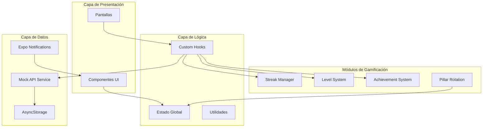
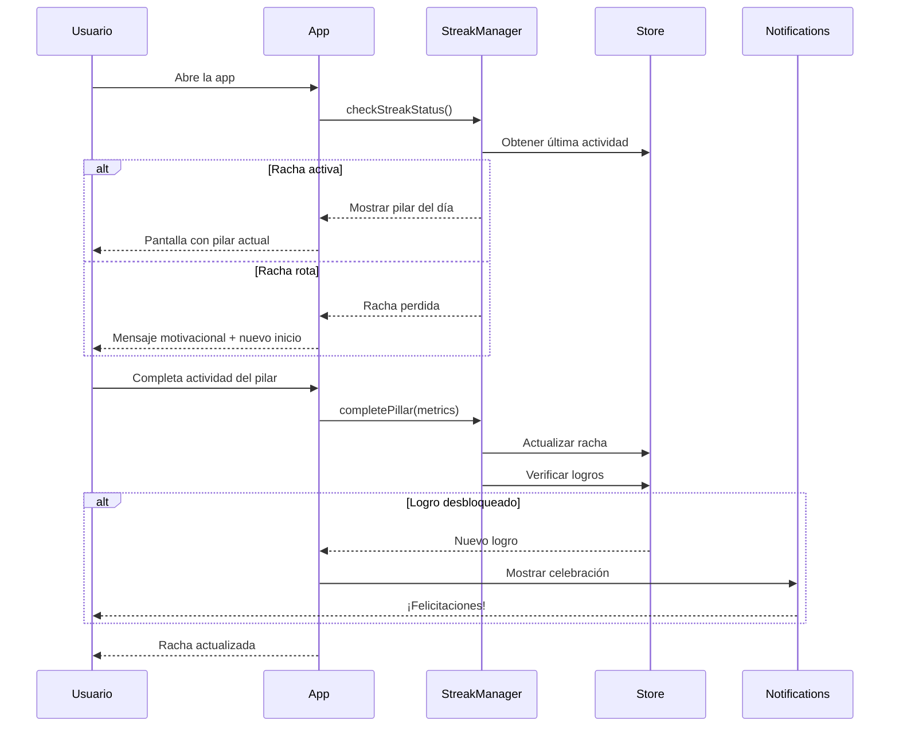
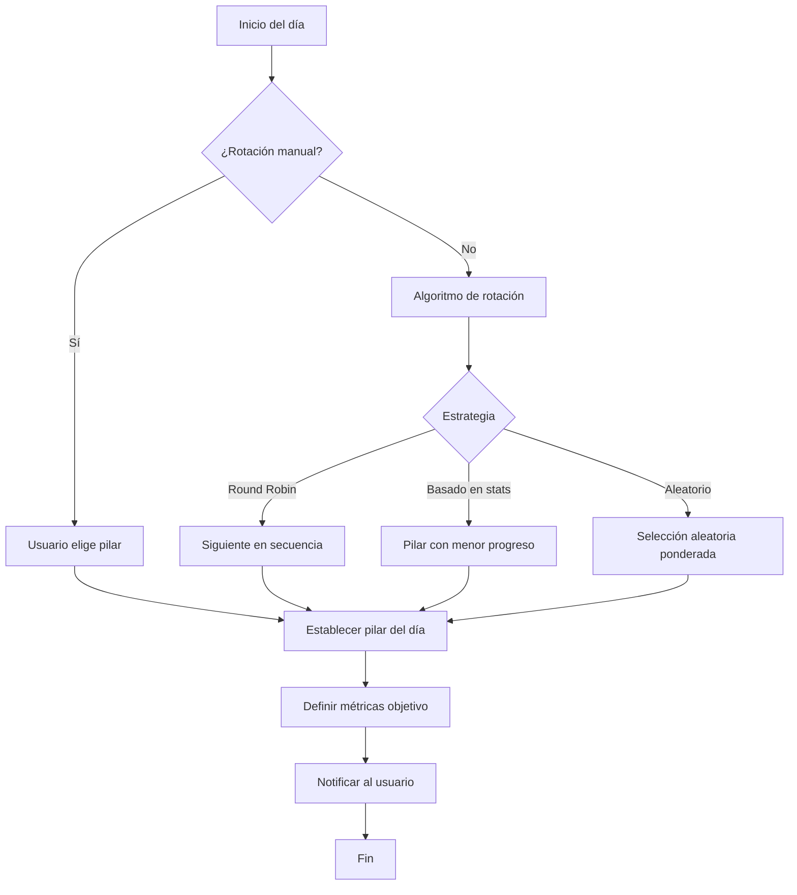
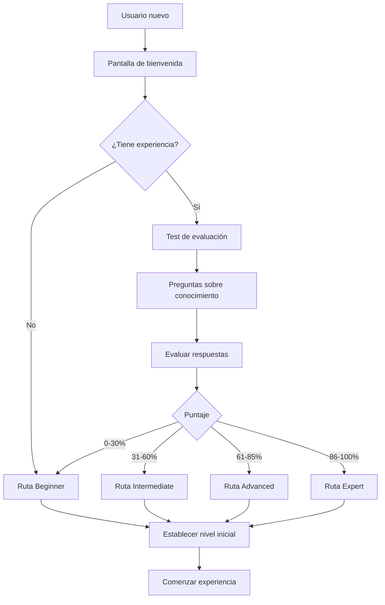

# Arquitectura: Sistema de Gamificación - Rachas Multi-Factor y Niveles de Maestría

## 1. Resumen Ejecutivo

Este documento describe la arquitectura frontend para un sistema de gamificación que incluye:
- **Rachas Multi-Factor**: Sistema flexible donde la racha se mantiene cumpliendo el "Pilar del Día" (nutrición, sueño o movimiento)
- **Niveles de Maestría**: Sistema de progresión tipo RPG con rutas personalizadas según nivel del usuario

La solución está diseñada para React Native con Expo, utilizando datos mock para desarrollo inicial, con arquitectura preparada para futura integración con backend real.

## 2. Contexto y Objetivos

### 2.1 Contexto del Proyecto
- Aplicación móvil React Native con Expo
- Fase inicial: Frontend con backend mock
- Enfoque en experiencia de usuario gamificada
- Preparación para escalabilidad futura

### 2.2 Objetivos Técnicos
- Implementar sistema de rachas flexible y motivador
- Crear progresión tipo RPG con niveles personalizables
- Diseñar arquitectura desacoplada para fácil integración con backend
- Implementar notificaciones push con Expo
- Mantener código limpio y mantenible

### 2.3 Restricciones
- Solo frontend (backend mock)
- Métricas de deportes pueden ser imaginarias inicialmente
- Integración con wearables no prioritaria pero considerar en diseño

## 3. Arquitectura de Alto Nivel

### 3.1 Diagrama General



### 3.2 Componentes Principales

1. **Streak Manager**: Gestiona rachas multi-factor
2. **Level System**: Sistema de progresión RPG
3. **Achievement System**: Logros y felicitaciones
4. **Pillar Rotation**: Rotación automática y manual de pilares
5. **Mock API Service**: Simula backend con datos locales
6. **Notification Service**: Gestiona notificaciones push

## 4. Diseño Técnico Detallado

### 4.1 Estructura de Datos

#### Usuario
```javascript
const User = {
  id: string,
  name: string,
  level: number,
  experience: number,
  currentStreak: number,
  longestStreak: number,
  selectedRoute: string, // 'beginner' | 'intermediate' | 'advanced' | 'expert'
  completedAchievements: string[],
  stats: {
    nutrition: number,
    sleep: number,
    movement: number
  }
}
```

#### Racha (Streak)
```javascript
const Streak = {
  id: string,
  userId: string,
  currentCount: number,
  lastCompletedDate: string,
  pillarHistory: Array<{
    date: string,
    pillar: 'nutrition' | 'sleep' | 'movement',
    completed: boolean,
    metrics: object
  }>
}
```

#### Pilar del Día
```javascript
const DailyPillar = {
  date: string,
  pillar: 'nutrition' | 'sleep' | 'movement',
  isManuallySet: boolean,
  target: {
    type: string,
    value: number,
    unit: string
  },
  progress: number,
  completed: boolean
}
```

#### Nivel y Ruta
```javascript
const LevelRoute = {
  id: string,
  name: string, // 'beginner' | 'intermediate' | 'advanced' | 'expert'
  levels: Array<{
    level: number,
    experienceRequired: number,
    unlockedFeatures: string[],
    title: string
  }>
}
```

#### Logro
```javascript
const Achievement = {
  id: string,
  title: string,
  description: string,
  icon: string,
  category: 'streak' | 'level' | 'pillar' | 'special',
  requirement: {
    type: string,
    value: number
  },
  unlockedAt: string | null
}
```

### 4.2 Patrones de Diseño

#### Estado Global con Zustand
```javascript
// stores/gameStore.js
import create from 'zustand'
import { persist } from 'zustand/middleware'
import AsyncStorage from '@react-native-async-storage/async-storage'

export const useGameStore = create(
  persist(
    (set, get) => ({
      user: null,
      streak: null,
      dailyPillar: null,
      achievements: [],
      
      // Actions
      updateStreak: (completed) => {
        // Lógica de actualización de racha
      },
      
      rotatePillar: (manual = false) => {
        // Lógica de rotación de pilar
      },
      
      addExperience: (amount) => {
        // Lógica de experiencia y niveles
      },
      
      unlockAchievement: (achievementId) => {
        // Lógica de desbloqueo de logros
      }
    }),
    {
      name: 'game-storage',
      getStorage: () => AsyncStorage
    }
  )
)
```

#### Service Layer Pattern
```javascript
// services/mockAPI.js
class MockAPIService {
  constructor() {
    this.delay = 500 // Simular latencia de red
  }
  
  async getUserData(userId) {
    await this._simulateDelay()
    // Retornar datos mock del usuario
  }
  
  async updateStreak(userId, pillarData) {
    await this._simulateDelay()
    // Simular actualización de racha
  }
  
  async getAchievements(userId) {
    await this._simulateDelay()
    // Retornar logros
  }
  
  _simulateDelay() {
    return new Promise(resolve => setTimeout(resolve, this.delay))
  }
}

export default new MockAPIService()
```

#### Custom Hooks Pattern
```javascript
// hooks/useStreak.js
export const useStreak = () => {
  const { streak, dailyPillar, updateStreak } = useGameStore()
  
  const completePillar = async (metrics) => {
    try {
      const result = await mockAPI.updateStreak(user.id, {
        pillar: dailyPillar.pillar,
        metrics
      })
      updateStreak(true)
      return result
    } catch (error) {
      console.error('Error completing pillar:', error)
    }
  }
  
  const checkStreakStatus = () => {
    // Verificar si la racha sigue activa
  }
  
  return {
    streak,
    dailyPillar,
    completePillar,
    checkStreakStatus
  }
}
```

### 4.3 Módulos Principales

#### 1. Streak Manager
```javascript
// modules/streakManager.js
export class StreakManager {
  static calculateStreak(pillarHistory) {
    // Lógica para calcular racha actual
    // Considera que se mantiene si se cumple el pilar del día
  }
  
  static isStreakActive(lastCompletedDate) {
    // Verificar si la racha sigue activa (dentro de 24h)
  }
  
  static getPillarForToday(user, isManual = false) {
    if (isManual) {
      return null // Usuario elige
    }
    // Algoritmo de rotación automática
    // Puede ser: round-robin, basado en stats más bajas, aleatorio ponderado
  }
}
```

#### 2. Level System
```javascript
// modules/levelSystem.js
export class LevelSystem {
  static routes = {
    beginner: { /* niveles 1-10 */ },
    intermediate: { /* niveles 11-25 */ },
    advanced: { /* niveles 26-50 */ },
    expert: { /* niveles 51-100 */ }
  }
  
  static calculateLevel(experience, route) {
    // Calcular nivel basado en experiencia y ruta
  }
  
  static getExperienceForNextLevel(currentLevel, route) {
    // Retornar experiencia necesaria para siguiente nivel
  }
  
  static assessUserLevel(testResults) {
    // Evaluar test inicial y recomendar ruta
  }
}
```

#### 3. Achievement System
```javascript
// modules/achievementSystem.js
export class AchievementSystem {
  static checkAchievements(user, streak, action) {
    const unlockedAchievements = []
    
    // Verificar logros de racha
    if (streak.currentCount === 7) {
      unlockedAchievements.push('week_warrior')
    }
    
    // Verificar logros de nivel
    if (user.level === 10) {
      unlockedAchievements.push('level_10_master')
    }
    
    return unlockedAchievements
  }
  
  static getAchievementMessage(achievementId) {
    // Retornar mensaje de felicitación
  }
}
```

## 5. Flujos de Usuario

### 5.1 Flujo de Racha Diaria



### 5.2 Flujo de Rotación de Pilar



### 5.3 Flujo de Evaluación Inicial



## 6. Implementación de Notificaciones Push

### 6.1 Configuración con Expo Notifications

```javascript
// services/notificationService.js
import * as Notifications from 'expo-notifications'
import * as Device from 'expo-device'

Notifications.setNotificationHandler({
  handleNotification: async () => ({
    shouldShowAlert: true,
    shouldPlaySound: true,
    shouldSetBadge: true,
  }),
})

export class NotificationService {
  static async registerForPushNotifications() {
    if (Device.isDevice) {
      const { status: existingStatus } = await Notifications.getPermissionsAsync()
      let finalStatus = existingStatus
      
      if (existingStatus !== 'granted') {
        const { status } = await Notifications.requestPermissionsAsync()
        finalStatus = status
      }
      
      if (finalStatus !== 'granted') {
        return null
      }
      
      const token = (await Notifications.getExpoPushTokenAsync()).data
      return token
    }
  }
  
  static async scheduleDailyReminder(hour = 9) {
    await Notifications.scheduleNotificationAsync({
      content: {
        title: "¡Es hora de tu pilar del día! 💪",
        body: "Mantén tu racha activa completando tu actividad de hoy",
        data: { type: 'daily_reminder' },
      },
      trigger: {
        hour,
        minute: 0,
        repeats: true,
      },
    })
  }
  
  static async notifyAchievement(achievement) {
    await Notifications.scheduleNotificationAsync({
      content: {
        title: "🎉 ¡Nuevo logro desbloqueado!",
        body: achievement.title,
        data: { type: 'achievement', achievementId: achievement.id },
      },
      trigger: null, // Inmediato
    })
  }
  
  static async notifyStreakWarning() {
    await Notifications.scheduleNotificationAsync({
      content: {
        title: "⚠️ ¡Tu racha está en riesgo!",
        body: "Completa tu pilar del día antes de medianoche",
        data: { type: 'streak_warning' },
      },
      trigger: null,
    })
  }
}
```

### 6.2 Estrategia de Notificaciones

- **Recordatorio diario**: 9:00 AM - Pilar del día
- **Advertencia de racha**: 8:00 PM - Si no ha completado el pilar
- **Logros**: Inmediato al desbloquear
- **Nivel subido**: Inmediato al alcanzar nuevo nivel
- **Motivación**: Mensajes personalizados según progreso

## 7. Estructura de Carpetas

```
src/
├── components/
│   ├── common/
│   │   ├── Button.js
│   │   ├── Card.js
│   │   └── ProgressBar.js
│   ├── streak/
│   │   ├── StreakCounter.js
│   │   ├── PillarCard.js
│   │   └── StreakHistory.js
│   ├── level/
│   │   ├── LevelProgress.js
│   │   ├── RouteSelector.js
│   │   └── ExperienceBar.js
│   └── achievement/
│       ├── AchievementCard.js
│       ├── AchievementModal.js
│       └── AchievementList.js
├── screens/
│   ├── HomeScreen.js
│   ├── StreakScreen.js
│   ├── LevelScreen.js
│   ├── AchievementsScreen.js
│   ├── PillarSelectionScreen.js
│   └── OnboardingScreen.js
├── hooks/
│   ├── useStreak.js
│   ├── useLevel.js
│   ├── useAchievements.js
│   └── useNotifications.js
├── stores/
│   ├── gameStore.js
│   └── userStore.js
├── services/
│   ├── mockAPI.js
│   ├── notificationService.js
│   └── storageService.js
├── modules/
│   ├── streakManager.js
│   ├── levelSystem.js
│   ├── achievementSystem.js
│   └── pillarRotation.js
├── utils/
│   ├── dateHelpers.js
│   ├── calculations.js
│   └── constants.js
└── data/
    ├── mockUsers.js
    ├── mockAchievements.js
    └── mockRoutes.js
```

## 8. Consideraciones de Infraestructura

### 8.1 Almacenamiento Local
- **AsyncStorage**: Persistencia de datos del usuario
- **Zustand Persist**: Estado global persistente
- **Expo SecureStore**: Tokens y datos sensibles (futuro)

### 8.2 Preparación para Backend Real

```javascript
// services/apiService.js
const API_BASE_URL = __DEV__ 
  ? 'http://localhost:3000/api' 
  : 'https://api.production.com'

const USE_MOCK = true // Toggle para desarrollo

export const apiService = {
  async getUser(userId) {
    if (USE_MOCK) {
      return mockAPI.getUserData(userId)
    }
    // Implementación real
    const response = await fetch(`${API_BASE_URL}/users/${userId}`)
    return response.json()
  },
  
  // ... otros métodos
}
```

### 8.3 Migración de Datos Mock a Real

```javascript
// utils/migration.js
export class DataMigration {
  static async syncLocalToServer(userId) {
    const localData = await AsyncStorage.getItem('game-storage')
    
    if (localData) {
      const parsed = JSON.parse(localData)
      // Enviar al servidor
      await apiService.syncUserData(userId, parsed)
      // Limpiar datos locales después de confirmar
    }
  }
}
```

## 9. Métricas y Monitoreo

### 9.1 Métricas Clave
- Tasa de retención diaria
- Longitud promedio de rachas
- Distribución de usuarios por nivel
- Logros más desbloqueados
- Pilares más completados

### 9.2 Analytics (Preparación)
```javascript
// services/analyticsService.js
export class AnalyticsService {
  static trackEvent(eventName, properties) {
    if (__DEV__) {
      console.log('Analytics:', eventName, properties)
      return
    }
    // Integración futura con Firebase Analytics, Amplitude, etc.
  }
  
  static trackStreakCompleted(streak) {
    this.trackEvent('streak_completed', {
      count: streak.currentCount,
      pillar: streak.pillarHistory[streak.pillarHistory.length - 1].pillar
    })
  }
}
```

## 10. Riesgos y Mitigaciones

| Riesgo | Impacto | Probabilidad | Mitigación |
|--------|---------|--------------|------------|
| Pérdida de datos locales | Alto | Media | Implementar backup en cloud, sincronización periódica |
| Notificaciones no llegan | Medio | Media | Fallback a notificaciones in-app, verificar permisos |
| Algoritmo de rotación no balanceado | Medio | Alta | Implementar múltiples estrategias, permitir override manual |
| Experiencia no escalable | Alto | Baja | Diseñar curva de experiencia ajustable, balanceo posterior |
| Mock data inconsistente | Bajo | Media | Tests unitarios, validación de esquemas |

## 11. Próximos Pasos

### TERMINADA FASE 1
### Fase 1: Setup Inicial (Semana 1)
1. Configurar estructura de carpetas
2. Implementar Zustand store
3. Crear mock API service
4. Configurar AsyncStorage

### Fase 2: Sistema de Rachas (Semana 2-3)
1. Implementar StreakManager
2. Crear componentes de racha
3. Implementar rotación de pilares
4. Pantallas de racha

### Fase 3: Sistema de Niveles (Semana 4-5)
1. Implementar LevelSystem
2. Crear test de evaluación inicial
3. Componentes de progresión
4. Pantallas de nivel y rutas

### Fase 4: Logros y Notificaciones (Semana 6)
1. Implementar AchievementSystem
2. Configurar Expo Notifications
3. Crear pantalla de logros
4. Implementar celebraciones

### Fase 5: Pulido y Testing (Semana 7-8)
1. Testing de flujos completos
2. Ajuste de UX
3. Optimización de rendimiento
4. Preparación para backend real

## 12. Referencias y Recursos

### Documentación Técnica
- [React Native](https://reactnative.dev/)
- [Expo](https://docs.expo.dev/)
- [Zustand](https://github.com/pmndrs/zustand)
- [Expo Notifications](https://docs.expo.dev/versions/latest/sdk/notifications/)

### Patrones de Gamificación
- "Hooked: How to Build Habit-Forming Products" - Nir Eyal
- "The Gamification Toolkit" - Kevin Werbach
- Octalysis Framework - Yu-kai Chou

### Inspiración de Diseño
- Duolingo (sistema de rachas)
- Habitica (RPG gamification)
- Strava (logros deportivos)

---
*Documento generado por Solution Architect - Febrero 2026*
